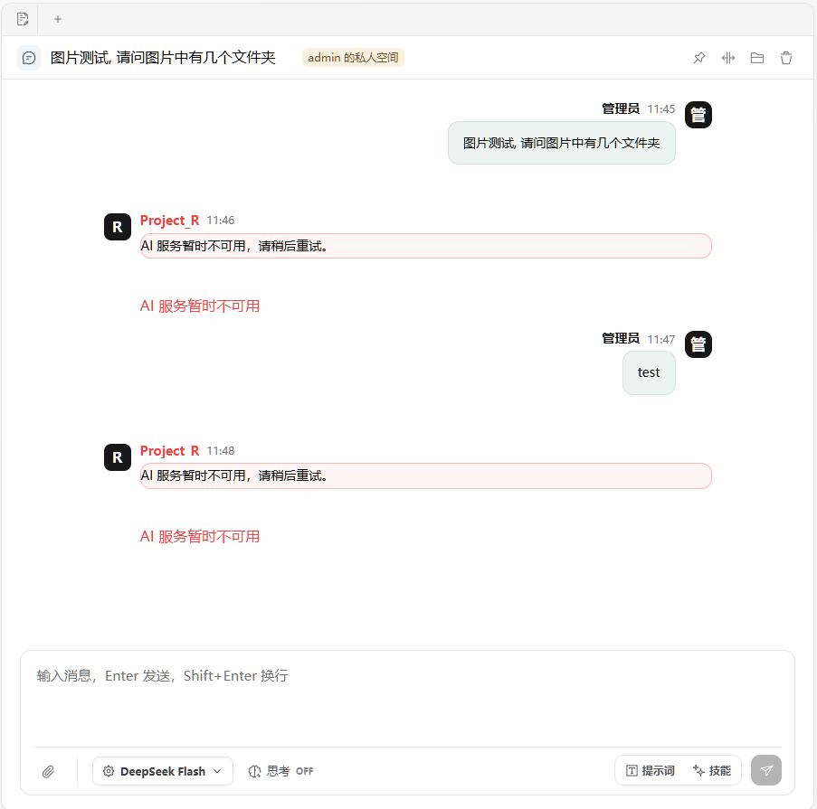
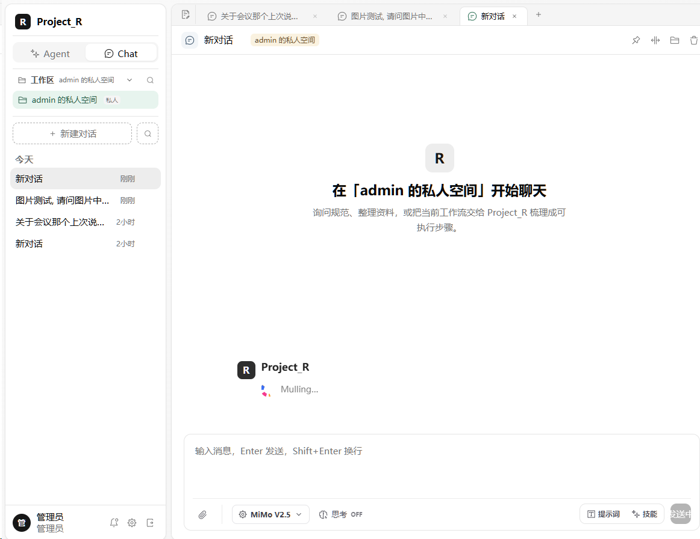
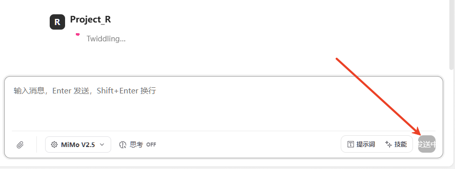
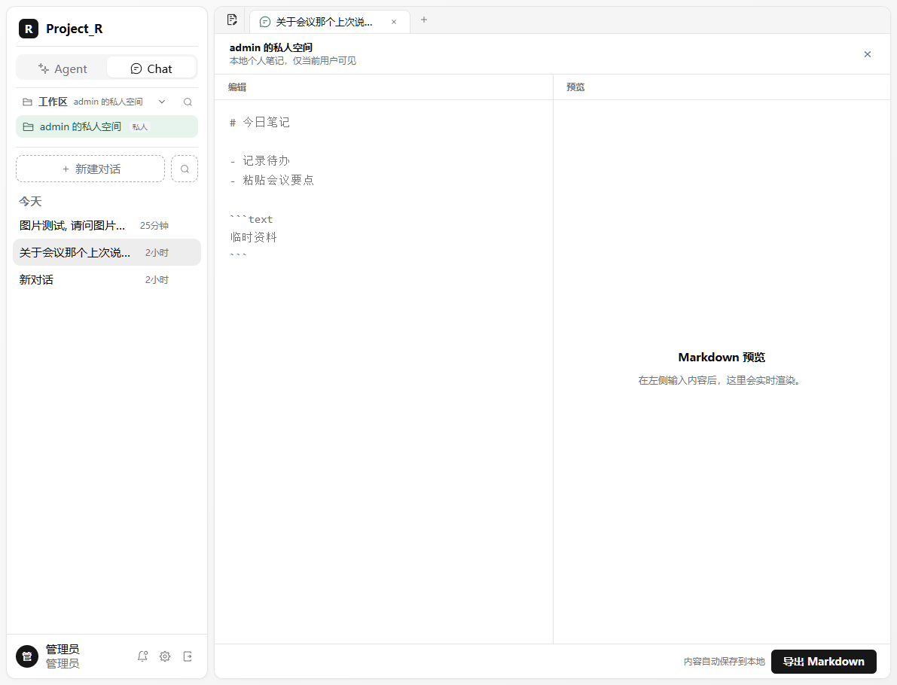

# 变更指令集
## CHG-001
- **类型**: bug
- **标题**: mimo 大模型调用失败
- **当前状态**: 在大模型选择界面中选择mimo v2.5,在输入栏中键入任何内容后enter发送,对话一直显示加载动画,且加载一段时间后软件顶部出现"AI 服务暂时不可用，请稍后重试"提示
- **期望状态**: mimo大模型正常与用户对话
- **复现步骤**:
  1. 在大模型选择界面中选择mimo v2.5
  2. 输入任意内容
  3. 发送内容
- **验收标准**:
  - [ ] 大模型能正常回复用户信息
- **优先级**: 高
- **附件**:

## CHG-002
- **类型**: bug
- **标题**: 对话加载动画在其他对话中显示
- **当前状态**: 模型加载中旋转动画占用了其他对话的输入框和界面
- **期望状态**: 每个对话都是独立的,软件支持多对话同时运行
- **复现步骤**:
  1. 打开任意对话进行信息输入
  2. 在等待大模型输出的过程中,回答区会显示加载动画
  3. 点击其他对话,在对话中会重新显示步骤2中的加载对话
- **验收标准**:
  - [ ] 每个对话是独立的,可以打开多个对话.同时调用大模型进行使用
  - [ ] 对话加载动画,不会影响其他对话
- **优先级**: 高
- **附件**:

## CHG-003
- **类型**: bug
- **标题**: 无法取消发送中的对话
- **当前状态**: 正在加载的对话信息,无法取消/中止
- **期望状态**: 用户点击键盘esc后停止对话;发送按钮位置不用"发生中"文字标识,使用停止图标代替.
- **复现步骤**:
  1. 打开任意对话进行信息输入
  2. 发送按钮长期显示发送中
  3. 按esc无反应,无对话中止机制
- **验收标准**:
  - [ ] 在加载中的对话,用户可以直接esc或点击停止按钮位置中断
  - [ ] 将发送中修改为一个等待的按钮图标
- **优先级**: 高
- **附件**:

## CHG-004
- **类型**: bug
- **标题**: 个人笔记界面常驻
- **当前状态**: 个人笔记窗口常驻,虽然标签栏显示在切换其他对话,但是笔记窗口比对话区更前置.
- **期望状态**: 个人笔记窗口其实可以归类成一个固定到标签页栏的标签,使用这个标签按钮进行打开,点击对话后切换到其他对话.
- **复现步骤**:
  1. 点击个人笔记界面
  2. 再点击其他对话
  3. 未跳转对话界面
- **验收标准**:
  - [ ] 在个人笔记界面点击其他对话会切换到其他对话内容显示.
  - [ ] 
  - [ ] 
- **优先级**: 高
- **附件**:

## CHG-005
- **类型**: 功能修改
- **标题**: 个人笔记markdown预留渲染
- **当前状态**: 个人笔记分为左右两个区域
- **期望状态**: 合并成一个显示区域,且markdown格式在输入后 自动渲染,可参考obsidian的输入功能和显示功能
- **复现步骤**:
  1. 在笔记输入区 输入 ## 标题1
  2. 自动渲染成二号标题的"标题1"
- **验收标准**:
  - [ ] markdown语法正确渲染
  - [ ] 个人笔记区能二合一
- **优先级**: 高
- **附件**:

## CHG-00
- **类型**: 
- **标题**: 
- **当前状态**: 
- **期望状态**: 
- **复现步骤**:
  1. 
  2. 
  3. 
- **验收标准**:
  - [ ] 
  - [ ] 
  - [ ] 
- **优先级**: 高
- **附件**:
