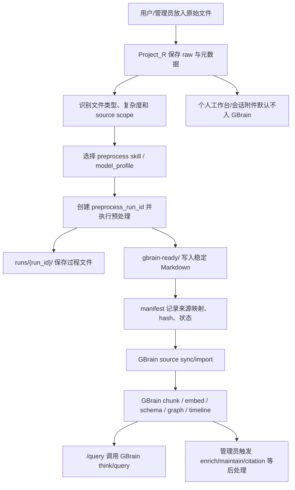

# GBrain 原始资料导入与提炼流程

状态：v0.3，2026-06-04  
适用范围：Project_R 管理的公司全局知识库、项目资料、会议资料、PDF/音视频/邮件等原始文件进入 GBrain source 的流程。

相关进度：GBrain 功能盘点见 `docs/gbrain-feature-inventory.md`；Project_R 对 GBrain 的适配完成度、未闭环项和下一步顺序见 `docs/gbrain-adaptation-progress.md`。

## 核心结论

Project_R 的用户源文件目录是原始资料保管区；GBrain 的 source 不直接吃所有原始文件，而是吃经过 Project_R 预处理 Skill / 脚本转换后写入 `_preprocessed/.../gbrain-ready/` 的 GBrain 友好 Markdown。是否需要审核由 source scope 决定：管理员后台录入的公司知识视为管理员已审核；项目工作区文件默认只进入项目 source，不进公司库且不需要管理员审核；个人工作台和会话附件不得进入 GBrain source。

2026-06-04 已进一步收紧边界：Project_R 不修改、不替代 GBrain 成熟架构。Project_R 只负责原始资料保管、文件类型识别、粗处理/预处理、后端保存、权限审计、查询/operation 转发和 UI 展示；真正的知识库系统、schema、entity enrichment、graph、timeline、source sync、query、think、citation、maintain 由 GBrain 负责。

DeepSeek 负责纯文本资料预处理；MiMo V2.5 负责 PDF、截图、图纸、设计图片和视觉版式资料，不使用 MiMo V2.5 Pro。PDF 可先做本地文本抽取作为辅助证据，但最终统一由 MiMo V2.5 生成结构化 Markdown，纯文本抽取结果不得直接入 GBrain。会议音频/视频先走转写脚本，再进入会议结构化预处理。

GBrain 的 `import` / `sync` 负责把 `gbrain-ready/` Markdown 变成可检索、可引用、可 graph/timeline/enrich 的知识数据。它不是 Project_R 的源文件预处理器。该长期边界见 `docs/adr/0009-pr-owned-extraction-to-gbrain-markdown.md` 和 `docs/adr/0019-gbrain-ready-preprocessing-source-repos.md`；GBrain runtime home 固定规则见 `docs/adr/0021-gbrain-runtime-home-under-workspace-data-gbrain.md`；按空间决定审核/入库责任的规则见 `docs/adr/0010-source-scoped-knowledge-ingest-review-policy.md`；自动分类与模型路由规则见 `docs/adr/0011-automatic-extractor-routing-by-file-type.md`。

## 目录分层

后续正式目录采用源文件与 GBrain-ready 产物分离。

GBrain 自身运行目录固定为 `backend/workspace_data/_gbrain/`。该目录只保存 GBrain runtime/config，例如 `.gbrain/config.json`、PGLite brain、运行审计和本地服务日志；不得放公司、项目或客户业务源文件。`backend/workspace_data/global/company-wiki/` 只作为公司知识源文件区，不再承载 `.gbrain/`。

用户源文件目录只保存用户上传或管理员投放的原始资料，不创建 `derived/`：

```text
backend/workspace_data/global/company-wiki/
  raw/        # 公司知识源文件

backend/workspace_data/project/{品牌}/{项目代号}/
  01-合同与报价/
  02-图纸与技术资料/
  ...
  99-未归档文件/

backend/workspace_data/customer/CRM/
  raw/        # 全公司 CRM 客户情报源文件
```

预处理产物统一放在：

```text
backend/workspace_data/_preprocessed/
├── company/
│   └── company-wiki/
│       ├── gbrain-ready/   # GBrain company-wiki source repo
│       ├── runs/           # 过程文件
│       └── manifests/      # 映射、状态、错误、sync 结果
├── project/
│   └── {brand}/{workspace_id}-{project_slug}/
│       ├── gbrain-ready/   # 当前 project-* source repo
│       ├── runs/
│       └── manifests/
└── customer/
    └── crm/
        ├── gbrain-ready/   # 全公司 CRM 客户情报 source repo
        ├── runs/
        └── manifests/
```

项目 source 第一版映射规则：

- `source_id = project-{brand}-{workspace_id}`，例如 `project-bfi-7`。
- `source path = backend/workspace_data/_preprocessed/project/{brand}/{workspace_id}-{project_slug}/gbrain-ready/`。
- 项目 source 默认 `--no-federated`，不参与跨项目联合检索。
- Project_R 查询项目资料时必须显式传入项目 `source_id`，并先通过 Project_R 项目访问权限判断：开放项目对所有有效用户可查，隐藏项目只对系统管理员、成员管理中的显式人员或授权组别可查。
- 项目文件面板提供“录入”动作；点击后默认递归处理当前打开路径/文件夹下的待处理文件，并必须二次确认递归范围、数量、文件类型和高成本模型/转写提示。文件右键菜单提供“录入此文件”。第一版不做复杂多选批量。
- 待处理文件包括 `new`、`source_changed`、`failed_retryable`、`pending_capability_now_supported`；`synced`、`processing`、`source_deleted`、`failed_non_retryable`、`ignored` 不默认处理。
- 项目资料默认不提升到 `company-wiki`，也不进入管理员公司知识审核队列。

个人工作台规则：

- 个人工作台不进入 GBrain source，不提供个人文件面板，不提供跨工作区保存到项目/客户资料。
- 个人工作台里的轻量 Skill / Agent 输出只作为本轮结果展示，可复制或下载到本地，不进入未入库候选。

客户情报 / 客户画像规则：

- `workspace_data/customer/` 是 CRM 客户画像资料根，不是 `workspace_data/project/` 的另一类项目目录。它主要保存客户往来邮件、会议记录、联系人、公司、项目关系、沟通事件和销售判断线索。
- 客户资料属于受限业务情报，不是公司公共知识库，不得写入 `company-wiki`，客户工作区 `/query` 也不得默认叠加 `company-wiki`。
- 客户情报的目标是把 `workspace_data/customer/CRM/raw/` 中的资料经 Project_R 提炼后投喂给 GBrain，让 GBrain Entity Enrichment 自动建立 People Graph、Company Graph 和 Project Graph，服务销售团队做客户关系管理、关键人判断、公司关系判断和项目关系判断。
- 工作区目录里的客户入口统一显示为 `CRM`。CRM 是全公司单例客户情报工作区，后端目录固定为 `backend/workspace_data/customer/CRM/`，GBrain-ready 路径固定为 `backend/workspace_data/_preprocessed/customer/crm/gbrain-ready/`；不得再按单个客户 slug 创建 `workspace_data/customer/{slug}/` 或 `_preprocessed/customer/{workspace_id}-{customer_slug}/`。
- 正式查询对象是 GBrain 已经精炼、吸收、整理后的客户情报数据，不是原始 customer 文件夹，也不是公司全局知识库。
- 2026-06-02 建立过参考竖切片：`backend/workspace_data/customer/reference/` 映射为 `customer-reference` source。2026-06-04 已确认该结果只是 MVP 验证数据，不作为正式客户画像质量基线；可清理旧 `customer-reference` source/client/derived/manifests 和回归产物，保留原始 Markdown 资料源，后续用 GBrain 原生客户画像 / Entity Enrichment 能力重跑。
- 客户资料正式路径不能把客户材料当普通项目 RAG 文档简单编译。Project_R 只把客户邮件、会议、联系人资料、公司/项目关系和沟通事件预处理成 GBrain 友好来源记录 Markdown，不直接生成最终 `people/`、`companies/`、`projects/` 实体画像页；实体页、关系、timeline 和画像吸收由 GBrain 原生 schema/enrich/entity detection/graph/timeline 机制负责。
- Project_R 已有 `customer` 工作区权限入口 MVP：系统管理员可在工作区目录打开或创建 `CRM` 单例工作区，默认隐藏且路径为 `backend/workspace_data/customer/CRM/`，源文件入口为 `raw/`；普通用户必须是成员或授权组别才能搜索/进入，CRM 不能切成开放项目。
- 客户工作区录入由系统管理员或客户工作区管理员触发；普通成员只允许上传源文件，不允许触发客户情报录入。
- CRM 工作区可提供客户画像入口，标签包括画像概览、图谱、时间线、实体处理和 GBrain 状态。该入口只是 Project_R 对 GBrain 原生能力的权限、转发和展示壳，不是 Project_R 自建客户画像系统。
- 工作区级实体候选审核已接入：`GET /workspaces/{id}/knowledge/entity-merge-candidates` 和 action 接口只允许系统管理员或当前工作区管理员使用；第一版支持创建缺失实体占位页、记录 `entity-overrides/aliases/*.md` 别名审核沉淀、受控应用 frontmatter 引用改写或忽略候选，不做自动合并、不删除旧实体页、不改写正文事实。`GET /workspaces/{id}/knowledge/entity-merge-candidates/preview` 与管理员同类接口可生成安全 diff 预览，列出 alias review 文件和 frontmatter 引用改写建议，但预览本身不会写文件；只有管理员显式执行 `apply_relink_changes` 后，系统才会改写允许的 frontmatter 关系字段并同步当前 source。普通授权成员可以看客户画像/项目事件图谱，但不能处理实体候选。
- GBrain 原生 graph/timeline/backlinks 上下文已接入：`GET /workspaces/{id}/knowledge/graph/native-context?slug=...` 使用当前 workspace source 的 token-bound OAuth client 调用 `traverse_graph`、`get_timeline`、`get_backlinks`；前端“原生”按钮显示 Graph traversal、Timeline、Backlinks 摘要和明细列表。不能用普通 service bearer 裸调这些 operation，否则 source scope 不可靠。
- 客户 Entity Enrichment、实体合并、别名/关系修改、source 清理、回滚、maintain、dream cycle、citation-fixer 和 contradiction probe 都是 GBrain 写操作；普通成员不能触发，系统管理员或客户工作区管理员触发前必须确认范围、成本和可能改写实体/关系的影响。

## 标准流程



## 自动分类与模型路由

Project_R 在调用提炼模型前必须先做资料分类，普通用户不需要也不能手动选择 API Key。前端只展示“一键录入”、处理数量、状态和失败原因；后端根据分类结果选择 `model_profile`，再由 `model_profile` 映射到 DeepSeek、MiMo、转写流程或待能力补齐状态。

分类结果至少写入 manifest：

| 字段 | 含义 |
|---|---|
| `source_scope` | 公司、项目、私人或未来扩展 source，决定能否进入公司库。 |
| `file_kind` | `text`、`markdown`、`docx`、`pdf`、`image`、`audio`、`video`、`email`、`archive`、`unknown`。 |
| `preprocess_complexity` | `simple_text`、`vision_required`、`transcription_required`、`email_thread_required`、`archive_expand_required`、`unsupported`、`unknown`。 |
| `preprocess_skill` | `markdown-source-preprocess`、`pdf-structured-preprocess`、`email-thread-preprocess` 等独立预处理 Skill 名称。 |
| `extractor_profile` | `deepseek_text`、`mimo_v2_5_vision`、`transcription`、`pending_extractor_capability` 等后端路由结果。 |
| `classifier_reason` | 简短说明为什么选择该路线，不包含 API Key 或敏感内容。 |

默认路由：

| 文件条件 | 默认处理 |
|---|---|
| Markdown、TXT、干净 DOCX、可读转写文本、可读邮件正文 | DeepSeek 文字预处理。 |
| PDF | 可抽文本作为辅助证据，但统一使用 MiMo V2.5 生成最终 GBrain-ready Markdown；不使用 MiMo V2.5 Pro；不把纯文本抽取结果直接入 GBrain。 |
| 图片、截图、表格图片、现场照片、图纸截图、设计图片 | MiMo V2.5 视觉预处理，生成结构化 Markdown；后续补区域级引用定位和 OCR 回归。 |
| 音频/视频且无 transcript | 先走转写脚本；长媒体按分段处理；转写后再用 DeepSeek 做说话人/术语纠错和会议/知识预处理。 |
| 视频画面也承载知识 | 第一版先做音频转写；如画面本身承载知识，后续需要补 MiMo 关键帧视觉提炼，完成前应明确标记待能力补齐或待人工处理。 |
| 邮件线程或邮箱导出 | 邮件解析器 + DeepSeek 文字预处理；附件保存到过程目录后递归重新分类，图片/PDF 附件进入 MiMo V2.5 预处理。 |
| Excel / CSV / 表格 | 独立 spreadsheet preprocess；CSV 可由 DeepSeek 处理，复杂 Excel 先标记 pending 或走后续表格 Skill。 |
| ZIP / RAR / 文件包 | 独立 archive preprocess；只负责展开、分类和调度其他预处理 Skill，不直接产出最终知识 Markdown。 |
| 属于知识目标范围但 extractor 未完成 | 标记 `pending_extractor_capability`，不误报 indexed。 |

LLM 输出必须保留 evidence，不允许只产出总结。所有模型输出必须区分事实、解释和不确定点；合同、报价、技术规格、客户判断等高影响资料宁可标记 `partial` 或 `pending_review`，不得编造补全。

## 各区域职责

| 区域 | 职责 | 不做什么 |
|---|---|---|
| 用户源文件目录 | 保存原始 PDF、DOCX、音视频、Markdown、邮件、截图等；用户可上传、预览、移动、删除。 | 不存 `derived/`、过程文件或 GBrain-ready Markdown；不直接作为普通 `/query` 的主检索内容。 |
| `_preprocessed/.../runs/` | 保存每次录入的过程文件、文本抽取、页面图片、转写、模型中间输出和诊断。 | 不给普通用户文件面板展示；不作为 GBrain source repo。 |
| `_preprocessed/.../gbrain-ready/` | 保存稳定路径的 GBrain 友好 Markdown；作为 GBrain source repo。 | 不由普通用户手工编辑；不因源文件删除自动删除。 |
| `_preprocessed/.../manifests/` | 保存每个源文件的状态、错误、hash、目标 Markdown、run 历史、模型和 sync 结果。 | 不作为知识正文。 |
| GBrain DB / index | 保存由 `gbrain-ready/` 派生出的页面、chunks、embedding、graph、tags。 | 不作为唯一事实源，不直接接管 Project_R 原始文件生命周期。 |

## 审核和责任规则

| 来源 | 默认目标 | 是否需要审核 | 责任人 |
|---|---|---|---|
| 管理员后台录入公司知识 | `company-wiki` source | 不需要额外审核；管理员自行检查 | 操作管理员 |
| 用户私人空间附件 | 不进入公司知识库 | 不进入公司审核流 | 上传用户 |
| 项目工作区附件 | 当前项目 source | 不需要管理员审核；有权限用户点击录入当前路径/文件后生效 | 点击录入的项目用户 |
| 客户工作区附件 | 客户情报 source | 不需要公司知识审核；仅系统管理员或客户工作区管理员可触发客户情报录入 | 点击录入的管理员 |
| 答案低分反馈、纠错、显式提升公司知识 | `company-wiki` 候选 | 需要管理员处理 | 管理员 |

## GBrain 在哪里参与

GBrain 参与分为四层。

### 1. Source 管理

GBrain source 是知识边界。第一阶段：

```text
source_id = company-wiki
source path = backend/workspace_data/_preprocessed/company/company-wiki/gbrain-ready/
```

Project_R 已把每个项目工作区映射为独立项目 source，source id 使用 `project-{brand}-{workspace_id}`。

项目工作区的 `/query` 查询范围是 `company-wiki + 当前项目 source`。`company-wiki` 提供公司全局规则、通用流程和跨项目沉淀；当前项目 source 提供该项目特有资料、会议、邮件、图纸和项目事件。项目 source 的 `/query` 不再依赖手工把每个项目追加到 `GBRAIN_THINK_ALLOWED_SOURCES`。Project_R 会为 `project-*` source 准备独立的 GBrain Think OAuth client，凭证保存在 Project_R 侧 manifest 目录；项目一键录入完成 GBrain sync 后会预先准备该 client，后续项目对话中的 `/query` 必须同时带上 `company-wiki` 与当前项目 source 的允许范围。

客户查询统一走受限客户情报 GBrain 数据范围的 token-bound source scope，不需要混入 `GBRAIN_THINK_ALLOWED_SOURCES`。Project_R adapter 会在客户工作区 `/query` 中显式传入客户情报 source scope，并在进入查询前先做工作区权限判断；客户查询不得回落到 `company-wiki`，也不得查询项目 source。当前回归重点是 5Points、18 Mary Avenue、Aaron Morris 等特定客户问题在同一客户情报数据中不串到其他客户资料。`customer-reference` 如仍被脚本或 manifest 使用，只是当前早期实现 source id。

客户工作区真实验收命令：

```powershell
cd backend
venv\Scripts\python.exe scripts\gbrain_customer_workspace_regression.py --workspace-id <客户工作区ID> --query "客户关键决策人是谁？" --expected-term "<客户名或联系人>"
venv\Scripts\python.exe scripts\gbrain_customer_workspace_regression.py --workspace-id <客户工作区ID> --query "客户关键决策人是谁？" --expected-term "<客户名或联系人>" --think
```

第一条验证 customer workspace 入口使用受限客户情报 GBrain 数据查询且不回落到 `company-wiki`；第二条验证 GBrain native Think 使用 token-bound 客户情报 source scope 且返回 citation。

### 2. 导入与索引

当 `gbrain-ready/` 里已有合格 Markdown 后，Project_R 调用 GBrain：

- `import <gbrain-ready> --source-id company-wiki`
- 或后续使用 `sync --source company-wiki`

这一步做的是：

- 读取 Markdown/frontmatter
- 生成页面记录
- 切 chunk
- 生成 embedding，前提是已配置 embedding provider
- 建立 tags、links、timeline 等派生索引

这一步不负责把糟糕 PDF 抽取文本变成好知识。

### 3. 提炼与维护

原始文件预处理归 Project_R 预处理 Skills / 脚本负责。Project_R 必须参考 GBrain 的 schema pack、skills、recipes、entity detection、enrich 和 source sync 偏好设计输出 Markdown；生产链路中由 Project_R 选择模型、调用 API、写入 manifest、生成过程文件和 GBrain-ready Markdown。

GBrain 主要在 Markdown 已经存在后参与维护和知识演进，例如：

- `think` 进行综合回答、gap analysis
- `extract links/timeline/all` 提取关系和时间线
- `maintain` / `doctor` / `dream` 做健康检查、矛盾发现、维护建议
- citation-fixer、contradiction probe、graph/timeline、schema、jobs 等后处理能力

Project_R 的原则改为：原始资料预处理优先做成 Project_R preprocessor skill；GBrain-native first 保留在 GBrain 擅长的 source、sync、query、think、citation、graph、timeline、schema、entity enrichment、maintain 和 jobs。2026-06-02 起，contradiction probe 已作为 Project_R 维护能力的一部分接入管理员配置、手动运行、到期 tick 和后台 worker，但它只生成疑似冲突报告，不自动修改 GBrain-ready Markdown 或覆盖事实。

### 4. 查询与综合

普通用户主要通过对话使用 GBrain：

- `/query ...`：Project_R 的唯一“查询知识库”Skill 调用指令，直接调用 GBrain native `think` 综合回答层，必须显式传入允许的 source scope 或使用 token-bound source scope；个人工作台只允许 `company-wiki`，项目工作区允许 `company-wiki + 当前项目 source`，客户工作区只允许受限客户情报 GBrain 数据范围。GBrain 返回综合答案、citation、gap/conflict/warning，Project_R 负责权限、路由、来源面板、`context_trace.gbrain_think` 基础展示、可提交 `gbrain_think_review:*` 审核项和审计。
- 普通 Chat：不自动查 GBrain，仍保留 chatbot 能力。
- Agent / 管理员任务：可使用 `think`、维护、审核、纠错等流程型能力。
- 工作区图谱：`GET /workspaces/{id}/knowledge/graph` 是客户画像和项目事件入口的第一版产品化接口，只读返回当前 workspace source 的 `nodes/edges/events/profile_cards`；它不是 `/query` 回答路径，也不跨 source 联合查询。前端工作区侧栏已支持按搜索词/实体类型筛选画像、关系和事件，点击画像、关系端点或事件进入节点详情，并可继续调用原生 graph/timeline/backlinks 上下文；侧栏小画布可展示当前筛选下的节点-关系结构，点击节点会联动详情；Timeline 区域已按月份/未标日期分组，并支持全部、有日期、未标日期和当前节点筛选，点击事件会显示事件详情和 citation 状态。
- 工作区实体候选：`GET /workspaces/{id}/knowledge/entity-merge-candidates` 与 action 接口是 Entity Enrichment 的第一版审核入口，仅限工作区管理员；它只处理当前 workspace source 的缺失实体占位、别名沉淀、受控 frontmatter 引用改写和忽略决策，不做自动实体正文合并或删除。
- 原生图谱上下文：`GET /workspaces/{id}/knowledge/graph/native-context` 是对 GBrain native graph/timeline/backlinks operation 的受控读取入口，必须通过 token-bound source client 限制在当前 project/customer source 内；当前 UI 已显示三类结果明细，工作区侧栏已补小型关系画布、事件详情、Timeline 月份折叠/展开、紧凑/详细密度切换、全屏大画布基础 pan/zoom 和 source preview 联动 MVP。source preview 只尝试打开安全的工作区源文件路径（`source_file` / `citation.source_file`），不直接暴露 `derived/`、`manifests/`、`.git`、`.trash`、`.pending_review` 等系统目录；无可预览源文件时只展示 citation。后续再做更细的来源定位。2026-06-02 已完成自动布局优化（改进力导向初始化、实体类型聚类、自适应 cooling）和 native timeline 可视化增强（时间轴密度第三档），图谱节点已按 entity_type 着色。

## 文件类型处理规则

| 文件类型 | 当前策略 | 进入 GBrain 的内容 |
|---|---|---|
| Markdown / txt | `markdown-source-preprocess` 清理 Notion/Obsidian 噪音、保留原始结构和来源。 | 补 Project_R provenance 后进入对应 `gbrain-ready/`。 |
| DOCX / 普通文字资料 | DeepSeek 做文字预处理。 | 事实、实体、时间线信号、证据摘录形成 Markdown，进入 `gbrain-ready/`。 |
| PDF | 统一 MiMo V2.5；文本抽取仅作辅助证据。 | 通过 MiMo/视觉/OCR/章节解析生成可读 Markdown 后进入 `gbrain-ready/`。 |
| 录音 / 视频 | 先转写，再用 DeepSeek 做会议结构化预处理。 | transcript 作为过程文件保存在 `runs/`；会议结构化 Markdown 进入 `gbrain-ready/`。 |
| 图片 / 截图 / 图纸 | MiMo V2.5 做视觉理解。 | 生成结构化摘要、证据、字段/流程和待确认问题后进入 `gbrain-ready/`；后续补区域级引用位置。 |
| 邮件 | 邮件线程预处理 + DeepSeek；附件递归进入对应预处理 Skill。 | 邮件正文、附件名、决策和行动项整理成 Markdown 后进入 `gbrain-ready/`；附件各自产出来源记录。 |
| Excel / CSV | 独立表格预处理；复杂 Excel 未支持前标记 pending。 | 表格摘要、关键行列、实体和证据进入 `gbrain-ready/`。 |
| ZIP / RAR | 独立归档预处理，只负责展开、分类和调度。 | 通常不直接产出最终知识 Markdown；由被调度的子 Skill 产出。 |

## 语言规则

所有由 Project_R / GBrain adapter / GBrain skill / Skillify 流程生成的提炼型 Markdown，都必须执行 `bilingual_zh_en_aligned` 语言规则：

- 无论原始资料是中文、英文还是中英混合，最终可检索知识页必须中英文并存。
- 中文与 English 必须表达同一事实；英文不得新增中文没有的信息，中文不得省略英文信息。
- 标题、核心结论、关键参数、业务建议、风险边界和待审核问题都需要中英对齐。
- 如果某个信息无法可靠翻译或无法确认，不能单语输出为事实；必须进入“待审核问题 / Review Questions”。
- 原始 source record 可保留原语言；但任何“提炼后进入 GBrain 查询”的知识页必须满足本规则。

## PDF 结构化提炼要求

PDF 进入 `gbrain-ready/` 前，至少应输出：

- 原始文件名、hash、页码范围
- 文档类型：合同、标准、报价、技术资料、图纸说明等
- 章节/条款结构
- 关键要求、参数、限制条件
- 表格的结构化 Markdown 表达
- 对业务有用的风险点和适用条件
- 不确定或无法识别区域
- 审核状态
- 中英文对齐表达，frontmatter/manifest 标记 `language_policy: bilingual_zh_en_aligned`

纯 `pypdf.extract_text()` 只能作为诊断或中间材料，不能作为默认知识正文。

## 音视频会议提炼要求

音视频进入 GBrain 前分两层：

1. 忠实转录层：保留时间戳、说话人、原文、中英混合、听不清标记、疑似错词。
2. 知识提炼层：会议主题、背景、决策、行动项、风险、待确认事项、项目事件、可沉淀公司知识候选。

默认进入 GBrain 查询的是第二层。第一层保留在 Project_R 文件系统和 manifest 中，供管理员或 Agent 回溯。

当前已实现的 MVP：

- MP3/MP4/MOV/MKV/WEBM 若存在同名 transcript 侧车文件，Project_R 会生成会议结构化 Markdown；项目一键录入路径直接进入当前项目 source，不走管理员审核，公司知识路径按管理员录入/审核规则处理。
- 项目 source 无 transcript 的 MP4 会优先用本地 ffmpeg 抽取音轨，再调用 MiMo 音频理解生成 `.auto.transcript.md`；长媒体默认按 300 秒分段，避免一次请求过长导致截断；随后用 DeepSeek 做说话人映射和术语纠错，再复用会议结构化提炼流程。若音轨抽取失败，才尝试 MiMo 视频输入。
- 支持 `<媒体名>.transcript.md/.txt/.vtt/.srt/.json`、`<媒体名>.zh-CN.transcript.*`、`<媒体名>.zh.transcript.*`、`<媒体名>.en.transcript.*`、直接 `.vtt/.srt`，以及同名目录 `transcript.md/txt/vtt/srt`。
- 输出包含会议主题、决策候选、行动项候选、风险/待确认事项、可沉淀公司知识候选、时间戳摘录和原文转写，并标记 `language_policy: bilingual_zh_en_aligned`。
- 无法转写、分段失败或超过当前模型能力的音视频不会进入 GBrain 查询面，只记录 `pending_meeting_transcription` / `pending_transcription`，等待人工补 transcript 或后续重试。
- 说话人/术语纠错和长视频分段已完成项目 MVP，但置信度、绝对时间戳回链、专业 diarization、人工抽检和公司 source 会议直入规则仍未完成。

质量控制要求：

- 使用公司术语表：人名、客户名、品牌、项目代号、产品词、标准号、中英文常见说法。
- 支持中英混合，不强行翻译为单一语言。
- 低置信内容标记为 `[听不清]` 或 `[疑似：...]`，不得让模型擅自补事实。
- 关键决策和行动项必须回链到时间戳。
- 重要会议进入公司知识库时由管理员录入或触发，视为管理员已自行检查；非管理员产生的会议沉淀若要提升为公司知识，必须走显式提升和审核。

## 附件递归测试方法

附件递归不是前端文件预览问题，而是后端 ingest 能否发现“文件里的文件”，再把抽出来的附件按原规则重新分类和提炼。

早期 `.eml` MVP 测试步骤如下；迁移后产物路径应从项目 `derived/` 改为对应 `_preprocessed/.../gbrain-ready/`：

1. 在项目目录放一个带附件的邮件，例如 `99-未归档文件/RE-   Lucerna - Apt. Type 5 Window.eml`。
2. 点击项目文件面板当前路径的“录入”，或右键单个邮件文件选择“录入此文件”。
3. 后端解析 `.eml` 后，应在同目录生成 `<邮件名>.attachments/`，例如 `99-未归档文件/RE-   Lucerna - Apt. Type 5 Window.attachments/`。
4. 该目录下的附件会在同一次 ingest 的后续扫描轮次中重新进入 classifier。图片附件应显示为 `file_kind=image`、`extractor_profile=mimo_v2_5_vision`，并生成对应 `gbrain-ready/unfiled/<邮件名>.attachments/<附件名>.md`。
5. `manifests/project-source-ingest-manifest.json` 里，原 `.eml` 记录应包含 `email_extracted_attachment_files`；每个附件也应有独立 manifest item，最终状态为 `compiled` 或明确失败/待能力补齐。

2026-05-31 真实验收：`GBrain验收项目-001` 的 Lucerna 邮件抽出 4 个 PNG 附件，4 个附件均被递归编译为项目 Markdown；项目 manifest 为 `total=11, compiled=11, pending_extractor_capability=0, pending_transcription=0, failed=0`。

## Manifest 状态建议

建议 manifest 对每个源文件使用以下状态：

| 状态 | 含义 |
|---|---|
| `pending` | 已保存原始文件，尚未处理。 |
| `gbrain_ready` | 已生成可同步到 GBrain 的 Markdown。 |
| `pending_structured_extraction` | 需要模型/视觉/专用流程提炼，尚未生成合格 Markdown。 |
| `pending_transcription` | 音视频文件已保存，但缺少可用转写文本，或自动转写失败、超出当前体积/时长能力。 |
| `pending_extractor_capability` | 文件属于知识库目标范围，但对应 Project_R extractor skill 尚未实现。 |
| `pending_review` | 已生成 Markdown，但需要管理员审核。 |
| `indexed` | 已导入 GBrain source。 |
| `skipped` | 当前类型或条件下明确跳过。 |
| `failed` | 处理失败，可重试或人工介入。 |

## 管理员面板需要展示

GBrain 不需要为普通用户做复杂知识库浏览入口。管理员需要一个实用面板：

- source 列表和健康状态
- raw 文件数量、类型、大小
- manifest 状态统计
- 待结构化提炼文件
- 待审核 Markdown（仅用于答案纠错、显式提升公司知识和异常情况）
- 导入/同步/embedding 状态
- 最近失败原因和重跑按钮
- GBrain health / doctor / maintain 摘要
- GBrain jobs 最近状态、失败原因、取消/重试入口
- contradiction 最近探针结果和后续审核入口
- 答案低分反馈产生的知识纠错审核候选
- 查询/Think 质量回归入口，仅用于管理员验收和升级前检查

## 当前实现状态

- 当前代码已开始迁移到新路径：GBrain runtime home 固定为 `backend/workspace_data/_gbrain/`；`company-wiki` source 目标路径为 `backend/workspace_data/_preprocessed/company/company-wiki/gbrain-ready/`。旧 `backend/workspace_data/global/company-wiki/derived/` 只作为早期 MVP 事实和兼容迁移来源，不再作为新数据写入目标。
- `core/gbrain.py` 已提供 GBrain health/source/query/sync/doctor/status adapter，并支持后端启动/重启 GBrain HTTP 服务。
- 2026-05-30 已接入 GBrain 维护任务第一版：`core/gbrain.py` 包装 `run_onboard(mode=check)`、`list_jobs`、`submit_job`、`get_job`、`get_job_progress`、`cancel_job`、`retry_job`、`find_contradictions`；管理员后台新增“GBrain 维护”页，可看 jobs/contradictions/maintain check，并提交、取消、重试白名单维护任务，操作写审计和通知中心。citation-fixer 已确认是 GBrain agent skill，不是普通 maintenance job，后端已补 `submit_agent` / `submit_citation_fixer` 入口和 `POST /admin/knowledge/gbrain/citation-fixer`，前端管理员 GBrain 维护区已补提交表单。2026-06-02 已补 contradiction probe 调度 MVP：`core/gbrain_contradiction_probe.py` 保存受控查询列表和运行摘要，管理员可配置/立即运行/检查到期，维护 worker 会周期触发到期 probe；该能力只读发现疑似冲突，后续修正仍必须经管理员审核或受控 citation-fixer / 知识审核流程。
- 2026-05-30 已接入答案反馈到知识纠错审核 MVP：用户对带 GBrain 引用来源的回答打低分时，Project_R 会把反馈、原问题、原回答摘录和引用来源写成 `gbrain_answer_correction:*` 知识审核候选，并通知管理员；审核通过后当前代码沿用早期 `derived/reviews/知识审核沉淀.md` 与 GBrain sync 路径，迁移后应写入对应 `gbrain-ready/reviews/`。citation-fixer 已配置本机真实 agent-bound OAuth client，并通过 `backend/scripts/gbrain_agent_submit_smoke.py` 冒烟验证 GBrain 接受 `submit_agent` 工具/source/slug/budget 绑定；随后通过 `backend/scripts/gbrain_agent_inline_execution_smoke.py` 验证 PGLite 下只读 subagent 可在 `company-wiki` source 内执行 `search/get_page`，管理员维护状态可显示 inline execution 已验证。2026-06-02 已通过 `backend/scripts/gbrain_agent_citation_fixer_mutation_smoke.py` 完成真实 citation-fixer 改写型验收，并补 Project_R 管理员 job 追踪/手动轮询/Project_R worker 自动轮询/sidecar 同步/通知 MVP；同日继续补低分审核项受控触发：管理员可在 `gbrain_answer_correction:*` 审核项上点击“引用修复”，后端 `POST /admin/knowledge-reviews/{review_id}/citation-fixer` 从审核内容里的 GBrain 引用推断 page slug，默认限制同目录 slug prefix，并阻止重复活跃 job；该动作保持审核项 pending，不自动通过审核，也不自动覆盖事实。随后补单任务回滚 MVP：citation-fixer 同步成功时记录 Git commit hash，管理员可通过 `POST /admin/knowledge/gbrain/citation-fixer/{job_id}/rollback` 或后台“回滚”按钮撤销该 job 写入，系统写审计/通知并清理 sidecar。预检脚本见 `backend/scripts/gbrain_agent_preflight.py`，注册和运行边界见 `docs/gbrain-agent-citation-fixer-runbook.md`。本地 GBrain 注册与执行兼容能力由 `patches/gbrain/0004-agent-bound-oauth-client-registration.patch`、`patches/gbrain/0005-subagent-tool-source-scope.patch`、`patches/gbrain/0006-chat-tool-json-schema-wrapper.patch` 提供；GBrain 原生 Postgres worker 长跑、批量修复和复杂恢复策略仍未完成。
- `/health/gbrain` 已读取本地 `.gbrain/config.json` 并暴露非敏感 embedding 状态；当前本机已配置 `ollama:mxbai-embed-large / 1024`，Ollama `mxbai-embed-large` 已安装，返回 `semantic_search_ready=true`。
- `core/knowledge_sources.py` 已修正 GBrain `chunk_text` 字段归一化；中文 `/query` 会同时跑受控英文业务检索词并按分数合并结果，用于提升中英双语知识库中标准/条款类问题命中。
- `core/gbrain_ingest.py` 已提供第一版 raw 扫描和 Markdown/DOCX 编译；管理员后台“导入 raw 并同步”会写 manifest 并调用 GBrain `sync_brain`。
- PDF 结构化提炼 MVP 已接入：默认仍不走纯文本直入库；显式启用 `GBRAIN_PDF_STRUCTURED_EXTRACTION_ENABLED=true` 或管理员点击“含 PDF 提炼”后，`core/pdf_structured_extraction.py` 会用 `pypdf` 读取全文文本作为中间材料，并用 MiMo 视觉模型读取 PDF 同名 PNG 侧车文件夹中的关键页图，生成 `pending_review` + `bilingual_zh_en_aligned` Markdown。当前代码输出到早期 `derived/.pending_review/standards/`；迁移后应输出到对应 `_preprocessed/.../runs/` 和 `gbrain-ready/` 审核路径。管理员审核通过后才触发 GBrain sync。
- PDF 同名 PNG 文件夹视为视觉侧车资料，不作为独立 raw 文件扫描；当前支持 `GBRAIN_PDF_EXTRACTOR_VISION_PAGES=auto` 自动选择封面、目录、章节分布页、表格/图示/数字密集页，并把实际视觉页码写入 frontmatter 与 manifest。
- 2026-05-29 已用真实样本完成一次 MiMo V2.5 视觉辅助提炼：`AS 1288` 全 153 页文本 + 8 页图，`AS 2047` 全 73 页文本 + 8 页图；两份输出按默认流程先生成 `pdf_structured_mvp_pending_review`，随后在本次验证中标记为 `review_status: approved` 并同步到 GBrain 查询面。
- 音视频会议 transcript 侧车与项目 MP4 自动转写 MVP 已接入：MP3/MP4/MOV/MKV/WEBM 有同名 transcript 时生成 `meeting_structured_extract`；当前项目 MVP 写入项目 `derived/meetings/`，迁移后应写入对应 `gbrain-ready/meetings/`，转写和纠错过程文件进入 `runs/{preprocess_run_id}/`。项目 MP4 无 transcript 时会用本地 ffmpeg 抽音频并调用 MiMo 自动转写，长媒体默认 300 秒分段，生成 transcript 后用 DeepSeek 做说话人/术语纠错再提炼。置信度、绝对时间戳回链、专业 diarization 和真实音视频质量回归仍待完成。
- 正式 `/query` 和管理员知识刷新路径已改走 GBrain adapter，不再调用旧 Wiki Router / Chroma / vector_store fallback；旧 `core/wiki_router.py`、`core/rag_engine.py`、旧测试和旧 Chroma 依赖已删除。
- 2026-05-29 已切换到本地免费 embedding：Ollama + `mxbai-embed-large`。为适配该模型较短上下文，本地 `reference/gbrain-master` 的 Ollama recipe 增加 `dims_options=[384,768,1024]`、保守 batch cap，并将 Markdown chunk hard cap 收紧到 400 字符；2026-05-30 PGLite 重建并重新 sync 后，最新 GBrain sync 为 `page_count=7`、`chunks_total=207`、`chunks_unembedded=0`，已生成真实 1024 维向量。
- 2026-05-30 已确认 GBrain 上游源码维护原则：Project_R 不再无记录地直接修改 `reference/gbrain-master`。上述 Ollama recipe、Markdown chunk hard cap、think source scope、agent-bound OAuth client 注册、subagent source scope、AI SDK v6 tool schema/message 兼容均属于当前临时本地 patch，已记录到 `patches/gbrain/`；后续优先通过 GBrain 原生配置/operation/skill/schema、Project_R adapter、更好的 `gbrain-ready/` Markdown 结构或向 GBrain 上游提 PR 解决，只有绕不过去才维护 patch 或 fork。
- 2026-05-30 已建立 GBrain 查询质量回归集第一版：`backend/tests/fixtures/gbrain_query_regression_cases.json` 固定真实业务问题和期望来源，`backend/tests/test_gbrain_query_regression.py` 覆盖离线排序逻辑，`backend/scripts/gbrain_query_regression.py` 可对本机 GBrain service + Ollama embedding 跑真实回归。
- 2026-05-30 管理员后台已接入质量回归入口：`POST /admin/knowledge/regression` 默认运行 query 回归，`include_think=true` 时额外运行 Think 回归；前端设置页管理员区可触发“查询回归”和“Think 回归”，展示通过数和失败原因。2026-06-02 已补质量报告存档、趋势和导出；2026-06-05 起运行期 GBrain home 迁入 `workspace_data/_gbrain/`，质量报告等 Project_R 侧状态后续应随 source-scoped manifest 迁移到 `_preprocessed/.../manifests/` 或明确的 Project_R runtime manifest，不再依赖 `global/company-wiki/.gbrain`。
- 2026-05-30 已完成项目级 source adapter 第一版：`core/gbrain.py` 可根据 Project_R 项目工作区生成稳定 `project-{brand}-{workspace_id}` source id、计算早期 `derived/` 路径、返回 registration plan/status，并在服务凭据可用时注册/同步项目 source；迁移后项目 source path 应计算为 `_preprocessed/project/{brand}/{workspace_id}-{project_slug}/gbrain-ready/`。`core/knowledge_sources.py` 对项目查询必须允许 `company-wiki + 当前项目 source`；管理员知识状态返回 `project_sources`。
- 2026-05-31 已完成项目资料一键录入补齐版并通过真实样本增量验收：`core/gbrain_project_ingest.py` 扫描项目工作区文件目录，排除 `derived/`、`manifests/`、`.trash/`、`.git/` 和 PDF图片侧车目录；将 Markdown/txt、DOCX、PDF、图纸、图片/截图、MP4 自动/长视频分段转写、EML 邮件线程和 EML 附件递归编译到项目 `derived/`。这是 MVP 验收路径；2026-06-04 后续目标是按当前打开路径递归录入，过程文件进入 `_preprocessed/.../runs/`，最终 Markdown 进入 `_preprocessed/.../gbrain-ready/`。`POST /workspaces/{id}/knowledge/ingest` 已接入项目编译、source 注册、sync、通知和 `rag_status` 更新；`POST /workspaces/{id}/knowledge/ingest/async` 已接入后台 job 队列和前端轮询。真实样本 `backend/workspace_data/project/BFI/GBrain验收项目-001/` 验收结果为 `total=11, compiled=11, pending_extractor_capability=0, pending_transcription=0, failed=0`。
- 2026-05-30 已完成 GBrain `think` guarded adapter 第一版并补齐上游 source-scope patch：`core/gbrain.py` 可通过 source-scoped OAuth client_credentials token 调用 MCP `think`，`core/knowledge_sources.py` 会把 citations 归一化为聊天来源项，把 gaps、conflicts、warnings 写入 `context_trace.gbrain_think`。`patches/gbrain/0003-think-source-scope-gather-and-takes.patch` 已让 `runGather()` 把 `sourceId/allowedSources` 传入 `hybridSearch`、takes keyword/vector 和 graph traversal，并补齐 PGLite/Postgres takes SQL 的 `pages.source_id` 过滤；真实 `company-wiki` source-scoped OAuth + MCP `think` 调用已验证 `status=ok` 和 token-bound source scope，配置 `deepseek:deepseek-chat` 后可返回无 warning、带 citation 的综合回答。2026-06-01 起，`api/chat.py` 将 `/query ...` 收紧为唯一知识库问答入口并直接调用 GBrain native `think`。2026-06-02 已补前端“本轮上下文”卡片对 gap/conflict/warning 的基础展示，并补 `POST /chat/sessions/{session_id}/messages/{message_id}/gbrain-think-review`：用户可把 GBrain Think 缺口/冲突提交为知识审核项，管理员后台可复用知识审核和 citation-fixer。同日已补查询/Think 质量报告存档、趋势和导出 MVP，管理员可查看最近报告、趋势并导出 JSON。`backend/tests/fixtures/gbrain_think_regression_cases.json`、`backend/scripts/gbrain_think_regression.py` 和 `backend/tests/test_gbrain_think_regression.py` 已固定第一条可重复验收。项目 source scope、项目/客户真实回归仍需继续验收。
