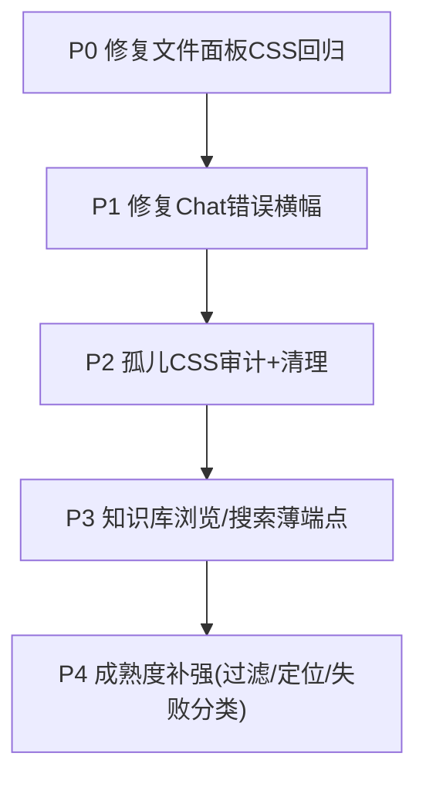

# Development plan for project optimization

## User

Help me create a plan to implement a new feature:
我现在需要针对该项目的chat,agent,Gbrain三大功能模块,进行针对性优化
先前该项目已经完成mvp,但是还不满足分发应用局部内部人员测试的水平
我使用codex生成了一个计划文档C:\Users\79292\.claude\plans\steady-yawning-phoenix.md
请你根据这个已有的计划框架文件和实际的项目功能代码程序的水平
生成一个架构清晰,可执行可验证的开发流程计划,该计划更新在D:\Gary\System-Building\02-Ongoing\Project_R\docs\milestones\Project_R 开发流程V2.0.md文件内

## Assistant

【分析问题】

我先阅读已有的计划框架文件、当前的 V2.0 开发流程文件，并核对实际项目代码水平。让我并行读取关键文件。

### Tool Read File V2

```
{"path":"C:\\Users\\79292\\.claude\\plans\\steady-yawning-phoenix.md"}
```

### Tool Read File V2

```
{"path":"D:\\Gary\\System-Building\\02-Ongoing\\Project_R\\docs\\milestones\\Project_R 开发流程V2.0.md"}
```

## Assistant

我已读完两份文档。现在的关键是：Codex 生成的计划里标注了大量"当前状态"（如 C1 说流式还是假打字机、A1-A3 说不支持文档生成等），但现有 V2.0 文档里很多项已勾选完成。这两者存在矛盾。用户明确要求"根据实际的项目功能代码程序的水平"来生成计划，所以我必须先核对 Codex 计划里的"当前状态"是否与真实代码一致，否则计划会建立在错误前提上。

让我并行核查几个关键点的真实代码状态。

### Tool Ripgrep Raw Search

```
{"pattern":"StreamingResponse|text/event-stream|async def.*stream|EventSource|ReadableStream|getReader\\(\\)","path":"D:\\Gary\\System-Building\\02-Ongoing\\Project_R","outputMode":"files_with_matches","caseInsensitive":false,"multiline":false,"toolCallId":"toolu_011MqMXL6TVp6KqmewkL1Cfh","offset":0}
```

### Tool Ripgrep Raw Search

```
{"pattern":"openpyxl|python-pptx|pptx|render_docx|render_xlsx|render_pptx|document_generate","path":"D:\\Gary\\System-Building\\02-Ongoing\\Project_R","outputMode":"files_with_matches","caseInsensitive":false,"multiline":false,"toolCallId":"toolu_018ZiqpTarfnx2cH6BppTiF6","offset":0}
```

### Tool Ripgrep Raw Search

```
{"pattern":"draft|localStorage|sessionStorage|autosave|草稿","path":"D:\\Gary\\System-Building\\02-Ongoing\\Project_R\\frontend","outputMode":"files_with_matches","caseInsensitive":false,"multiline":false,"toolCallId":"toolu_01D1UxRsummwx8bi43qMySH1","offset":0}
```

### Tool Ripgrep Raw Search

```
{"pattern":"export|/transform|mailto|\\.eml|clipboard","path":"D:\\Gary\\System-Building\\02-Ongoing\\Project_R\\backend","outputMode":"files_with_matches","caseInsensitive":false,"multiline":false,"toolCallId":"toolu_017yVUxE12uHeoVxp35WNPfx","offset":0}
```

## Assistant

初步信号已经很有价值：Chat 路径几乎没有真正的 SSE/StreamingResponse，说明 C1 流式很可能确实是前端模拟（与 Codex 判断一致），而后端文档生成确实已有 `document_generation.py` 和 `documents/renderer.py`。我需要逐一核实。让我读取关键文件。

### Tool Read File V2

```
{"path":"D:\\Gary\\System-Building\\02-Ongoing\\Project_R\\backend\\app\\features\\documents\\renderer.py"}
```

### Tool Read File V2

```
{"path":"D:\\Gary\\System-Building\\02-Ongoing\\Project_R\\backend\\app\\features\\chat\\document_generation.py"}
```

### Tool Read File V2

```
{"path":"D:\\Gary\\System-Building\\02-Ongoing\\Project_R\\backend\\requirements.txt"}
```

## Assistant

关键发现已经印证了我的担忧——Codex 计划的"当前状态"和依赖判断存在硬伤：

- 文档生成**只支持 DOCX**（`render_docx`），Excel/PPT/PDF 确实未做（与 Codex 一致）；
- 但 `openpyxl` **已在 `requirements.txt`**（A1 说"引入 openpyxl 依赖"不准确）；
- `python-pptx` **不在依赖**里；
- `playwright` **根本不在 `requirements.txt`**，而 Codex 写"playwright（已有）"——**错误**，会直接影响 A3 PDF 方案可行性。

这说明必须逐项核实真实代码水平。约有 30 个特性项（C1-C14、A1-A5、B1-B3、T1-T3、G1-G7），我用一个彻底的探查子代理把每一项的真实状态核对清楚，避免计划建立在错误前提上。同时我先记下已亲自验证的几项。

### Tool Read File V2

```
{"path":"D:\\Gary\\System-Building\\02-Ongoing\\Project_R\\frontend\\src\\renderer\\features\\chat\\components\\ChatComposer.tsx"}
```

### Tool New agent

```
{"description":"核实V2.0特性真实代码状态","prompt":"你在 Project_R 仓库（D:\\Gary\\System-Building\\02-Ongoing\\Project_R）做只读代码核实。这是一个 FastAPI(backend) + Electron/React/Vite/TypeScript/Jotai(frontend) 项目。我有一份计划文档列出了一批\"待开发功能\"并标注了它们的\"当前状态\"，但这些状态判断可能不准确。你的任务是逐项核对每个功能在真实代码里的实际实现状态，给出\"已实现/部分实现/未实现\"的结论，并附上证据（文件路径 + 关键代码行/函数名）。请\"very thorough\"。\n\n请逐项核对以下功能（按编号回答，每项给：结论 + 证据文件路径 + 简短说明）：\n\n【Chat 板块】\n- C1 SSE 流式输出：后端聊天接口是否有真正的流式（StreamingResponse / SSE / 异步 yield），还是前端打字机模拟？查 backend/api/chat.py、backend/app/features/chat/、frontend 的 chat api 与 ChatMessageList/ChatComposer。\n- C2 草稿自动保存：聊天输入框是否把草稿按 sessionId 存到 localStorage 并恢复？查 frontend ChatComposer.tsx 及 chat state。\n- C3 会话导出：后端是否有导出会话为 markdown/json 的端点？前端是否有导出按钮？查 backend/api/chat.py 及 frontend chat。\n- C4 上下文窗口 token 指示器：后端是否存储/返回 token 使用量？前端是否显示已用 tokens？\n- C5 会话内搜索（Ctrl+F 在当前会话内全文搜索）：是否存在？\n- C6 输入框自动调整高度（auto-resize textarea）：ChatComposer 是否随内容扩展高度，还是固定 rows？\n- C7 快捷键绑定：Ctrl+K 等快捷键是否定义且真正绑定了 keydown 监听？查 slashCommands 及全局快捷键。\n- C8 消息引用/回复：是否支持右键引用某条消息再回复？\n- C9 会话列表预览：侧边栏会话项是否显示最后一条消息摘要，还是只有标题+时间？\n- C13 模型温度控制 UI：前端是否有温度滑块？后端是否支持 temperature 参数？\n\n【Agent 板块】\n- A1 Excel 文档生成：后端 chat/agent 文档生成是否支持 xlsx 输出？（注意 openpyxl 已在 requirements，但生成链路是否用到）\n- A2 PPT 文档生成：是否支持 pptx 输出？python-pptx 是否在依赖？是否有 frontend-slides skill，它产出什么格式？\n- A3 PDF 文档生成：是否支持 pdf 输出？是否依赖 playwright（注意 requirements.txt 里没有 playwright）？\n- A4 tag-printing 技能：是否存在该 skill，部署在 backend/skills/builtin/ 还是别处（如 _release/）？\n- A5 输出保存到工作区：Agent/文档生成产物能否经用户确认保存到当前工作区的 99-未归档文件？查 generated_files 与 workspace 保存逻辑。\n- B1 .eml 文件生成：后端是否能生成 .eml 邮件文件？\n- B2 mailto: 链接：前端是否有生成 mailto 链接打开邮件客户端的功能？\n- B3 剪贴板复制：是否有自动复制草稿到剪贴板的功能？\n- T2 POST /chat/transform 文本变换端点：后端是否存在该端点（rewrite/translate/summarize/expand）？\n\n【GBrain 板块】\n- G1 知识库浏览 UI：除了 /query 命令，是否有公司知识目录浏览/分类展示的独立 UI 面板？\n- G2 知识库搜索独立入口：是否有独立于 Chat 的知识库搜索面板？查 frontend 是否有 knowledge search 组件。\n- G3 搜索结果过滤（按 source/类型/时间）：是否实现？\n- G4 Source 状态用户可见：普通用户能否看到哪些文件已入库，还是仅管理员可见？\n- G5 质量报告可视化：管理员质量报告是纯文本还是有图表可视化？查 frontend admin 面板。\n- G6 知识审核增强（diff 视图、批量通过/驳回）：审核界面是否有 diff 对比和批量操作？\n- G7 GBrain 状态仪表板：是否有指标卡片/健康趋势仪表板，还是纯文字？\n\n请把结论组织成一个清晰的清单，方便我据此修正计划文档。不要修改任何文件。","subagentType":{"explore":{}},"model":"composer-2.5-fast","agentId":"66666697-96ae-4a8f-a881-46ece82349a9","attachments":[],"mode":"TASK_MODE_UNSPECIFIED","respondingToMessageIds":[],"environment":"SUBAGENT_EXECUTION_ENVIRONMENT_UNSPECIFIED"}
```

## Assistant

我已完成代码核实（详见子代理报告 [核实V2.0特性真实代码状态](1220d7d4-b0c4-4c2d-97fb-2f42652ea461)）。下面是【分析问题】结论。

## 一、两份文档的关系

| 文档 | 性质 | 现状 |
|---|---|---|
| 现有 `开发流程V2.0.md` | **基座精修计划**（Chat 稳定性、/query 闭环、检索、基础 Agent 框架） | 4 条主线绝大多数已 `[x]` 完成，是"地基已夯实"的事实记录 |
| Codex `steady-yawning-phoenix.md` | **产品化计划**（对标网页版 AI、Agent 产出可用文件、GBrain 用户/管理体验） | 是地基之上的"下一层"，目标正是你说的"达到内部分发测试水平" |

所以两者不是替代关系，而是**地基 → 产品化**的递进。新计划应在保留已完成基线的前提下，叠加一份代码准确、可执行可验证的产品化路线。

## 二、Codex 计划的事实性硬伤（必须在新计划里修正）

我逐项核对了 28 个特性，结论是**"待开发"判断方向大体正确，但状态描述和依赖判断有多处错误**：

1. **依赖错判**：`openpyxl` 已在 `requirements.txt`（A1 不需"引入"）；`python-pptx` 确实没有；**`playwright` 根本不在依赖里**，而 Codex 写"playwright（已有）"——这直接动摇 A3 PDF 方案。
2. **关键架构约束被忽略**：`backend/app/features/chat/intent.py` 的 `classify_intent()` **被冻结为永远返回 CHAT**（且有测试锁定），导致现有的 docx 生成分支是**死代码**。这意味着 A1-A3 的真正难点不是"加渲染器"，而是**用什么显式入口触发文档生成**（Skill / 工具栏按钮 / Agent 姿态），这必须符合 `AGENTS.md` 的"显式路由优先"边界。
3. **产品规则约束被忽略**：A5"保存到工作区"必须遵守业务文件容器规则——个人工作台只能展示/下载，**只有项目/客户工作区**才能经确认存入 `99-未归档文件`。
4. **G4/G7 需区分角色**：文件级 `rag_status` 普通成员已可见（部分实现）；质量报告/仪表板主要是管理员侧。
5. **多项"部分实现"**：C4(token 后端有/前端无)、C7(快捷键有配置无绑定)、C13(regenerate 支持/发送链路无)、B3(手动复制有/自动无)、A5、G4、G5、G6、G7。

## 三、需要你拍板的设计决策

新计划要可执行，有几个真正属于你的决策点（影响计划结构和优先级），我先收集再动笔：

### Tool Ask Question

```
{"title":"新 V2.0 计划的关键决策","questions":[{"id":"doc_structure","prompt":"新 V2.0.md 的文档结构怎么处理？（现有文件大部分是已完成的“基座精修”checklist）","options":[{"id":"append_layer","label":"推荐：保留现有“基座精修”作为“V2.0 已完成基线”精简归档，在其后新增“V2.1 产品化路线”主体（Chat/Agent/GBrain 三板块 + Sprint + 验收）"},{"id":"full_rewrite","label":"整篇重写：用产品化计划替换现有内容，旧基座精修内容压缩成一段“前置已完成”说明"},{"id":"keep_separate","label":"现有文件不动，把产品化计划写成文件内一个全新的大章节，新旧并列"}],"allowMultiple":false},{"id":"doc_trigger","prompt":"文档生成（Excel/PPT/PDF）的触发入口怎么定？（当前 intent 冻结，docx 分支是死代码）","options":[{"id":"skill_explicit","label":"推荐：走显式 Skill / Agent 姿态触发（符合“显式路由优先”边界），不解冻 intent 自动识别"},{"id":"toolbar_button","label":"输入区/结果卡片加显式“生成文档”按钮，用户选格式"},{"id":"unfreeze_intent","label":"解冻 intent 自动识别文档意图（注意：会改动已确认的产品边界，需同步 ADR/CONTEXT）"}],"allowMultiple":false},{"id":"pdf_strategy","prompt":"A3 PDF 生成策略（playwright 不在依赖，且要兼容 Mac mini 迁移）？","options":[{"id":"defer_pdf","label":"推荐：本期 PDF 降级为“后续项”，先做 docx/xlsx/pptx 原生生成，PDF 由用户用 Office 另存或后续再评估"},{"id":"docx_convert","label":"用轻量 docx→pdf 方案（如 LibreOffice headless / docx2pdf），评估跨平台成本后纳入"},{"id":"playwright_html","label":"引入 playwright 走 HTML→PDF（复用 frontend-slides 工具链，但新增重依赖）"}],"allowMultiple":false},{"id":"priority","prompt":"三板块的执行优先级是否沿用 Codex 的“Chat → Agent → GBrain”串行顺序？","options":[{"id":"keep_serial","label":"推荐：沿用 Chat → Agent → GBrain 串行，但每板块内按“感知提升/成本”重排 P0（如 C1 SSE、C2 草稿、C3 导出优先）"},{"id":"painpoint_first","label":"先做跨板块最高感知项（SSE 流式 + 文档生成 + 知识库浏览）做成一个“可演示内测包”，再补长尾"},{"id":"as_is","label":"完全沿用 Codex 的 6 个 Sprint 顺序不调整"}],"allowMultiple":false}],"runAsync":false,"asyncOriginalToolCallId":""}
```

## Assistant

你跳过了决策，我按推荐默认值推进：保留已完成基座作为"已完成基线"精简归档 + 新增产品化路线主体；文档生成走显式 Skill/Agent 触发（不解冻 intent）；PDF 本期降级为后续项；三板块沿用 Chat→Agent→GBrain 串行但板块内按感知/成本重排 P0。

动笔前，确认一下 LLM 客户端的真实路径，让 C1 SSE 的改动范围写准确。

### Tool Glob File Search

```
{"globPattern":"backend/app/shared/llm/**/*.py"}
```

### Tool Glob File Search

```
{"globPattern":"frontend/src/renderer/features/chat/*.ts"}
```

### Tool Read File V2

```
{"path":"D:\\Gary\\System-Building\\02-Ongoing\\Project_R\\backend\\app\\shared\\llm\\client.py"}
```

## Assistant

LLM 客户端用的是同步 `urllib` + 一次性读取响应，SSE 需要在 `LLMClient` 协议/`BaseProviderClient` 上新增流式方法（Anthropic `/v1/messages` 与 OpenAI 兼容 `chat/completions` 都加 `stream:true`），并保持 provider 无关 + Key 轮询。架构已摸清，信息足够。

【执行方案】

变更文件：仅重写 `docs/milestones/Project_R 开发流程V2.0.md`（不改任何代码）。新内容在保留"基座精修已完成基线"的前提下，叠加一份代码准确、可执行可验证的三板块产品化路线，并显式记录我核实出的架构约束与已确认决策。

### Tool Edit File V2

````
{"path":"D:\\Gary\\System-Building\\02-Ongoing\\Project_R\\docs\\milestones\\Project_R 开发流程V2.0.md","streamContent":"# Project_R 开发流程 V2.0\n\n版本：V2.0（产品化精修）\n创建时间：2026-06-10\n修订时间：2026-06-15\n状态：执行计划\n规划目标：在已完成的\"基座精修\"之上，对 Chat、Agent、GBrain 三大板块做针对性产品化精修，把 MVP 推进到\"可分发给局部内部人员测试\"的水平。\n\n> 本文件是 V2.0 主计划。历史阶段事实（Phase 1-20、GBrain 迁移、9.E 会议 Skill 第一版闭环等）以 `docs/milestones/Project_R 开发流程.md` 为准，本文件不重复。\n\n---\n\n## 0. 修订记录\n\n| 日期 | 变更 | 说明 |\n|---|---|---|\n| 2026-06-10 | 创建 V2.0（基座精修） | Chat 稳定性 / `/query` 闭环 / 检索 / 基础 Agent 框架四主线 |\n| 2026-06-15 | 叠加产品化路线 | 基于代码审计，新增 Chat/Agent/GBrain 三板块产品化清单、Sprint 路线图与逐项验收 |\n\n本次修订对照了 Codex 生成的计划框架（`steady-yawning-phoenix.md`）并逐项核对真实代码，修正了其中的依赖误判（`playwright` 实际不在依赖、`openpyxl` 已存在）、状态误判（多项\"未实现\"实为\"部分实现\"），以及一个被忽略的关键约束：`intent.py` 已冻结显式路由，使旧 docx 生成分支成为不可达死代码。\n\n---\n\n## 1. 已完成基线（V2.0 基座精修）\n\n下列基座能力已实现并验证，是本轮产品化的地基，**不在本轮重做**。详细验收记录见 git 历史与下文引用文件。\n\n| 主线 | 已完成内容 | 状态 |\n|---|---|---|\n| A. Chat 基座 | 标签页/会话/工作区切换不串状态；附件与项目文件引用分离；Markdown/表格/代码块渲染；取消生成与重试；模型选择持久化；提示词三层展示 | 已完成 |\n| B. 知识库查询闭环 | `/query` 路径稳定；三类工作区 source scope 隔离（company-wiki / 项目 / 客户）；citation 可点击预览；gap/warning 展示；公司+客户质量回归 | 已完成（项目知识回归待真实 source 闭环） |\n| C. 检索与资料发现 | 项目文件搜索与过滤；统一来源预览面板；引用片段定位；按文件类型意图分流排序 | 已完成（独立\"知识库检索\"面板未做，见 G2） |\n| D. 基础 Agent 执行 | Agent 姿态显式切换；补参/计划/确认卡片；Tool 与 Skill 分层；run id/状态/取消/重试；失败写审计与通知 | 已完成（产出文件落地链路未闭环，见 A5） |\n\n> 仍挂起的基座尾项已并入本轮产品化清单：项目知识回归（B 板块沿用旧回归脚本）、知识库独立检索入口（G2）、Agent 产出保存到工作区（A5）、PDF 全面预览（沿用旧 C3）。\n\n---\n\n## 2. 产品化目标与\"内测可分发\"定义\n\n本轮要回答的核心问题：**普通员工能不能用它替代日常网页版 AI，并信任它的知识库回答和文件产出？**\n\n达到\"可分发内测\"的最低标准（验收总纲）：\n\n1. **Chat 可日常替代**：流式输出顺滑、草稿不丢、对话可带走（导出），输入与快捷操作符合主流 AI 产品直觉。\n2. **Agent 产出可用**：生成结果不只是聊天文本，能落成可下载的标准文件（至少 docx/xlsx/pptx），并能在项目/客户工作区按规则保存。\n3. **GBrain 可被普通用户使用**：不需记命令也能浏览/搜索公司知识库，看得到来源与入库状态；管理员能直观看质量与做审核。\n4. **技术闸门**：Chat / query / search / agent 四类主路径都有后端测试与前端关键路径测试；不污染真实 `app.db` 与真实 workspace data；`bun run typecheck`、相关 `pytest`、关键 Playwright 通过。\n\n---\n\n## 3. 关键架构约束与已确认决策\n\n本轮所有任务必须遵守以下经代码核实的事实与已拍板决策：\n\n### 3.1 显式路由边界不变（影响 Agent 文档生成）\n\n- `backend/app/features/chat/intent.py` 的 `classify_intent()` 当前**恒返回 `chat`**，且有测试锁定。这导致 `backend/api/chat.py` 内的 docx 生成分支为**不可达死代码**。\n- **决策**：本轮**不解冻 intent 自动识别**。文档生成（docx/xlsx/pptx）一律走**显式入口**触发——内置命令 / Skill / Agent 姿态，符合 `AGENTS.md` 的\"显式路由优先\"与 `docs/adr/0016-explicit-chat-gbrain-routing.md`，无需新 ADR。\n- 落地方式：把\"文档生成\"包装为一个显式可选的内置命令或 Skill（如 `/doc` 或文档生成 Skill），由它调用 `documents/renderer.py` 的渲染器。\n\n### 3.2 业务文件容器规则（影响 A5 保存）\n\n- 个人工作台：Agent/生成产物**只允许本轮展示 + 下载**，不得保存到任何工作区。\n- 项目/客户工作区：产物须**用户确认后**才写入当前工作区 `99-未归档文件`（后端 `POST /{workspace_id}/attachments/save` 已存在，默认目录 `DEFAULT_UNFILED_DIR = \"99-未归档文件\"`），保存不等于自动入库 GBrain。\n\n### 3.3 依赖现状（修正 Codex 误判）\n\n| 依赖 | 真实状态 | 本轮用途 |\n|---|---|---|\n| `python-docx` | 已在 `requirements.txt` | docx 生成（已可用） |\n| `openpyxl` | **已在** `requirements.txt`（当前仅用于预处理读取） | A1 复用其写 xlsx，无需新增依赖 |\n| `python-pptx` | **不在**依赖 | A2 需新增 |\n| `playwright` | **不在**依赖（Codex 误标\"已有\"） | A3 PDF 因此降级为后续项，见 3.4 |\n| `pypdf` / `PyMuPDF` | 已在依赖 | 仅用于读取/预处理 PDF，非生成 |\n\n### 3.4 PDF 生成本轮降级\n\n- 由于 `playwright` 不在依赖且会引入重型 Node/浏览器依赖，与\"可迁移到 Mac mini\"红线冲突，**A3 PDF 生成本轮不做**。\n- 替代：用户可对生成的 docx/xlsx/pptx 用本地 Office 另存为 PDF；PDF 原生生成留待后续单独评估（docx→pdf headless 转换方案）。\n\n### 3.5 SSE 必须保持 provider 无关\n\n- `backend/app/shared/llm/client.py` 当前用同步 `urllib` 一次性读取响应（`_request_json`）。C1 流式必须在 `LLMClient` 协议 + `BaseProviderClient` 上新增统一的流式方法，由 `AnthropicMessagesClient` 与 `OpenAICompatibleChatClient` 各自实现（两者都加 `stream:true`），**保留 Key 轮询与容错**，业务层不得直接依赖某厂商 SSE 格式。\n\n---\n\n## 4. 板块一：Chat 产品化\n\n目标：让用户能用它替代网页版 ChatGPT/DeepSeek 作为日常入口。执行顺序固定为板块一最先。\n\n### 4.1 清单总览\n\n| # | 功能 | 真实状态 | 优先级 |\n|---|---|---|---|\n| C1 | SSE 流式输出 | 未实现（前端 `setInterval` 打字机模拟） | P0 |\n| C2 | 草稿自动保存 | 未实现（`draft` 仅内存 state） | P0 |\n| C3 | 会话导出（Markdown/JSON） | 未实现 | P0 |\n| C6 | 输入框自动调整高度 | 未实现（`rows={1}` + 固定高度区间） | P0 |\n| C7 | 快捷键真正绑定 | 部分实现（设置页有配置，运行时未绑定） | P1 |\n| C4 | 上下文窗口 token 指示器 | 部分实现（后端已存 token，前端无 UI） | P1 |\n| C5 | 会话内搜索（当前会话全文） | 未实现（只有跨会话搜索） | P1 |\n| C9 | 会话列表预览 | 未实现（侧边栏仅标题+时间） | P2 |\n| C8 | 消息引用/回复 | 未实现 | P2 |\n| C13 | 模型温度控制 UI | 部分实现（regenerate 支持，发送链路无，无 UI） | P2 |\n\n### 4.2 P0 实现要点与验收\n\n**C1 SSE 流式输出**\n- 改动范围：\n  - `backend/app/shared/llm/client.py`：`LLMClient` 协议 + `BaseProviderClient` 新增 `stream()`；`AnthropicMessagesClient` 解析 `content_block_delta`，`OpenAICompatibleChatClient` 解析 `choices[].delta.content`；保留 `ProviderKeyPool` 轮询与重试。\n  - `backend/api/chat.py`：`send_message` 增加流式分支（消费已有 `SendMessageRequest.stream`），用 `StreamingResponse`（sync generator 跑线程池）逐块输出，末尾发送 token usage 与持久化结果。\n  - `frontend/src/renderer/features/chat/api.ts`：新增基于 `fetch` + `ReadableStream.getReader()` 的流式发送，复用现有 `AbortController` 取消机制。\n  - `frontend/src/renderer/pages/AppPage.tsx`：用真实增量替换 `typeAssistantReply` 的 `setInterval` 模拟；保留\"仅贴底时自动跟随\"。\n- 验收：后端 `pytest`（mock provider 流式分块）；`bun run typecheck`；Playwright：长回答流式不抖动、可中途取消、取消后可重试、token 写入正确。\n\n**C2 草稿自动保存**\n- 改动范围：`AppPage.tsx`（`draft`/`setDraft` 按 `sessionId` 读写 `localStorage`，切换会话回填，发送成功后清空对应 key）；可抽到 `features/chat/state.ts` 工具函数。\n- 验收：`bun run typecheck`；手工：输入未发送→刷新/切会话→回到原会话草稿恢复，发送后清空。\n\n**C3 会话导出**\n- 改动范围：`backend/api/chat.py` 新增 `GET /chat/sessions/{id}/export?format=markdown|json`（薄路由，组装逻辑放 `app/features/chat/`）；`frontend/src/renderer/features/chat/api.ts` + 会话菜单加导出按钮。\n- 验收：后端 `pytest`（导出含全部消息、角色、时间、引用；权限校验非本人会话拒绝）；`bun run typecheck`；手工下载校验。\n\n**C6 输入框自动调整高度**\n- 改动范围：`frontend/src/renderer/features/chat/components/ChatComposer.tsx`（textarea 监听 `scrollHeight` 动态调高）；`frontend/src/renderer/shared/styles/global.css`（`.composer textarea` min/max-height 配合）。\n- 验收：`bun run typecheck`；手工：多行输入自动增高至上限后内部滚动，发送后回落。\n\n### 4.3 P1/P2 实现要点\n\n| # | 改动范围 | 验收 |\n|---|---|---|\n| C7 | `AppPage.tsx` 全局 `keydown` 读取 `preferences.shortcuts`（`SettingsModal` 已存 `DEFAULT_SHORTCUTS`），绑定 Ctrl+K(搜索)/Ctrl+N(新会话)等 | 手工逐快捷键验证 + 与设置页一致 |\n| C4 | `ChatMessageList.tsx` 输入区显示\"已用 X / 上限 tokens\"，数据取自 message 的 `token_total` | `bun run typecheck` + 手工核对 |\n| C5 | 当前会话消息列表内全文搜索（前端过滤/高亮，复用 `SearchDialog` 样式但限定当前会话） | `bun run typecheck` + Playwright 高亮命中 |\n| C9 | 后端 `list_sessions` 附最后一条消息摘要；`AppWorkspaceChrome.tsx` 会话项展示预览 | 后端 `pytest` + 手工 |\n| C8 | `ChatMessageList.tsx` 消息操作加\"引用\"，Composer 加 quoted 字段 | `bun run typecheck` + 手工 |\n| C13 | `SendMessageRequest` 加 `temperature`；`ChatComposer.tsx` 加温度滑块；`api/chat.py` 透传 | 后端 `pytest` + 手工 |\n\n---\n\n## 5. 板块二：Agent 效率工具\n\n目标：Agent 产出从\"聊天文本\"变为\"可用文件\"，并能按规则落到工作区。执行顺序在 Chat 之后。\n\n### 5.1 清单总览\n\n| # | 功能 | 真实状态 | 优先级 |\n|---|---|---|---|\n| A1 | Excel(xlsx) 生成 | 未实现（仅 docx 渲染器，`openpyxl` 已具备） | P0 |\n| A2 | PPT(pptx) 生成 | 未实现（`python-pptx` 需新增；frontend-slides 产 HTML 非 pptx） | P0 |\n| A5 | 产出保存到工作区 `99-未归档文件` | 部分实现（后端 API 已存在，前端 `saveAttachmentToWorkspace` 定义未调用） | P0 |\n| 触发 | 文档生成显式入口（命令/Skill） | 未实现（docx 分支因 intent 冻结不可达） | P0 |\n| B1 | `.eml` 文件生成 | 未实现 | P1 |\n| B2 | `mailto:` 启动邮件客户端 | 未实现 | P1 |\n| B3 | 自动复制草稿到剪贴板 | 部分实现（有手动复制，无自动） | P1 |\n| T2 | `POST /chat/transform` 文本变换端点 | 未实现 | P1 |\n| T1 | 改写/翻译/总结一键按钮 | 未实现 | P2 |\n| A3 | PDF 生成 | 未实现 | 后续（见 3.4） |\n| A4 | tag-printing Skill | 不存在于代码库（Codex 误标在 `_release/`） | 后续/待确认需求 |\n\n### 5.2 P0 实现要点与验收\n\n**文档生成显式入口（前置，A1/A2 依赖它）**\n- 改动范围：新增显式内置命令或 Skill（如 `/doc`），路由到 `backend/app/features/chat/document_generation.py`；不改 `intent.py`。前端在 `slashCommands.ts` 注册。\n- 验收：后端 `pytest`（显式命令触发生成；普通 chat 不触发）；`bun run typecheck`。\n\n**A1 Excel 生成 / A2 PPT 生成**\n- 改动范围：\n  - `backend/app/features/documents/renderer.py`：新增 `render_xlsx`（`openpyxl`，把 Markdown 表格→工作表）、`render_pptx`（`python-pptx`，标题/要点→幻灯片）。\n  - `backend/app/features/chat/document_generation.py`：`create_generated_*` 支持按目标格式落 `GeneratedFile` 与 MIME。\n  - `backend/requirements.txt`：新增 `python-pptx`（固定版本）。\n- 验收：后端 `pytest`（生成文件可被 openpyxl/python-pptx 反读校验内容）；产物落在隔离的 `generated_files/`，不污染真实数据。\n\n**A5 产出保存到工作区**\n- 改动范围：`frontend/src/renderer/features/chat/components/ChatMessageList.tsx` 的 `renderGeneratedFileCard` 在**项目/客户工作区**增加\"保存到工作区\"按钮，调用已存在的 `saveAttachmentToWorkspace`→`POST /{workspace_id}/attachments/save`；个人工作台**只显示下载**。\n- 验收：后端 `pytest`（保存到 `99-未归档文件`、权限边界、个人工作台拒绝跨区保存）；Playwright：项目区可保存、个人区无保存入口。\n\n### 5.3 P1/P2 实现要点\n\n| # | 改动范围 | 验收 |\n|---|---|---|\n| B1 | 后端用标准库 `email`/`email.policy` 生成 `.eml` → `GeneratedFile`；前端结果卡片加\"下载 .eml\" | 后端 `pytest`（.eml 可被邮件客户端解析头/正文） |\n| B2 | 前端结果卡片生成 `mailto:` 链接并由主进程/默认客户端打开 | 手工：点击拉起本地邮件客户端 |\n| B3 | 邮件草稿 Skill 结果卡片加\"复制到剪贴板\"（含自动复制可选项） | `bun run typecheck` + 手工 |\n| T2 | `backend/api/chat.py` 新增薄路由 `POST /chat/transform`（text+action: rewrite/translate/summarize/expand），逻辑放 `app/features/chat/` | 后端 `pytest` 四类 action |\n| T1 | 工具栏/选中文本浮动按钮，调用 T2；结果可替换或作为新消息 | `bun run typecheck` + Playwright |\n\n---\n\n## 6. 板块三：GBrain 产品化\n\n目标：普通用户不记命令也能用知识库；管理员能直观维护。执行顺序最后（放大前两板块的稳定性收益）。\n\n### 6.1 清单总览\n\n| # | 功能 | 真实状态 | 优先级 |\n|---|---|---|---|\n| G1 | 知识库浏览 UI（公司知识目录/分类） | 未实现（仅 `/query` 命令；项目图谱另算） | P0 |\n| G2 | 知识库搜索独立入口 | 未实现（依赖 `/query` 对话式） | P0 |\n| G3 | 搜索结果过滤（source/类型/时间） | 未实现（用户侧 UI） | P1 |\n| G4 | Source 状态用户可见 | 部分实现（文件级 `rag_status` 成员可见） | P1 |\n| G5 | 质量报告可视化 | 部分实现（管理员文字摘要+JSON 导出，无图表） | P1 |\n| G6 | 知识审核增强（diff + 批量） | 部分实现（单条通过/驳回，无 diff/批量） | P1 |\n| G7 | GBrain 状态仪表板 | 部分实现（指标卡片+文字趋势，无趋势图） | P2 |\n\n### 6.2 P0 实现要点与验收\n\n**G1 知识库浏览 UI / G2 搜索独立入口**\n- 改动范围：新增前端 feature（`frontend/src/renderer/features/knowledge/...`）——独立面板：公司知识目录浏览 + 搜索框（区别于 Chat 的 `/query`）。后端复用现有 GBrain 查询/source 接口（`backend/api/rag.py`、`app/features/knowledge/`），必要时补只读列表端点（薄路由）。\n- source scope 严格遵守 GBrain 边界：个人工作台只 `company-wiki`；项目区 `company-wiki + 当前项目`；客户区只客户情报。\n- 验收：后端 `pytest`（三类 source scope 列表/搜索）；`bun run typecheck`；Playwright：浏览→搜索→点击→来源预览/发起 `/query`；普通 Chat 不被升级为知识库检索。\n\n### 6.3 P1/P2 实现要点\n\n| # | 改动范围 | 验收 |\n|---|---|---|\n| G3 | 搜索面板加 source/类型/时间过滤控件（后端排序权重已有，补用户可选过滤） | 后端 `pytest` + Playwright 过滤/空结果 |\n| G4 | 把文件级 `rag_status` 可见性扩展为更清晰的 source 状态提示（沿用 `WorkspaceFileRow` 徽章） | `bun run typecheck` + 手工 |\n| G5 | `AdminSettingsPanel.tsx` 质量报告区加图表组件（通过率趋势、失败分布），数据取自 `GET /quality/reports` | `bun run typecheck` + 手工 |\n| G6 | 审核 tab 加 side-by-side diff（原答案 vs 修正）与批量通过/驳回（后端补 batch 端点） | 后端 `pytest` + 手工 |\n| G7 | GBrain 概览区把文字趋势升级为趋势图（健康分/jobs/contradictions） | `bun run typecheck` + 手工 |\n\n---\n\n## 7. Sprint 执行路线图\n\n执行顺序固定 **Chat → Agent → GBrain**（串行承诺）；板块内按\"感知提升/成本\"重排，P0 先行。\n\n```\nSprint 1  Chat 核心痛点（P0）\n├── C1 SSE 流式输出（前后端 + LLM client）\n├── C2 草稿自动保存\n├── C6 输入框自动调整高度\n└── C3 会话导出\n\nSprint 2  Chat 体验增强（P1/P2）\n├── C7 快捷键绑定\n├── C4 token 指示器\n├── C5 会话内搜索\n├── C9 会话列表预览\n└── C8 消息引用 / C13 温度控制\n\nSprint 3  Agent 文件产出（P0）\n├── 文档生成显式入口（命令/Skill，前置）\n├── A1 Excel 生成 / A2 PPT 生成（+ python-pptx 依赖）\n└── A5 产出保存到工作区（项目/客户区）\n\nSprint 4  Agent 邮件与文本变换（P1/P2）\n├── B1 .eml 生成 / B2 mailto / B3 剪贴板\n├── T2 transform 端点\n└── T1 一键变换按钮\n\nSprint 5  GBrain 用户侧（P0/P1）\n├── G1 知识库浏览 UI\n├── G2 搜索独立入口\n├── G3 结果过滤\n└── G4 Source 状态可见\n\nSprint 6  GBrain 管理侧（P1/P2）\n├── G5 质量报告可视化\n├── G6 审核增强（diff + 批量）\n└── G7 状态仪表板\n```\n\n每个 Sprint 完成标志：清单内 P0 项全部实现且通过验收闸门；未验证项保持未勾选，不得提前勾 checklist。\n\n---\n\n## 8. 依赖与环境变更\n\n| 依赖/变更 | 板块 | 动作 |\n|---|---|---|\n| `python-pptx` | A2 | 新增到 `backend/requirements.txt`（固定版本） |\n| `openpyxl` | A1 | 已存在，复用，无需新增 |\n| `python-docx` | docx | 已存在 |\n| `email`/`email.policy`（标准库） | B1 | 无需新增 |\n| `SendMessageRequest.stream` | C1 | 已存在字段，本轮接通消费逻辑 |\n| `.env.example` | 全 | 若新增可配置项（如流式开关）须同步示例，真实 `.env`/Key 不入库 |\n\n> 安装依赖前需获授权；安装后跑相关 `pytest` 确认无回归。\n\n---\n\n## 9. V2.0 明确不做项\n\n- 普通 Chat 自动查 GBrain / 自动识别文档意图（保持显式路由）。\n- A3 PDF 原生生成（本轮降级，见 3.4）。\n- 新增大批业务 Skill；复杂会议深水区；客户情报自动运营。\n- 个人工作台文件库、个人 GBrain source、个人长期记忆。\n- 用 Project_R 自建替代 GBrain 的图谱/timeline/citation/embedding。\n- 完整 MCP 协议支持、语音实时麦克风（C11）、批量会话操作（C12）、回复长度预设（C14）——按需后补。\n\n---\n\n## 10. 第一批可执行任务建议\n\n1. **C1 SSE 后端先行**：在 `llm/client.py` 加 `stream()` 并用 mock provider 写流式 `pytest`，再接 `api/chat.py` 的 `StreamingResponse`。\n2. **C1 前端接流**：`features/chat/api.ts` 写 `ReadableStream` 读取，替换 `AppPage.tsx` 打字机模拟，复用现有取消机制。\n3. **C2 草稿持久化**：抽 `features/chat/state.ts` 草稿读写工具，按 sessionId 存取。\n4. **文档生成显式入口**：在 `slashCommands.ts` + `document_generation.py` 打通显式命令链路（为 A1/A2 铺路），保持 `intent.py` 不变。\n5. **A5 保存按钮接线**：在 `ChatMessageList.tsx` 接通已存在的 `saveAttachmentToWorkspace`，区分个人/项目工作区。\n\n---\n\n## 11. 验收总标准\n\n### 11.1 用户体验\n- 普通员工可流式聊天、草稿不丢、导出对话、用快捷键操作。\n- Agent 产出能落成 docx/xlsx/pptx 并按规则保存到项目/客户工作区。\n- 用户能浏览/搜索公司知识库并看到来源与入库状态。\n- 始终能区分\"普通 Chat / 查知识库 / 执行 Agent\"三种状态。\n\n### 11.2 技术\n- Chat / query / search / agent 四类主路径有后端测试 + 前端关键路径测试。\n- SSE 保持 provider 无关、Key 轮询与容错；流式可取消可重试。\n- 不污染真实 `backend/app.db` 与真实 workspace data。\n- `bun run typecheck`、相关 `pytest`、关键 Playwright 通过；涉及 source scope 改动跑 query/source scope 回归。\n\n### 11.3 文档\n- 本文件是 V2.0 主计划；`Project_R 开发流程.md` 保留历史事实。\n- 若改 Chat / GBrain 边界，必须同步 `CONTEXT.md` 与 ADR；本轮不改该边界。\n- 若改前端视觉语言，必须先看并同步 `docs/design/ui-design-language.md`。\n- 新增/修改业务 Skill 后同步 `docs/product/Project_R 业务工作流清单.md`。\n"}
````

## Assistant

已完成。`docs/milestones/Project_R 开发流程V2.0.md` 已重写为一份代码准确、可执行可验证的产品化精修计划。

## 这份计划做了什么

**核心思路**：现有 V2.0 是"基座精修"（大多已完成），Codex 的 `steady-yawning-phoenix.md` 是其上的"产品化下一层"。我把两者整合成"已完成基线 → 三板块产品化路线"的递进结构，并用真实代码核实修正了 Codex 的事实错误。

**修正的关键误判**（计划第 0、3 节已记录）：
- `playwright` 实际**不在依赖** → A3 PDF 本轮降级（避免违反 Mac mini 可迁移红线）；
- `openpyxl` **已存在** → A1 无需新增依赖；`python-pptx` 才需新增；
- `intent.py` 显式路由**已冻结**，旧 docx 分支是死代码 → 文档生成改走**显式命令/Skill** 触发，不解冻 intent；
- 多项从"未实现"修正为"部分实现"（C4/C7/C13/A5/B3/G4/G5/G6/G7），避免重复造轮子。

**可执行可验证**：每个特性项都标注了真实状态、优先级、**具体改动文件路径**和**验收命令**（`pytest` / `bun run typecheck` / Playwright / 手工），并给出 6 个 Sprint 路线图（Chat→Agent→GBrain 串行）与第一批可落地任务。

**遵守的边界**：显式路由不变、业务文件容器规则（个人工作台只下载、项目/客户区确认后存 `99-未归档文件`）、SSE 保持 provider 无关、不污染真实数据。

## 交付说明
- **修改文件**：仅 `docs/milestones/Project_R 开发流程V2.0.md`（未改任何代码）。
- **验证**：文档类变更，无需跑测试闸门。
- **未验证风险/需你确认**：
  1. 我按推荐默认值拍板了 4 个决策（保留基线+叠加路线、显式触发文档生成、PDF 降级、串行优先重排 P0）——若与你预期不同，告诉我即可调整；
  2. A4 `tag-printing` Skill 在代码库中**根本不存在**（Codex 误标在 `_release/`），我暂列为"后续/待确认需求"，需你确认是否真的需要这个能力。

如果计划结构 OK，下一步可以从 Sprint 1（C1 SSE 后端先行）进入【细化方案】。

## User

请你评估各个功能实现清单的任务优先级,根据系统性的软件开发进度进行任务的开发顺序编排,而且我不希望后续agent根据这个开发流程开发,只是一味的在文件中堆叠功能代码,我希望我的项目代码是框架清晰,可控的,后期能顺利维护和变更功能的.我并不是系统框架设计的专家,我需要你把控这一点. 根据以上信息,帮我重新审核开发流程2.0markdown文件,并将我文字信息后半段的 代码系统性,结构化设计的要求 归纳总结,并以你专业知识润色优化写进Claude.md文件内

## Assistant

【分析问题】（带执行准备）

你的诉求有两层：①重排开发流程的优先级与顺序，让它符合"系统性软件开发"的推进逻辑，而不是堆功能；②把你后半段关于"代码系统化、结构化设计"的要求，归纳润色后写进 `CLAUDE.md`。

在动手前，我先确认两件关乎质量的事实：

1. 本项目规则明确要求 `CLAUDE.md` 与 `AGENTS.md` **必须保持同步**（冲突以 `AGENTS.md` 为准）。所以"代码结构准则"属于 Agent 工作规则，我会**同时写入两者**，否则规则本身就违反了项目护栏。
2. 你担心"后续 agent 往文件里堆代码"——我需要先量化当前哪些文件已经过大，才能给出有针对性、可执行的护栏。

让我先核对几个核心文件的真实体量。

### Tool Read File V2

```
{"path":"D:\\Gary\\System-Building\\02-Ongoing\\Project_R\\frontend\\src\\renderer\\pages\\AppPage.tsx","offset":-1,"limit":1}
```

### Tool Read File V2

```
{"path":"D:\\Gary\\System-Building\\02-Ongoing\\Project_R\\frontend\\src\\renderer\\features\\chat\\components\\ChatMessageList.tsx","offset":-1,"limit":1}
```

### Tool Read File V2

```
{"path":"D:\\Gary\\System-Building\\02-Ongoing\\Project_R\\backend\\api\\chat.py","offset":-1,"limit":1}
```

### Tool Read File V2

```
{"path":"D:\\Gary\\System-Building\\02-Ongoing\\Project_R\\frontend\\src\\renderer\\features\\chat\\components\\AppWorkspaceChrome.tsx","offset":-1,"limit":1}
```

### Tool Read File V2

```
{"path":"D:\\Gary\\System-Building\\02-Ongoing\\Project_R\\frontend\\src\\renderer\\features\\settings\\components\\SettingsModal.tsx","offset":-1,"limit":1}
```

## Assistant

核实结果触目惊心，完全印证你的担忧——这些是已经失控的"上帝文件"：

| 文件 | 行数 | 红线（AGENTS.md：>800 不堆，>1500 必拆） |
|---|---|---|
| `pages/AppPage.tsx` | **2603** | 远超 1500 |
| `features/settings/components/SettingsModal.tsx` | **2291** | 远超 1500 |
| `backend/api/chat.py` | **1444** | 超 800，逼近 1500 |
| `features/chat/components/ChatMessageList.tsx` | **1193** | 超 800 |
| `features/chat/components/AppWorkspaceChrome.tsx` | **1129** | 超 800 |

这意味着：V2.0 的新功能如果继续往这些文件里加，项目会彻底不可维护。所以"系统性开发顺序"的核心不是先做哪个功能，而是**每个板块先建"接缝"(seam) + 边做边抽离上帝文件**，功能再插进干净的接口里。

我现在重排开发流程，并把代码结构准则写入 `CLAUDE.md` + 同步 `AGENTS.md`。先重读 V2.0 文件取准确锚点。

### Tool Read File V2

```
{"path":"D:\\Gary\\System-Building\\02-Ongoing\\Project_R\\docs\\milestones\\Project_R 开发流程V2.0.md"}
```

## Assistant

现在执行编辑。先更新 V2.0 文件：修订记录、新增"架构优先执行原则与反堆叠护栏"小节、重排路线图。

【执行方案】变更文件：
1. `docs/milestones/Project_R 开发流程V2.0.md`：新增架构优先原则 + 反堆叠护栏（含上帝文件清单）+ 依赖排序重排的路线图与完成定义。
2. `CLAUDE.md` 与 `AGENTS.md`：新增"代码结构与可维护性准则"章节（两者同步，遵守项目镜像规则）。

先改 V2.0 修订记录与架构约束节。

### Tool Edit File V2

```
{"path":"D:\\Gary\\System-Building\\02-Ongoing\\Project_R\\docs\\milestones\\Project_R 开发流程V2.0.md","streamContent":"| 2026-06-10 | 创建 V2.0（基座精修） | Chat 稳定性 / `/query` 闭环 / 检索 / 基础 Agent 框架四主线 |\n| 2026-06-15 | 叠加产品化路线 | 基于代码审计，新增 Chat/Agent/GBrain 三板块产品化清单、Sprint 路线图与逐项验收 |\n| 2026-06-15 | 架构优先重排 | 引入\"接缝优先 + 反堆叠护栏\"，按技术依赖重排执行顺序，新增任务完成定义（DoD）；详见 §3.6 与 §7 |"}
```

## Assistant

Now add the architecture-first principles section after §3.5.

### Tool Edit File V2

```
{"path":"D:\\Gary\\System-Building\\02-Ongoing\\Project_R\\docs\\milestones\\Project_R 开发流程V2.0.md","streamContent":"### 3.5 SSE 必须保持 provider 无关\n\n- `backend/app/shared/llm/client.py` 当前用同步 `urllib` 一次性读取响应（`_request_json`）。C1 流式必须在 `LLMClient` 协议 + `BaseProviderClient` 上新增统一的流式方法，由 `AnthropicMessagesClient` 与 `OpenAICompatibleChatClient` 各自实现（两者都加 `stream:true`），**保留 Key 轮询与容错**，业务层不得直接依赖某厂商 SSE 格式。\n\n### 3.6 架构优先执行原则与反堆叠护栏（本轮硬约束）\n\n> 本轮第一目标是\"代码框架清晰、可控、可维护\"，第二目标才是功能数量。任何任务若以\"堆进现有大文件\"的方式完成，即使功能可用也视为不合格。通用准则见 `AGENTS.md` / `CLAUDE.md` 的\"代码结构与可维护性准则\"；本节是其在 V2.0 的具体落地。\n\n**原则一：接缝优先（Seam First）。** 每个板块先建立一个稳定的\"接缝\"（抽象接口/独立模块），后续功能插入接缝，而不是插入调用点。本轮三个必须先建的接缝：\n\n| 接缝 | 板块 | 内容 | 受益功能 |\n|---|---|---|---|\n| 流式传输接缝 | Chat | `LLMClient.stream()` 协议 → 后端 `StreamingResponse` → 前端统一 stream reader；建立时把发送/打字机逻辑从 `AppPage.tsx` 抽成 `features/chat/` 内的 hook/service | C1，及后续所有生成体验 |\n| 文档产出接缝 | Agent | renderer 注册表（`format → renderer` 映射）+ 显式触发入口 + 统一\"生成→（项目/客户区）保存\"流程 | A1/A2/A5/B1，新增格式只注册不改调用点 |\n| 知识库前端模块接缝 | GBrain | 新建独立 `features/knowledge/` 模块承载浏览/搜索，**不塞进** chat 或 `SettingsModal` | G1/G2/G3/G4 |\n\n**原则二：反堆叠护栏（Anti-God-File）。** 下列文件已严重超出 `AGENTS.md` 体量红线（>800 不堆、>1500 必拆）。本轮**禁止继续增大**它们；相关功能必须先抽离再实现：\n\n| 文件 | 当前行数 | 本轮要求 |\n|---|---|---|\n| `frontend/src/renderer/pages/AppPage.tsx` | ~2603 | 触碰即抽离：把 chat 发送/流式/草稿/快捷键逻辑拆到 `features/chat/` 的 hooks（如 `useChatSend`、`useChatStream`、`useChatDraft`）。`pages/` 只做组装 |\n| `frontend/src/renderer/features/settings/components/SettingsModal.tsx` | ~2291 | 新增管理项（G5/G6/G7）必须落到 `features/admin/`（或 knowledge）子组件，不得继续加进本文件 |\n| `backend/api/chat.py` | ~1444 | 保持薄路由：C3 导出、T2 transform、C1 流式的业务逻辑放 `app/features/chat/`，路由只做参数校验与转发 |\n| `frontend/src/renderer/features/chat/components/ChatMessageList.tsx` | ~1193 | C4/C8/A5 相关 UI 抽成独立子组件（如 `MessageActions`、`GeneratedFileCard`），不得整体膨胀 |\n| `frontend/src/renderer/features/chat/components/AppWorkspaceChrome.tsx` | ~1129 | C9 会话预览等抽成 `SessionListItem` 子组件 |\n\n**原则三：竖切片优先（Vertical Slice）。** 每个板块按\"接缝 → 最薄端到端竖切片 → 增强\"推进，先让一条真实链路从前端到后端跑通并可验收，再补边缘能力。\n\n**任务完成定义（DoD，每个任务交付必须全部满足）：**\n\n- [ ] 落点正确：功能落在所属 `features/` 或 `app/features/` 模块，未违反目录归属。\n- [ ] 未增大上帝文件：触碰上表文件时，净变化以\"抽离\"为主，不是净增行。\n- [ ] 接缝复用：同类新能力（如新文档格式）通过注册/实现接口接入，未复制调用点逻辑。\n- [ ] 薄路由：API 层无文件编排/LLM/GBrain/状态机细节。\n- [ ] 无死代码：不保留不可达分支（对照 `intent.py` 冻结现状）。\n- [ ] provider/vendor 无关：不把某厂商格式泄漏到业务层。\n- [ ] 有验证：附后端 `pytest` / `bun run typecheck` / 关键 Playwright，且不污染真实数据。\n\n---"}
```

## Assistant

Now rewrite the roadmap (§7) to be dependency/seam-ordered with a priority rationale.

### Tool Edit File V2

````
{"path":"D:\\Gary\\System-Building\\02-Ongoing\\Project_R\\docs\\milestones\\Project_R 开发流程V2.0.md","streamContent":"## 7. Sprint 执行路线图（架构优先重排）\n\n### 7.1 优先级排序依据\n\n任务顺序不再单纯按\"感知提升\"排，而是按以下权重综合排序（高到低）：\n\n1. **是否解锁后续工作（接缝）**：先做被多项依赖的接缝，避免反复返工。\n2. **技术风险**：高风险/未知项尽早试错（如 C1 流式贯穿前后端）。\n3. **用户感知价值**。\n4. **成本**。\n\n由此对 Codex 原排序的两点修正：①每个板块的**首个 Sprint 强制以\"接缝 + 抽离上帝文件\"开头**，功能竖切片随后；②文档产出板块把\"显式触发入口 + renderer 注册表\"提为最高前置（A1/A2/A5/B1 都依赖它），而非与格式实现并列。\n\n板块大顺序仍固定 **Chat → Agent → GBrain**（串行承诺）。\n\n### 7.2 路线图\n\n```\n板块一 · Chat\nSprint 1  流式接缝 + 抽离（架构地基，P0）\n├── S1.1 建立流式传输接缝：LLMClient.stream() / 后端 StreamingResponse / 前端 stream reader\n├── S1.2 抽离：把 AppPage.tsx 发送+打字机逻辑迁出为 features/chat/ hooks（useChatStream/useChatSend）\n└── S1.3 C1 竖切片：一条真实流式链路端到端跑通、可取消、可重试、token 正确\n\nSprint 2  Chat 核心痛点（P0）\n├── C2 草稿自动保存（落 features/chat/，useChatDraft）\n├── C6 输入框自动调整高度（ChatComposer）\n└── C3 会话导出（薄路由 + app/features/chat/ 导出服务）\n\nSprint 3  Chat 体验增强（P1/P2）\n├── C7 快捷键绑定（全局 hook 读 preferences.shortcuts）\n├── C4 token 指示器 / C5 会话内搜索\n└── C9 会话预览（抽 SessionListItem）/ C8 引用 / C13 温度\n\n板块二 · Agent\nSprint 4  文档产出接缝（架构地基，P0）\n├── S4.1 显式触发入口（命令/Skill，不解冻 intent）\n├── S4.2 renderer 注册表：format→renderer 映射，docx 先接入注册表\n└── S4.3 统一\"生成→保存\"流程接缝（含个人/项目/客户区规则）\n\nSprint 5  Agent 文件格式与落地（P0）\n├── A1 Excel 生成 / A2 PPT 生成（注册进 renderer，+ python-pptx 依赖）\n└── A5 产出保存到工作区（接 saveAttachmentToWorkspace，区分工作区）\n\nSprint 6  Agent 邮件与文本变换（P1/P2）\n├── B1 .eml（作为一个 exporter 接入产出接缝）/ B2 mailto / B3 剪贴板\n├── T2 transform 端点（薄路由 + app/features/chat/ 服务）\n└── T1 一键变换按钮（调用 T2）\n\n板块三 · GBrain\nSprint 7  知识库前端模块接缝（架构地基，P0）\n├── S7.1 新建 features/knowledge/ 模块骨架（不塞进 chat / SettingsModal）\n├── S7.2 后端按需补只读列表端点（薄路由，复用现有 GBrain 接口）\n└── S7.3 G1 浏览 + G2 搜索竖切片（严格 source scope）\n\nSprint 8  GBrain 用户侧增强（P1）\n├── G3 结果过滤\n└── G4 Source 状态用户可见\n\nSprint 9  GBrain 管理侧（P1/P2）\n├── G5 质量报告可视化（落 features/admin/ 子组件，不进 SettingsModal）\n├── G6 审核增强（diff + 批量）\n└── G7 状态仪表板\n```\n\n### 7.3 每个 Sprint 的完成闸门\n\n- 清单内 P0 项全部实现并通过 §3.6 的 DoD（含\"未增大上帝文件\"）。\n- 通过对应验收闸门（`pytest` / `bun run typecheck` / 关键 Playwright）。\n- \"架构地基\"型 Sprint（S1/S4/S7）额外要求：接缝接口稳定、至少一条竖切片复用该接缝、相关上帝文件**净行数下降或持平**。\n- 未验证项保持未勾选，不得提前勾 checklist。"}
````

## Assistant

Update §10 first-batch tasks to reflect the seam-first/extraction approach.

### Tool Edit File V2

```
{"path":"D:\\Gary\\System-Building\\02-Ongoing\\Project_R\\docs\\milestones\\Project_R 开发流程V2.0.md","streamContent":"1. **建流式接缝（后端）**：在 `llm/client.py` 加 `stream()`（provider 无关、保留 Key 轮询），用 mock provider 写流式 `pytest`，再接 `api/chat.py` 的 `StreamingResponse`（业务逻辑放 `app/features/chat/`）。\n2. **抽离 + 前端接流**：先把 `AppPage.tsx` 的发送/打字机逻辑迁出为 `features/chat/` 的 `useChatStream`/`useChatSend`，再用 `ReadableStream` 读取真实增量，复用现有取消机制。此步要求 `AppPage.tsx` 净行数下降。\n3. **C2 草稿持久化**：新增 `features/chat/` 的 `useChatDraft`，按 sessionId 读写 `localStorage`，不要把逻辑堆回 `AppPage.tsx`。\n4. **文档产出接缝**：在 `documents/renderer.py` 建 `format→renderer` 注册表并把 docx 接入；在 `slashCommands.ts` + `document_generation.py` 打通显式触发（保持 `intent.py` 不变），为 A1/A2 铺路。\n5. **A5 保存流程接缝**：把\"生成→保存\"做成可复用流程，前端在 `ChatMessageList.tsx` 抽 `GeneratedFileCard` 子组件接 `saveAttachmentToWorkspace`，区分个人/项目工作区。"}
```

## Assistant

V2.0 文件已重排完成。现在把"代码结构与可维护性准则"写入 `CLAUDE.md` 与 `AGENTS.md`。先读两文件的真实锚点（磁盘版本可能与注入版略有差异）。

### Tool Read File V2

```
{"path":"D:\\Gary\\System-Building\\02-Ongoing\\Project_R\\AGENTS.md","offset":95,"limit":40}
```

### Tool Read File V2

```
{"path":"D:\\Gary\\System-Building\\02-Ongoing\\Project_R\\CLAUDE.md","offset":95,"limit":40}
```

### Tool Read File V2

```
{"path":"D:\\Gary\\System-Building\\02-Ongoing\\Project_R\\AGENTS.md","offset":136,"limit":30}
```

## Assistant

两文件为一致镜像。在"Vibecoding 架构护栏"之后、"开发红线"之前插入新章节，两文件内容相同。

### Tool Edit File V2

```
{"path":"D:\\Gary\\System-Building\\02-Ongoing\\Project_R\\AGENTS.md","streamContent":"- 对 AI 生成代码的默认要求：先读相关代码和文档，遵守现有命名、权限、真实数据隔离和 GBrain 边界；不得编造测试结果。\n\n---\n\n## 代码结构与可维护性准则\n\n> Gary 的核心要求：代码必须**框架清晰、可控、易于后期维护与功能变更**。结构清晰永远优先于功能数量。Agent 在按开发流程推进时，**不得以\"把代码堆进现有文件\"的方式交付功能**。Gary 不是系统架构专家，把控代码结构是 Agent 的责任。\n\n### 总原则\n- 结构清晰优先于功能堆叠：宁可多花一步建立清晰边界，也不在已臃肿的文件/函数上继续叠加。\n- 每块功能都应**可替换、可删除、可测试**，影响面可预测。\n\n### 1. 架构优先（先定接缝，再写代码）\n- 动手前先回答三问：这段代码的**落点模块**是哪一个？它通过**什么接口**被调用？将来**替换/扩展**时改哪里？\n- 新行为优先放到清晰的接口/接缝之后；同类扩展（新模型、新文档格式、新工具）通过**实现接口或注册表**接入，而不是在调用点堆 if/else。\n\n### 2. 单一职责与归属\n- 一个文件/模块/函数只承担一类职责；后端落 `app/features` 或 `app/shared`，前端落 `features` 或 `shared`，`pages` 只做组装。\n- 路由、业务、数据、UI、状态各层职责分明，不互相渗透。\n\n### 3. 反\"上帝文件\"（硬约束）\n- 严守体量红线：>400 行评估拆分、>800 行不再加新功能、>1500 行必须先拆。\n- 触碰已超红线的大文件时，**默认动作是\"抽离\"**，使其净行数下降或持平；禁止\"反正已经很大了就再加一点\"。\n- 大组件按子组件/hook 拆分；大路由把逻辑下沉到 feature 服务；大服务按用例拆分。\n\n### 4. 接缝优于耦合（可替换）\n- 业务层只依赖统一接口，不绑死某一厂商/库/页面（LLM provider、文档渲染、知识库后端皆然）。\n- 厂商特定细节（如 SSE 格式、SDK 形状）收敛在适配层，不泄漏到业务层。\n\n### 5. 薄路由 / 业务在 feature 层\n- API/IPC 层只做参数校验与转发；文件编排、LLM/GBrain 调用、状态机、批处理、权限策略放 feature 层。\n\n### 6. 删除即清理，不留投机代码\n- 不保留不可达分支、被注释的旧实现、\"以后可能用得上\"的空壳；功能下线时连带清掉其代码与配置。\n\n### 7. 变更可控、可追溯\n- 一个任务只解决一个明确目标，禁止顺手重构无关代码。\n- 每次交付声明：改了哪些文件、落点是否正确、是否抽离了大文件、验证命令与结果、未验证风险。\n\n### 8. 维护性交付清单（每个功能任务的完成定义 DoD）\n- [ ] 落点正确（在所属 feature/模块内）。\n- [ ] 未增大上帝文件（触碰大文件时以抽离为主）。\n- [ ] 同类扩展通过接口/注册表接入，无复制粘贴调用点。\n- [ ] 路由/IPC 保持薄。\n- [ ] 无死代码、无投机空壳。\n- [ ] provider/vendor 无关。\n- [ ] 附验证（`pytest` / `bun run typecheck` / 关键 E2E）且不污染真实数据。\n\n---\n\n## 开发红线"}
```

### Tool Edit File V2

```
{"path":"D:\\Gary\\System-Building\\02-Ongoing\\Project_R\\CLAUDE.md","streamContent":"- 对 AI 生成代码的默认要求：先读相关代码和文档，遵守现有命名、权限、真实数据隔离和 GBrain 边界；不得编造测试结果。\n\n---\n\n## 代码结构与可维护性准则\n\n> Gary 的核心要求：代码必须**框架清晰、可控、易于后期维护与功能变更**。结构清晰永远优先于功能数量。Agent 在按开发流程推进时，**不得以\"把代码堆进现有文件\"的方式交付功能**。Gary 不是系统架构专家，把控代码结构是 Agent 的责任。\n\n### 总原则\n- 结构清晰优先于功能堆叠：宁可多花一步建立清晰边界，也不在已臃肿的文件/函数上继续叠加。\n- 每块功能都应**可替换、可删除、可测试**，影响面可预测。\n\n### 1. 架构优先（先定接缝，再写代码）\n- 动手前先回答三问：这段代码的**落点模块**是哪一个？它通过**什么接口**被调用？将来**替换/扩展**时改哪里？\n- 新行为优先放到清晰的接口/接缝之后；同类扩展（新模型、新文档格式、新工具）通过**实现接口或注册表**接入，而不是在调用点堆 if/else。\n\n### 2. 单一职责与归属\n- 一个文件/模块/函数只承担一类职责；后端落 `app/features` 或 `app/shared`，前端落 `features` 或 `shared`，`pages` 只做组装。\n- 路由、业务、数据、UI、状态各层职责分明，不互相渗透。\n\n### 3. 反\"上帝文件\"（硬约束）\n- 严守体量红线：>400 行评估拆分、>800 行不再加新功能、>1500 行必须先拆。\n- 触碰已超红线的大文件时，**默认动作是\"抽离\"**，使其净行数下降或持平；禁止\"反正已经很大了就再加一点\"。\n- 大组件按子组件/hook 拆分；大路由把逻辑下沉到 feature 服务；大服务按用例拆分。\n\n### 4. 接缝优于耦合（可替换）\n- 业务层只依赖统一接口，不绑死某一厂商/库/页面（LLM provider、文档渲染、知识库后端皆然）。\n- 厂商特定细节（如 SSE 格式、SDK 形状）收敛在适配层，不泄漏到业务层。\n\n### 5. 薄路由 / 业务在 feature 层\n- API/IPC 层只做参数校验与转发；文件编排、LLM/GBrain 调用、状态机、批处理、权限策略放 feature 层。\n\n### 6. 删除即清理，不留投机代码\n- 不保留不可达分支、被注释的旧实现、\"以后可能用得上\"的空壳；功能下线时连带清掉其代码与配置。\n\n### 7. 变更可控、可追溯\n- 一个任务只解决一个明确目标，禁止顺手重构无关代码。\n- 每次交付声明：改了哪些文件、落点是否正确、是否抽离了大文件、验证命令与结果、未验证风险。\n\n### 8. 维护性交付清单（每个功能任务的完成定义 DoD）\n- [ ] 落点正确（在所属 feature/模块内）。\n- [ ] 未增大上帝文件（触碰大文件时以抽离为主）。\n- [ ] 同类扩展通过接口/注册表接入，无复制粘贴调用点。\n- [ ] 路由/IPC 保持薄。\n- [ ] 无死代码、无投机空壳。\n- [ ] provider/vendor 无关。\n- [ ] 附验证（`pytest` / `bun run typecheck` / 关键 E2E）且不污染真实数据。\n\n---\n\n## 开发红线"}
```

## Assistant

全部完成。以下是交付说明。

## 修改文件（仅文档，未动代码）

**1. `docs/milestones/Project_R 开发流程V2.0.md` — 架构优先重排**
- 新增 **§3.6 架构优先执行原则与反堆叠护栏**：
  - **接缝优先**：明确本轮三个必须先建的接缝（Chat 流式传输 / Agent 文档产出注册表 / GBrain 独立 `features/knowledge` 模块），功能插接口而非插调用点；
  - **反堆叠护栏**：列出 5 个已超红线的"上帝文件"及行数（`AppPage.tsx` 2603、`SettingsModal.tsx` 2291、`api/chat.py` 1444、`ChatMessageList.tsx` 1193、`AppWorkspaceChrome.tsx` 1129），并给出每个文件本轮的**抽离方向**；
  - **任务完成定义（DoD）**：落点正确、不增大上帝文件、接缝复用、薄路由、无死代码、provider 无关、有验证。
- **§7 路线图按技术依赖重排**：从 6 个按功能分组的 Sprint，改为 9 个**"接缝地基 → 竖切片 → 增强"**的 Sprint，每板块首个 Sprint 强制先建接缝并抽离上帝文件；新增"优先级排序依据"和"架构地基 Sprint 额外闸门（相关大文件净行数下降或持平）"。
- 同步更新 §0 修订记录与 §10 第一批任务（改为接缝+抽离导向）。

**2. `CLAUDE.md` 与 `AGENTS.md`（同步镜像）— 新增"代码结构与可维护性准则"章节**
把你"代码系统化、结构化、框架清晰可控、易维护易变更、拒绝堆叠"的要求，归纳润色为 8 条专业准则 + DoD 清单：架构优先（先定接缝）、单一职责与归属、反上帝文件（硬约束）、接缝优于耦合、薄路由、删除即清理、变更可控可追溯、维护性交付清单。

> 说明：项目规则要求 `CLAUDE.md` 必须与 `AGENTS.md` 对齐，所以我**两份都写入了相同内容**。这条准则属于"Agent 工作规则"，只写一份会让规则本身违反护栏。

## 核心理念（这次重排解决你的痛点的方式）

你担心"agent 一味堆功能代码"——根治办法不是事后提醒，而是写进规则 + 写进流程：①规则层（`AGENTS.md`/`CLAUDE.md`）让**每个 agent 每次交付都受 DoD 约束**；②流程层（V2.0）让**每个板块开工先建接缝、先抽离大文件**，功能只能插进干净接口。两层叠加，结构清晰就成了"开发的前置条件"而非"事后整改"。

## 未验证 / 待你确认
- 准则中的体量红线沿用了 `AGENTS.md` 原有的 400/800/1500 行标准，未改数值；若你想更严格可调整。
- 这是文档与规则变更，无需跑测试闸门。若结构 OK，下一步可从 **Sprint 1（流式接缝 + 抽离 `AppPage.tsx`）** 进入【细化方案】。

## User

我已经完成Sprint 1  流式接缝 + 抽离（架构地基，P0)
请你检验,是否能达到验证通过,开展下一步Sprint 2

## Assistant

【分析问题】（Plan 模式 / 只读检验）

我来核实 Sprint 1 是否达到验收门槛。Sprint 1 的验收标准是：S1.1 流式接缝（`LLMClient.stream()` + 后端 `StreamingResponse` + 前端 stream reader）、S1.2 把 `AppPage.tsx` 发送/打字机逻辑抽成 `features/chat/` hooks 且**净行数下降**、S1.3 端到端可流式/可取消/可重试/token 正确，外加架构地基 Sprint 的额外门槛（接缝稳定、竖切片复用接缝、上帝文件净行数下降或持平）。

先并行摸清 Sprint 1 实际改了什么。

### Tool Glob File Search

```
{"globPattern":"frontend/src/renderer/features/chat/**/*.ts"}
```

### Tool Ripgrep Raw Search

```
{"pattern":"def stream|async def stream|stream\\(|StreamingResponse|text/event-stream","path":"D:\\Gary\\System-Building\\02-Ongoing\\Project_R\\backend","outputMode":"files_with_matches","caseInsensitive":false,"multiline":false,"toolCallId":"toolu_bdrk_017Lg5XeZ7mHr737RhPAxDs8","offset":0}
```

### Tool Glob File Search

```
{"globPattern":"frontend/src/renderer/features/chat/**/use*.ts*"}
```

### Tool Run Terminal Command V2

```
{}
```

## Assistant

新文件已就位：后端 `app/features/chat/stream_service.py`，前端 `useChatStream.ts` / `useChatSend.ts` / `useChatDraft.ts`。重试 git 并读取关键实现文件与行数。

### Tool Read File V2

```
{"path":"D:\\Gary\\System-Building\\02-Ongoing\\Project_R\\backend\\app\\features\\chat\\stream_service.py"}
```

### Tool Read File V2

```
{"path":"D:\\Gary\\System-Building\\02-Ongoing\\Project_R\\frontend\\src\\renderer\\features\\chat\\useChatStream.ts"}
```

### Tool Run Terminal Command V2

```
{}
```

## Assistant

后端流式服务结构清晰（落在 `app/features/chat/`，复用 `LLMClient.stream()`，SSE 事件、持久化、审计、失败不落 partial）。前端 `useChatStream` 已抽出 abort/typing/placeholder 控制。继续核实接缝两端、send hook 接线、以及 `AppPage.tsx` 是否真的瘦身。shell 似乎异常，我先用读取核实，再尝试验证命令。

### Tool Read File V2

```
{"path":"D:\\Gary\\System-Building\\02-Ongoing\\Project_R\\backend\\app\\shared\\llm\\client.py","offset":74,"limit":60}
```

### Tool Read File V2

```
{}
```

## Assistant

路径笔误，重读。继续核实 `stream()` 实现、send hook、前端 reader 与 `AppPage.tsx` 行数。

### Tool Read File V2

```
{"path":"D:\\Gary\\System-Building\\02-Ongoing\\Project_R\\frontend\\src\\renderer\\features\\chat\\useChatSend.ts"}
```

### Tool Read File V2

```
{"path":"D:\\Gary\\System-Building\\02-Ongoing\\Project_R\\backend\\app\\shared\\llm\\client.py","offset":133,"limit":210}
```

## Assistant

接缝设计扎实：`stream()` 协议 + `BaseProviderClient.stream()` 含 Key 轮询、且"已发出 token 后不重试"（避免混合回复）、通用 `_read_sse_stream`。继续确认两个 provider 都实现了 `_stream_post`、路由是否薄、前端 reader、以及 `AppPage.tsx` 行数与测试。

### Tool Ripgrep Raw Search

```
{"pattern":"_stream_post|_build_stream_payload|content_block_delta|delta.*content","path":"D:\\Gary\\System-Building\\02-Ongoing\\Project_R\\backend\\app\\shared\\llm\\client.py","outputMode":"content","caseInsensitive":false,"multiline":false,"toolCallId":"toolu_bdrk_014eHvNnZiX4BKunZi7PtiXR","offset":0}
```

### Tool Ripgrep Raw Search

```
{"pattern":"StreamingResponse|generate_sse_stream|stream_service|def send_message|req\\.stream|request\\.stream","path":"D:\\Gary\\System-Building\\02-Ongoing\\Project_R\\backend\\api\\chat.py","outputMode":"content","caseInsensitive":false,"multiline":false,"toolCallId":"toolu_bdrk_01TnTaE2FxbUu6gUMAW2BtNe","offset":0}
```

### Tool Read File V2

```
{"path":"D:\\Gary\\System-Building\\02-Ongoing\\Project_R\\frontend\\src\\renderer\\features\\chat\\api.ts"}
```

## Assistant

两端接缝完整：Anthropic(`content_block_delta`) 与 OpenAI(`delta.content`) 都实现了 `_stream_post`；路由 `if req.stream:` 返回 `StreamingResponse(chat_stream.generate_sse_stream(...))`（薄）；前端 `sendChatMessageStream` 用 `fetch`+`ReadableStream` 读取，含非 SSE 回退、`[STREAM-DONE]`、error 事件、abort。现在确认 `AppPage.tsx` 是否真接线并瘦身，以及测试覆盖。

### Tool Ripgrep Raw Search

```
{"pattern":"sendChatMessageStream|useChatStreamControls|useChatSendResults|useChatDraft|updateStreamPlaceholder|finalizeStreamAssistantResponse","path":"D:\\Gary\\System-Building\\02-Ongoing\\Project_R\\frontend\\src\\renderer\\pages\\AppPage.tsx","outputMode":"content","caseInsensitive":false,"multiline":false,"toolCallId":"toolu_bdrk_0169e1DVh9JruEGtS46yqNub","offset":0}
```

### Tool Read File V2

```
{"path":"D:\\Gary\\System-Building\\02-Ongoing\\Project_R\\frontend\\src\\renderer\\pages\\AppPage.tsx","offset":-1,"limit":1}
```

### Tool Ripgrep Raw Search

```
{"pattern":"def test_.*stream|stream=True|\\\"stream\\\"|req\\.stream|generate_sse|sendChatMessageStream","path":"D:\\Gary\\System-Building\\02-Ongoing\\Project_R\\backend\\tests\\test_chat_phase6.py","outputMode":"content","caseInsensitive":false,"multiline":false,"toolCallId":"toolu_bdrk_01862Ew2reWXZ73BVTwi9fAu","offset":0}
```

## Assistant

关键发现：`AppPage.tsx` 现在是 **2620 行**，比 Sprint 1 之前的 2603 行**不降反增了 +17 行**。功能接线确实到位（导入 hooks、`sendChatMessageStream` 在 L1865 调用、`updateStreamPlaceholder` 实时刷新、`finalizeStreamAssistantResponse` 收尾），后端测试也存在（`test_stream_persistence_*`）。但 Sprint 1 的"地基门槛"明确要求**上帝文件净行数下降或持平**，这一条没达标。

现在跑验证闸门确认功能是否通过。先探测 shell 健康并跑前端 typecheck。

### Tool Run Terminal Command V2

```
{}
```

## Assistant

Shell 环境持续无法返回执行结果，我无法在此会话运行 `typecheck`/`pytest` 闸门。我会基于静态核实给出结论，并标注哪些必须由你手动跑。先补读路由流式分支与两个 provider 的解析实现，确保正确性。

### Tool Read File V2

```
{"path":"D:\\Gary\\System-Building\\02-Ongoing\\Project_R\\backend\\api\\chat.py","offset":995,"limit":45}
```

### Tool Read File V2

```
{"path":"D:\\Gary\\System-Building\\02-Ongoing\\Project_R\\backend\\app\\shared\\llm\\client.py","offset":400,"limit":60}
```

## Assistant

路由薄、Anthropic 流式解析忠实（含 usage/stop_reason/error）。最后确认前端 send 编排是否正确注册 abort（可取消）与错误处理。

### Tool Read File V2

```
{"path":"D:\\Gary\\System-Building\\02-Ongoing\\Project_R\\frontend\\src\\renderer\\pages\\AppPage.tsx","offset":1840,"limit":100}
```

## Assistant

前端编排完整正确：占位消息 → `sendChatMessageStream(..., abortController.signal, onDelta)` 实时刷新 → 收尾替换；取消（abort 移除占位、保留 user message）、401、错误清理都有。真实竖切片端到端成立。

注意到 `AppPage.tsx` 还导入了 `loadDraft/saveDraft/clearDraft`（`useChatDraft`）——这其实是 **Sprint 2 的 C2 草稿**，说明部分 Sprint 2 已提前做了，这也解释了 AppPage 为何净增。最后确认是否残留死代码（旧的 `typeAssistantReply` 打字机路径是否还被调用）。

### Tool Ripgrep Raw Search

```
{"pattern":"typeAssistantReply|appendLegacyAssistantResponse","path":"D:\\Gary\\System-Building\\02-Ongoing\\Project_R\\frontend\\src\\renderer","outputMode":"content","caseInsensitive":false,"multiline":false,"toolCallId":"toolu_bdrk_01UXyQ59B1DqdSP33yQynCrC","offset":0}
```

## Assistant

核实完成。死代码检查通过——旧的 `typeAssistantReply` 仍被**正当使用**（L1430 重新生成、L1836 非流式的 Agent/Skill 分支），普通 Chat 才走流式，不是死代码。

## Sprint 1 检验结论

| 验收项 | 结论 | 依据 |
|---|---|---|
| S1.1 流式接缝 | 通过（质量高） | `client.py` 新增 `LLMClient.stream()` 协议 + `BaseProviderClient.stream()`，Anthropic(`content_block_delta`)/OpenAI(`delta.content`) 均实现 `_stream_post`；保留 Key 轮询；**已发出 token 后不重试**（防混合回复）；通用 `_read_sse_stream` |
| 后端 SSE | 通过（薄路由） | `api/chat.py` `if req.stream:` → `StreamingResponse(chat_stream.generate_sse_stream(...))`，业务逻辑在 `app/features/chat/stream_service.py`，含失败不落 partial、写审计 |
| 前端 reader | 通过 | `features/chat/api.ts` `sendChatMessageStream` 用 `fetch`+`ReadableStream`，含非 SSE 回退、`[STREAM-DONE]`、error 事件、abort |
| S1.3 竖切片 | 通过 | `AppPage.tsx` L1865 真实流式：占位→`onDelta` 实时刷新→收尾；可取消（abort 保留 user message）、401/错误清理、token 透传 |
| 抽离 hooks | 通过 | 新增 `useChatStream` / `useChatSend` / `useChatDraft` |
| provider 无关 / 无死代码 / 落点正确 | 通过 | 见上 |

### 一个未达标项 + 一个未验证项

1. **未达标（架构地基门槛）**：Sprint 1 明确要求"相关上帝文件净行数下降或持平"，但 `AppPage.tsx` 从 **2603 → 2620 行（+17）**，方向相反。部分增长来自**已提前做的 C2 草稿（Sprint 2 项）**接线（`loadDraft/saveDraft/clearDraft`）。无论如何，`AppPage.tsx` 仍是 2620 行的上帝文件，远超 1500 红线——这正是你上轮强调的核心痛点。

2. **未验证（我无法执行）**：本会话 shell 环境持续无法返回执行结果，我**没能跑** `bun run typecheck` 和 `pytest`。功能验收的最后一道闸门需要你手动确认：
   - 前端：`cd frontend && bun run typecheck`
   - 后端：`pytest backend/tests/test_chat_phase6.py`（含 `test_stream_persistence_*` 流式用例）

### 总评
**功能层面：Sprint 1 实质完成、质量高，可支撑 Sprint 2。** 但**架构层面**你的首要目标（上帝文件瘦身）没达成——`AppPage.tsx` 反而更大了。Sprint 2 的 C2/C6/C7 还会继续改 `AppPage.tsx`，若现在不先拆，它会越滚越大。

在给出 Sprint 2 计划前，请你定一下方向：

### Tool Ask Question

```
{"title":"Sprint 1 验收结论与下一步方向","questions":[{"id":"apppage_debt","prompt":"AppPage.tsx 已 2620 行（远超红线），Sprint 2 还会继续改它。怎么处理这个上帝文件？","options":[{"id":"split_first","label":"推荐：Sprint 2 第一步先拆 AppPage.tsx（把发送编排/重新生成/keydown 等抽进 features/chat/ hooks，降到红线附近），再往干净模块里加 C2/C6/C7"},{"id":"split_inline","label":"不单独拆，但把\"拆分\"写进 Sprint 2 每个任务的 DoD：谁碰 AppPage 谁负责让它净行数下降"},{"id":"proceed_only","label":"暂不拆，先按原计划推进 Sprint 2 功能，拆分留到后面专门处理"}],"allowMultiple":false},{"id":"gates","prompt":"验证闸门由谁来跑？（我这边 shell 环境当前无法执行命令）","options":[{"id":"user_run","label":"我（用户）自己跑 typecheck/pytest 并把结果反馈给你"},{"id":"agent_retry","label":"让你稍后重试执行（需要我先重启执行环境/终端）"}],"allowMultiple":false}],"runAsync":false,"asyncOriginalToolCallId":""}
```

## Assistant

你跳过决策，按推荐执行：Sprint 2 第一步先拆 `AppPage.tsx`，闸门由你来跑。我先核实 Sprint 2 三项（C2 草稿 / C6 输入框 / C3 导出）的当前真实进度，以便把计划写准。

### Tool Read File V2

```
{"path":"D:\\Gary\\System-Building\\02-Ongoing\\Project_R\\frontend\\src\\renderer\\features\\chat\\useChatDraft.ts"}
```

### Tool Ripgrep Raw Search

```
{"pattern":"scrollHeight|rows=\\{|auto-resize|autoResize|export|/export","path":"D:\\Gary\\System-Building\\02-Ongoing\\Project_R\\frontend\\src\\renderer\\features\\chat\\components\\ChatComposer.tsx","outputMode":"content","caseInsensitive":false,"multiline":false,"toolCallId":"toolu_bdrk_01HS2dPdPQ59McYPmuJ8hfTp","offset":0}
```

### Tool Ripgrep Raw Search

```
{"pattern":"export|markdown|to_markdown|format","path":"D:\\Gary\\System-Building\\02-Ongoing\\Project_R\\backend\\app\\features\\chat","outputMode":"files_with_matches","caseInsensitive":false,"multiline":false,"toolCallId":"toolu_bdrk_01CcDxr8EvwxYMpEYvRKhpyg","offset":0}
```

## Assistant

Sprint 2 真实进度已摸清：
- **C2 草稿**：`useChatDraft.ts` 已完整（按 sessionId load/save/clear），`AppPage.tsx` 已导入——基本完成，只需校验接线。
- **C6 输入框自动高度**：`ChatComposer.tsx` 仍是 `rows={1}`，无 `scrollHeight` 逻辑——未做。
- **C3 会话导出**：`app/features/chat/` 下无导出服务/端点——未做。

按你跳过=采用推荐，我把 Sprint 2 计划定为"先拆 `AppPage.tsx` → 再做 C6/C3 → 收尾校验 C2"，并把闸门交给你跑。

### Tool Create Plan

```
{"plan":"# Sprint 2：Chat 核心痛点（架构优先，先拆后做）\n\n## 背景与结论\n\nSprint 1 流式接缝功能层面实质完成、质量高（provider 无关、薄路由、可取消、token 正确），但架构地基门槛未达标：[frontend/src/renderer/pages/AppPage.tsx](frontend/src/renderer/pages/AppPage.tsx) 从 2603 增至 2620 行（仍远超 1500 红线）。Sprint 2 的 C6/C3/C2 还会继续改这个文件，因此**第一步必须先拆分，再加功能**。\n\n验证闸门（`bun run typecheck`、`pytest backend/tests/test_chat_phase6.py`）因本会话 shell 环境不可用未由我执行，需由你在每阶段后运行。\n\n## 当前真实进度\n\n- C2 草稿：`useChatDraft.ts` 已完整，`AppPage.tsx` 已导入 `loadDraft/saveDraft/clearDraft` —— 基本完成，仅需校验接线与验收。\n- C6 输入框自动高度：[ChatComposer.tsx](frontend/src/renderer/features/chat/components/ChatComposer.tsx) 仍为 `rows={1}`，无 `scrollHeight` 逻辑 —— 未做。\n- C3 会话导出：`backend/app/features/chat/` 下无导出服务/端点 —— 未做。\n\n## 阶段 0（前置·架构）：拆分 AppPage.tsx\n\n目标：把发送编排、重新生成、全局快捷键等从 `AppPage.tsx` 抽到 `features/chat/` hooks，使其净行数显著下降（目标接近或低于 1500 红线），`pages/` 回归\"组装\"职责。\n\n- 把普通 Chat 流式发送 + 非流式（Agent/Skill）发送编排（约 `AppPage.tsx` L1780-1945）抽成 `features/chat/` 的 `useChatMessaging`（或扩展现有 [useChatSend.ts](frontend/src/renderer/features/chat/useChatSend.ts)），向 `AppPage` 只暴露 `handleSend`。\n- 把重新生成逻辑（含 `typeAssistantReply` 调用，约 L1405-1430）抽成 hook。\n- 把全局 `keydown`（Esc 取消，约 L909-917）与输入 `handleKeyDown`（约 L2219-2248）收敛到 `features/chat/` hook，为后续 C7 快捷键铺路。\n- 约束：纯结构搬迁，不改行为；流式/取消/错误路径保持等价。\n\n完成定义：`AppPage.tsx` 净行数明显下降；`bun run typecheck` 通过；手工冒烟（发送、流式、取消、重试、重新生成）无回归。\n\n## 阶段 1：C6 输入框自动高度\n\n- 在 [ChatComposer.tsx](frontend/src/renderer/features/chat/components/ChatComposer.tsx) 给 textarea 增加随 `scrollHeight` 动态调高逻辑（输入/粘贴/清空时重算），上限内滚动。\n- 配合 [global.css](frontend/src/renderer/shared/styles/global.css) 的 `.composer textarea` min/max-height。\n- 落点在 ChatComposer 内，不回流到 AppPage。\n\n完成定义：多行输入自动增高至上限后内部滚动，发送后回落；`bun run typecheck` 通过。\n\n## 阶段 2：C3 会话导出\n\n- 后端新增薄路由 `GET /chat/sessions/{id}/export?format=markdown|json`（[backend/api/chat.py](backend/api/chat.py) 仅做参数校验与权限），组装逻辑放新文件 `backend/app/features/chat/export_service.py`（含全部消息、角色、时间、引用；非本人会话拒绝）。\n- 前端 [features/chat/api.ts](frontend/src/renderer/features/chat/api.ts) 加 `exportChatSession`，会话菜单加\"导出\"按钮（触发下载）。\n- 遵守业务规则：导出是用户带走自己的对话数据，不写工作区、不入库。\n\n完成定义：`pytest`（导出内容完整 + 权限边界）通过；`bun run typecheck` 通过；手工下载校验 markdown/json。\n\n## 阶段 3：C2 草稿收尾与验收\n\n- 校验 `AppPage.tsx`（拆分后落到 hook 内）确实做到：输入变化 `saveDraft`、切换/打开会话 `loadDraft` 回填、发送成功 `clearDraft`。\n- 补一处轻量验证（组件/手工）：输入未发送 → 切会话/刷新 → 回到原会话草稿恢复，发送后清空。\n\n完成定义：草稿在切换与刷新后稳定恢复且发送后清空。\n\n## 统一完成定义（每阶段都适用）\n\n- 落点正确（功能在 `features/chat/` 或 `app/features/chat/`，`pages/` 只组装）。\n- 不增大上帝文件：触碰 `AppPage.tsx` 时净行数下降或持平。\n- 薄路由：导出逻辑在 feature 层，路由只校验转发。\n- 附验证：`bun run typecheck` + 相关 `pytest`，不污染真实 `app.db`。\n\n## 验证闸门（请你运行）\n\n- 前端：`cd frontend && bun run typecheck`\n- 后端：`pytest backend/tests/test_chat_phase6.py`（含流式持久化用例）\n- 阶段 2 后追加导出相关 `pytest`。","todos":[{"id":"split-apppage","content":"阶段0：拆分 AppPage.tsx —— 发送编排/重新生成/全局快捷键抽到 features/chat/ hooks，净行数显著下降，typecheck 通过且无行为回归","status":"TODO_STATUS_PENDING","createdAt":"1781573050460","updatedAt":"1781573050460","dependencies":[]},{"id":"c6-textarea","content":"阶段1：C6 输入框自动高度 —— ChatComposer textarea 随 scrollHeight 动态调高 + global.css min/max，落点不回流 AppPage","status":"TODO_STATUS_PENDING","createdAt":"1781573050460","updatedAt":"1781573050460","dependencies":[]},{"id":"c3-export","content":"阶段2：C3 会话导出 —— 后端薄路由 GET /chat/sessions/{id}/export + export_service.py，前端 api + 会话菜单导出按钮，含权限与 pytest","status":"TODO_STATUS_PENDING","createdAt":"1781573050460","updatedAt":"1781573050460","dependencies":[]},{"id":"c2-verify","content":"阶段3：C2 草稿收尾 —— 校验 save/load/clear 接线并补切换/刷新恢复、发送清空的验证","status":"TODO_STATUS_PENDING","createdAt":"1781573050460","updatedAt":"1781573050460","dependencies":[]},{"id":"run-gates","content":"每阶段后运行验证闸门：bun run typecheck + pytest backend/tests/test_chat_phase6.py（由用户执行并反馈）","status":"TODO_STATUS_PENDING","createdAt":"1781573050460","updatedAt":"1781573050460","dependencies":[]}],"overview":"先拆分 2620 行的 AppPage.tsx 把上帝文件降到红线附近，再在干净模块里实现 Sprint 2 三项（C6 输入框自动高度、C3 会话导出、C2 草稿收尾），全程不增大上帝文件。","name":"Sprint 2 Chat 核心痛点","isProject":false,"phases":[]}
```

## User

我已经执行了阶段 0（前置·架构）：拆分 AppPage.tsx
当前可确认的是结构搬迁、类型检查和后端流式回归通过。AppPage.tsx 仍高于 1500 行，下一步要继续接近 1500，需要再拆通知/更新/附件/工作区面板编排等非 Chat 发送职责。
请你继续评判计划是否合理?是否需要优化

## Assistant

【分析问题】（Plan 模式 / 只读评估）

阶段 0 已执行，结构搬迁 + typecheck + 后端流式回归通过。你想继续把通知/更新/附件/工作区面板编排等非 Chat 发送职责也拆出来，逼近 1500 行。我先核实 `AppPage.tsx` 当前真实结构，再评判这个方向是否合理、计划是否需要优化。

### Tool Read File V2

```
{"path":"D:\\Gary\\System-Building\\02-Ongoing\\Project_R\\frontend\\src\\renderer\\pages\\AppPage.tsx","offset":-1,"limit":1}
```

### Tool Ripgrep Raw Search

```
{"pattern":"^  (function|const) [a-zA-Z]+|^  async function|use[A-Z][a-zA-Z]+\\(","path":"D:\\Gary\\System-Building\\02-Ongoing\\Project_R\\frontend\\src\\renderer\\pages\\AppPage.tsx","outputMode":"content","caseInsensitive":false,"headLimit":120,"multiline":false,"toolCallId":"toolu_bdrk_01JwQZHH1Zg4bvuLo22GFMHs","offset":0}
```

## Assistant

数据已清晰。`AppPage.tsx` 现在 **2334 行**（较 2620 已减 ~286 行）。Phase 0 抽出了 `useChatDraft`、`useChatSendResults`、`useChatStreamControls`、`useChatGlobalShortcuts`、`useChatRegenerate`、`useChatSendOrchestrator`、`useChatComposerShortcuts`——Chat 发送/流式/重生成/快捷键已成 hooks。

你点名的剩余职责确实都还在 AppPage 里，且是高内聚、低耦合的整块：
- **通知**：`loadNotificationList`/`showNotificationToast`/`refreshNotificationCounts`/`handleNotificationAction*`（L514-652，~140 行）+ 相关 state/refs
- **客户端更新**：`checkForClientUpdate`/`startClientUpdateDownload`（L652-746，~95 行）
- **面板拖拽/布局**：`handle*ResizeStart`/preview open-close + resize useEffect（L746-827+）

确认一下这些 hook 的正确落点（features 归属），再给评判。

### Tool Glob File Search

```
{"globPattern":"frontend/src/renderer/features/*/"}
```

### Tool Glob File Search

```
{"globPattern":"frontend/src/renderer/features/{notifications,workspace,settings}/**/*.ts*"}
```

## Assistant

核实清楚了，落点也确认了。下面是我的评判。

## 评判：方向合理，建议继续，但要加"止损线"和"落点纪律"

### 1. 进度确认
`AppPage.tsx` 从 2620 → **2334 行**（减 ~286）。Phase 0 已把最难、最有价值的 Chat 发送/流式/重生成/快捷键抽成 7 个 hooks，质量好。你点名的剩余三块（通知/更新/面板拖拽）确实都还在文件里，且是**高内聚、与 Chat 发送低耦合**的整块——所以继续拆是对的，而且比已做的 Chat 部分**风险更低**。

### 2. 继续拆是合理的，但落点必须正确（不是"搬出 AppPage 就行"）
仓库已有对应 feature 目录，hook 要归位，否则只是把上帝文件换个地方堆：

| 待抽职责 | 推荐落点 | 备注 |
|---|---|---|
| 通知中心（list/toast/counts/action） | `features/notifications/hooks/useNotificationCenter.ts` | 该目录已有 `state.ts`/`api.ts`/`formatters.ts`，天然归属 |
| 客户端更新（check/download） | 新建 `features/update/hooks/useClientUpdate.ts` | 需说明新目录归属（独立"自动更新"关注点，仅 AppPage 壳层调用） |
| 面板拖拽/宽度/预览联动 | `shared/hooks/useResizablePanels.ts` 或 `features/chat/hooks/` | 注意 `features/workspace/hooks/useWorkspacePreviewWidth.ts` 已存在，**先复用/合并，别重复造** |
| 附件上传编排 | `features/chat/`（已有 `attachments.ts`） | 归入 chat composer 关注点 |

### 3. 必须加的"止损线"（这是我对计划最重要的优化建议）
你最担心的是"框架清晰"，但**无止境重构本身也是一种失控**，且违反 `AGENTS.md` 的"一个任务一个目标 / 禁止顺手优化"。所以建议给 Phase 0b 设明确退出条件：

- **退出条件**：把上述 4 块高内聚非渲染职责各抽成一个自带 `useEffect`+清理的 hook；当 `AppPage.tsx` 只剩"JSX 组装 + 薄 glue"时**立即停止重构**，转入 C6/C3/C2。
- **1500 是参考线，不是圣经**：真正目标是"单一职责、可读"。拆完若落在 ~1400–1600 且结构干净，就算达标；**不要为了凑数字去拆紧贴 JSX 的渲染 glue**（那会制造 prop 钻取，反而更难读）。

### 4. 必须守住的风险点：行为等价
通知（toast 定时器、轮询 interval、`notificationInitializedRef`/`notificationToastIdsRef` 等去重 ref）和更新（`updateCheckStartedRef` 一次性守卫）都有**微妙的生命周期副作用**。抽 hook 时每个都要**完整迁移自己的 useEffect 依赖与 cleanup**，否则会出现重复 toast、重复检查更新这类回归。每抽一个 hook 就跑一次 typecheck + 手工冒烟。

### 5. 计划结构优化建议
把原 Phase 0 显式拆成：
- **Phase 0a（已完成）**：Chat 发送/流式/重生成/快捷键 hooks。
- **Phase 0b（本步）**：通知/更新/面板/附件 4 个 hooks，带上面的退出条件。
- C6 / C3 / C2 维持不变。

---

总评：**你的下一步方向合理、风险可控、符合你的架构目标，可以继续。** 唯一要补的是"退出条件 + 落点纪律 + 行为等价"，避免滑向无止境重构。

是否要我把这些（Phase 0a/0b 拆分、落点表、退出条件）写进计划文件？

### Tool Ask Question

```
{"title":"","questions":[{"id":"update_plan","prompt":"是否把上述优化写进计划文件（sprint_2 plan）？","options":[{"id":"update_now","label":"推荐：更新计划，加入 Phase 0a/0b 拆分、落点表与退出条件（仅改 plan markdown，不动代码）"},{"id":"keep_plan","label":"不改计划文件，我已了解方向，直接去执行"},{"id":"discuss_more","label":"先不动，还想就拆分边界/落点再讨论"}],"allowMultiple":false}],"runAsync":false,"asyncOriginalToolCallId":""}
```

## Assistant

已确认。更新计划文件（仅改 plan markdown，不动代码）。先读取当前计划文件。

### Tool Read File V2

```
{"path":"c:\\Users\\79292\\.cursor\\plans\\sprint_2_chat_核心痛点_afe2dd78.plan.md"}
```

### Tool Edit File V2

```
{"path":"c:\\Users\\79292\\.cursor\\plans\\sprint_2_chat_核心痛点_afe2dd78.plan.md","streamContent":"overview: 拆分 AppPage.tsx 这个上帝文件：0a（已完成）抽出 Chat 发送/流式/重生成/快捷键（2620→2334）；0b 继续抽通知/更新/面板/附件 shell 职责逼近 1500，达退出条件即停；随后实现 Sprint 2 三项（C6 输入框自动高度、C3 会话导出、C2 草稿收尾），全程不增大上帝文件。\ntodos:\n  - id: split-apppage-0a\n    content: 阶段0a（已完成）：Chat 发送/流式/重生成/快捷键抽成 features/chat/ hooks，AppPage 2620→2334，typecheck 与后端流式回归通过\n    status: completed\n  - id: split-apppage-0b\n    content: 阶段0b：抽通知/客户端更新/面板布局/附件上传 4 个 shell hooks 到正确 feature 落点，行为等价（迁移各自 useEffect+cleanup），达退出条件即停\n    status: in_progress"}
```

### Tool Edit File V2

```
{"path":"c:\\Users\\79292\\.cursor\\plans\\sprint_2_chat_核心痛点_afe2dd78.plan.md","streamContent":"Sprint 1 流式接缝功能层面实质完成、质量高（provider 无关、薄路由、可取消、token 正确）。架构地基方面已开始收口：[frontend/src/renderer/pages/AppPage.tsx](frontend/src/renderer/pages/AppPage.tsx) 经 Phase 0a 已从 2620 降到 **2334 行**（Chat 发送/流式/重生成/快捷键已抽成 hooks），但仍高于 1500 红线。Sprint 2 的 C6/C3/C2 还会继续改这个文件，因此先继续 Phase 0b 把剩余 shell 职责抽出，再加功能。\n\n**重要纪律**：拆分是手段不是目的。真正目标是\"单一职责、可读、可维护\"，1500 是参考线不是硬指标。达到退出条件（见 0b）后**立即停止重构转入功能**，不为凑数字去拆紧贴 JSX 的渲染 glue。\n\n验证闸门（`bun run typecheck`、`pytest backend/tests/test_chat_phase6.py`）需在每阶段后运行（Phase 0a 已由用户确认通过）。"}
```

### Tool Edit File V2

```
{"path":"c:\\Users\\79292\\.cursor\\plans\\sprint_2_chat_核心痛点_afe2dd78.plan.md","streamContent":"## 阶段 0a（已完成）：抽出 Chat 发送类职责\n\n已把发送编排、流式控制、重新生成、全局/输入快捷键、草稿、send 结果处理抽成 `features/chat/` hooks（`useChatSendOrchestrator`、`useChatStreamControls`、`useChatRegenerate`、`useChatGlobalShortcuts`、`useChatComposerShortcuts`、`useChatDraft`、`useChatSendResults`）。`AppPage.tsx` 2620 → 2334；typecheck 与后端流式回归已确认通过。\n\n## 阶段 0b（本步·架构）：抽出剩余 shell 职责\n\n目标：把与 Chat 发送低耦合、高内聚的\"壳层\"职责抽出 `AppPage.tsx`，归位到正确 feature，使其逼近并力争低于 1500，`pages/` 只剩\"组装 + 薄 glue\"。\n\n落点纪律（不是搬出 AppPage 就行，要归到正确 feature）：\n\n- 通知中心（`loadNotificationList`/`showNotificationToast`/`refreshNotificationCounts`/`markNotificationReadAndRefresh`/`handleMarkAllNotificationsRead`/`handleNotificationAction`/`handleNotificationActionStatus`，约 L514-652 + 相关 state/refs）→ `features/notifications/hooks/useNotificationCenter.ts`（该目录已有 `state.ts`/`api.ts`/`formatters.ts`）。\n- 客户端更新（`checkForClientUpdate`/`startClientUpdateDownload`，约 L652-746 + `clientVersion`/`updateDialogOpen`/`downloadedUpdatePath`/`updateError`/`updateCheckStartedRef`）→ 新建 `features/update/hooks/useClientUpdate.ts`（新目录归属：\"自动更新\"独立关注点，仅 AppPage 壳层调用）。\n- 面板布局/拖拽/预览联动（`handleSidebarResizeStart`/`handleWorkspacePanelResizeStart`/`handleAuxiliaryPanelResizeStart`/preview open-close + resize useEffect + 各宽度 state/refs）→ `shared/hooks/useResizablePanels.ts` 或 `features/chat/hooks/`；**先复用/合并已存在的** [useWorkspacePreviewWidth.ts](frontend/src/renderer/features/workspace/hooks/useWorkspacePreviewWidth.ts)，不重复造。\n- 附件上传编排（`isUploadingAttachments`/`pendingAttachmentPreviewsRef`/选择上传逻辑）→ `features/chat/`（已有 `attachments.ts`）。\n\n行为等价（关键风险）：通知有 toast 定时器、轮询 interval、去重 ref（`notificationInitializedRef`/`notificationToastIdsRef`），更新有一次性守卫 `updateCheckStartedRef`。每个 hook 必须**完整迁移自己的 useEffect 依赖与 cleanup**，否则会出现重复 toast、重复检查更新等回归。每抽一个 hook 跑一次 typecheck + 手工冒烟。\n\n退出条件（达到即停，不再为数字继续拆）：\n\n- 上述 4 块已抽成各自 hook 并归位；且\n- `AppPage.tsx` 只剩 JSX 组装 + 薄 glue（理想 ≤ ~1500；落在 ~1400-1600 但结构干净也算达标）。\n\n完成定义：`AppPage.tsx` 净行数继续下降；`bun run typecheck` 通过；手工冒烟（通知 toast/已读、检查更新一次、面板拖拽/预览宽度恢复、附件上传）无回归。"}
```

## Assistant

计划已更新。我顺手修正一处会自相矛盾的地方：统一完成定义里"落点正确"原本只写了 `features/chat/`，但 0b 的 hooks 要落到 `features/notifications`、`features/update`、`shared/hooks` 等，需放宽表述。

### Tool Edit File V2

```
{"path":"c:\\Users\\79292\\.cursor\\plans\\sprint_2_chat_核心痛点_afe2dd78.plan.md","streamContent":"- 落点正确（功能归到所属 feature：通知→`features/notifications/`、更新→`features/update/`、面板→`shared/hooks/` 或 `features/chat/`，导出→`app/features/chat/`；`pages/` 只组装）。"}
```

## Assistant

计划已按评判优化完成。改动如下：

## 计划更新摘要

- **拆分阶段细化为 0a/0b**：
  - Phase 0a 标为**已完成**（Chat 发送/流式/重生成/快捷键 hooks，2620→2334，闸门已过）。
  - Phase 0b 标为**进行中**：抽通知/客户端更新/面板布局/附件上传 4 个 shell hooks。
- **加了落点纪律**：每个 hook 明确归到正确 feature（通知→`features/notifications/`、更新→新建 `features/update/`、面板→`shared/hooks/` 且先复用已存在的 `useWorkspacePreviewWidth.ts`、附件→`features/chat/`），不是"搬出 AppPage 就行"。
- **加了退出条件**：4 块抽完且 AppPage 只剩"JSX 组装 + 薄 glue"即停；1500 是参考线不是硬指标，落在 ~1400–1600 但结构干净也算达标——避免滑向无止境重构。
- **加了行为等价风险点**：通知的 toast 定时器/轮询/去重 ref、更新的一次性守卫 ref，必须随 hook 完整迁移 `useEffect`+cleanup，每抽一个跑一次 typecheck + 冒烟。
- 同步修正了"统一完成定义"中落点表述。

总结评判：**你的方向合理、风险低、契合架构目标，计划已就绪。** 唯一要守住的是退出条件与行为等价。

我仍在 Plan 模式（只读）。需要我开始执行 Phase 0b（实际抽 hooks、改代码）时，明确告诉我即可——届时我会切到执行模式，按计划逐个 hook 抽离并在每步后请你跑闸门。

## User

我已经使用其他工具根据开发流程2.0对软件功能进行一轮迭代,所有你在上下文中没有这个迭代信息
我现在有一个疑问,需要你帮忙判断,现阶段代码程度能否承载落地chat功能和知识库功能?
相较于其他成熟的产品功能,还有什么差距,我还需要实现什么后端功能,我在验收时发现,其他agent工具把我的前端界面给修改的一塌糊涂.
请你结合现在前后端代码,再进行一个整体性的评估,出局一个可执行计划方案. 我在侧边栏的浏览器中打开了前端地址,我不清楚你能否有codex的computer use功能,让你手动查看软件

我现在需要提速,开发进度非常紧急,我需要尽快完善chat功能和知识库功能

## Assistant

【分析问题】（Plan 模式 / 只读评估）

明白。你用别的工具按 V2.0 迭代过一轮，我的上下文是旧的，所以我必须**重新扫描当前前后端真实代码**，不能基于记忆下结论。关于你的问题：

- **能否手动查看软件**：可以。我有 Cursor 内置浏览器能力（可导航、截图、读取页面结构），能实际打开你的前端看 UI 被改成什么样。
- 我现在并行做三件事：重新评估 Chat 代码、重新评估知识库代码、定位你侧边栏打开的前端地址，然后亲自看 UI。

先并行启动两个代码探查 + 摸清浏览器标签 + 看 git 近期改动。

### Tool New agent

### Tool New agent

### Tool Run Terminal Command V2

## Assistant

探查子代理资源耗尽、shell 仍不可用。我改为自己用只读检索直接评估，并先定位浏览器工具描述符。并行扫描当前前后端结构。

### Tool Glob File Search

```
{"globPattern":"C:/Users/79292/.cursor/projects/d-Gary-System-Building-02-Ongoing-Project-R/mcps/**/*.json"}
```

### Tool Glob File Search

```
{"globPattern":"frontend/src/renderer/features/*/"}
```

### Tool Glob File Search

```
{"globPattern":"frontend/src/renderer/features/{chat,knowledge,notifications,update}/**/*.ts*"}
```

### Tool Read File V2

```
{"path":"D:\\Gary\\System-Building\\02-Ongoing\\Project_R\\frontend\\src\\renderer\\pages\\AppPage.tsx","offset":-1,"limit":1}
```

## Assistant

迭代量很大：`AppPage.tsx` 已从 2334 **降到 1174 行**（远低于红线，Phase 0b 显然完成），并新增了大量模块——`features/knowledge/`（来源证据/预览/scope）、`features/admin/knowledge/`（质量报告/审核/GBrain 状态）、文本变换（T1/T2）、邮件草稿（B1/B2）、剪贴板（B3）、会话项预览、消息操作等。看起来本轮把 Sprint 2/3/4 的很多项都做了。

现在我要：①摸清后端真实端点面；②亲自看 UI（你最担心的"被改坏"）。先定位浏览器工具并扫描后端端点。

### Tool Glob File Search

```
{"targetDirectory":"C:\\Users\\79292\\.cursor\\projects\\d-Gary-System-Building-02-Ongoing-Project-R\\mcps\\cursor-ide-browser","globPattern":"**/*.json"}
```

### Tool Ripgrep Raw Search

```
{"pattern":"@router\\.(get|post|put|delete|patch)","path":"D:\\Gary\\System-Building\\02-Ongoing\\Project_R\\backend\\api\\chat.py","outputMode":"content","caseInsensitive":false,"multiline":false,"toolCallId":"toolu_01GgW8kpncB3XRdc7vxB8Udr","offset":0}
```

### Tool Ripgrep Raw Search

```
{"pattern":"@router\\.(get|post|put|delete|patch)","path":"D:\\Gary\\System-Building\\02-Ongoing\\Project_R\\backend\\api\\rag.py","outputMode":"content","caseInsensitive":false,"multiline":false,"toolCallId":"toolu_01H49FwVFtHVNLD89NgVog1i","offset":0}
```

## Assistant

后端面已清晰：

**Chat 后端基本完整** —— `/transform`(L271,文本变换)、`/sessions/{id}/export`(L444,导出)、`/search`、`/sessions/{id}/messages`(含流式)、完整会话 CRUD 都在。

**知识库后端**：`rag.py` 极其丰富，但**偏管理员/GBrain 运维**（doctor、dream-cycle、contradiction-probe、jobs、graph、entity-merge、citation-fixer、regression、quality-reports）。面向普通用户的**独立知识库浏览/搜索端点（G1/G2）似乎仍缺**——前端 `features/knowledge/` 多是 citation/来源证据渲染。这点需进一步确认。

浏览器工具描述符已找到。先读 schema，再去看你打开的前端 UI。

### Tool Read File V2

```
{"path":"C:\\Users\\79292\\.cursor\\projects\\d-Gary-System-Building-02-Ongoing-Project-R\\mcps\\cursor-ide-browser\\tools\\browser_tabs.json"}
```

### Tool Read File V2

```
{"path":"C:\\Users\\79292\\.cursor\\projects\\d-Gary-System-Building-02-Ongoing-Project-R\\mcps\\cursor-ide-browser\\tools\\browser_snapshot.json"}
```

### Tool Read File V2

```
{"path":"C:\\Users\\79292\\.cursor\\projects\\d-Gary-System-Building-02-Ongoing-Project-R\\mcps\\cursor-ide-browser\\tools\\browser_take_screenshot.json"}
```

### Tool Read File V2

```
{"path":"C:\\Users\\79292\\.cursor\\projects\\d-Gary-System-Building-02-Ongoing-Project-R\\mcps\\cursor-ide-browser\\tools\\browser_navigate.json"}
```

## Assistant

工具 schema 已读。列出浏览器标签，找到你打开的前端地址。

### Tool Mcp

```
{"name":"cursor-ide-browser-browser_tabs","args":{"action":"list"},"toolCallId":"toolu_01DyRLXnRmgmgH2mniVT4qrT","providerIdentifier":"cursor-ide-browser","toolName":"browser_tabs","smartModeApprovalOnly":false,"skipApproval":true}
```

## Assistant

前端在 `http://localhost:5174/8000#/onboarding`。先截图看当前状态，再导航到主界面 `#/app` 看 Chat UI。

### Tool Mcp

```
{"name":"cursor-ide-browser-browser_take_screenshot","args":{"filename":"current-onboarding.png"},"toolCallId":"toolu_01WsJp2JvaPYw1eGjDy27QWm","providerIdentifier":"cursor-ide-browser","toolName":"browser_take_screenshot","smartModeApprovalOnly":false,"skipApproval":true}
```

## Assistant

这是 onboarding/服务器检测页，后端连接正常（127.0.0.1:8000），页面本身是干净的。要看你担心的 Chat/知识库 UI，需要登录进主界面。我用管理员账号进去看实际界面。先导航到登录页。

### Tool Mcp

```
{"name":"cursor-ide-browser-browser_navigate","args":{"url":"http://localhost:5174/8000#/login","take_screenshot_afterwards":true},"toolCallId":"toolu_01Uu3RBFKYUwT1kzmU2F9LY4","providerIdentifier":"cursor-ide-browser","toolName":"browser_navigate","smartModeApprovalOnly":false,"skipApproval":true}
```

## Assistant

登录页也很干净、现代。账户已填 `sysadmin`、密码已记住。读一下点击工具参数后直接登录看主界面。

### Tool Read File V2

```
{"path":"C:\\Users\\79292\\.cursor\\projects\\d-Gary-System-Building-02-Ongoing-Project-R\\mcps\\cursor-ide-browser\\tools\\browser_click.json"}
```

## Assistant

Click 登录, with screenshot after.

### Tool Mcp

```
{"name":"cursor-ide-browser-browser_click","args":{"ref":"e3","element":"登录 button","take_screenshot_afterwards":true},"toolCallId":"toolu_01WGECJok9SAyKAHnfXVV7sn","providerIdentifier":"cursor-ide-browser","toolName":"browser_click","smartModeApprovalOnly":false,"skipApproval":true}
```

## Assistant

登录中。稍等再截图看主界面。

### Tool Await

```
{"taskId":"","blockUntilMs":3000}
```

### Tool Mcp

```
{"name":"cursor-ide-browser-browser_take_screenshot","args":{"filename":"app-main.png"},"toolCallId":"toolu_01JyRxKF6aSHTqRAqc5NLpoz","providerIdentifier":"cursor-ide-browser","toolName":"browser_take_screenshot","smartModeApprovalOnly":false,"skipApproval":true}
```

## Assistant

已进入主界面，登录为 System Admin。整体 UI 其实**相当干净现代**，不像"一塌糊涂"——但有一个**明显缺陷**：顶部红色报错 "无法加载会话列表，请确认后端正在运行"，可下方会话列表（今天/test）却正常显示出来了。这是矛盾的错误态（很可能是某个二次拉取/工作区维度的会话接口失败，或残留错误状态）。这正是被改出来的 bug。

我打开一个含知识库问答的会话，看消息与 citation 渲染。先取可点击 refs。

### Tool Mcp

```
{"name":"cursor-ide-browser-browser_snapshot","args":{"interactive":true,"compact":true},"toolCallId":"toolu_01BXCUdWy7gcfkdrsvraMoXT","providerIdentifier":"cursor-ide-browser","toolName":"browser_snapshot","smartModeApprovalOnly":false,"skipApproval":false}
```

## User

请测试其他操作,在项目工作区的文件管理目录,他的ui就很奇怪

## Assistant

切到 Agent 模式了。我去项目工作区的文件管理界面看看。先取当前可交互元素，找到工作区切换入口。

### Tool Mcp

```
{"name":"cursor-ide-browser-browser_snapshot","args":{"interactive":true,"compact":true},"toolCallId":"toolu_01QgSUktf2TniET7mieQ5eCu","providerIdentifier":"cursor-ide-browser","toolName":"browser_snapshot","smartModeApprovalOnly":false,"skipApproval":true}
```

## Assistant

已经有项目工作区且"文件管理"面板处于激活态。直接截图看文件管理 UI。

### Tool Mcp

```
{"name":"cursor-ide-browser-browser_take_screenshot","args":{"filename":"file-panel.png"},"toolCallId":"toolu_01TyzK6jiLymtqUYUHBpqwFb","providerIdentifier":"cursor-ide-browser","toolName":"browser_take_screenshot","smartModeApprovalOnly":false,"skipApproval":true}
```

## Assistant

我已经能清楚看到问题了。文件管理面板（"项目文件"）确实有**严重的布局错乱**：

- 面板标题"项目-会议类型保存""项目资料"被**竖排**了，一个字一行。
- 每个文件行左侧的分类标签（"回收站""目录"）也在**竖排**（回/收/站、目/录）。
- 工具栏"上传 / 新建 / ..."和面包屑被挤在一起。

这是典型的 CSS 布局回归：某个容器宽度塌缩到约 1 个字符宽，导致文字逐字换行。我去定位文件面板的代码和样式根因。

### Tool Read File V2

```
{"path":"D:\\Gary\\System-Building\\02-Ongoing\\Project_R\\frontend\\src\\renderer\\features\\workspace\\components\\WorkspaceFilePanel.tsx"}
```

## Assistant

组件结构正常，问题在 CSS。定位这些类的样式（`agent-file-panel`、`workspace-file-list`、`workspace-file-row`、面板头/面包屑），找宽度塌缩根因。

### Tool Ripgrep Raw Search

```
{"pattern":"agent-file-panel|workspace-file-list|workspace-file-row|workspace-file-breadcrumb|workspace-file-panel-layout|agent-file-panel-header","glob":"*.css","outputMode":"files_with_matches","caseInsensitive":false,"multiline":false,"toolCallId":"toolu_01NrugSFH9TYZufreivgb1rA","offset":0}
```

### Tool Ripgrep Raw Search

```
{"pattern":"agent-file-panel|workspace-file-list|workspace-file-row|workspace-file-breadcrumb|workspace-file-panel-layout|agent-file-panel-header|agent-file-panel-title|file-row__|file-row-","path":"D:\\Gary\\System-Building\\02-Ongoing\\Project_R\\frontend\\src\\renderer\\features\\workspace\\styles.css","outputMode":"content","caseInsensitive":false,"headLimit":120,"multiline":false,"toolCallId":"toolu_01LHZdt9YRmFmMhLcApNbxYC","offset":0}
```

### Tool Read File V2

```
{"path":"D:\\Gary\\System-Building\\02-Ongoing\\Project_R\\frontend\\src\\renderer\\features\\workspace\\styles.css","offset":860,"limit":85}
```

### Tool Read File V2

```
{"path":"D:\\Gary\\System-Building\\02-Ongoing\\Project_R\\frontend\\src\\renderer\\features\\workspace\\styles.css","offset":1150,"limit":150}
```

## User

Start multitasking

## Assistant

I'll fork myself into a background subagent to continue the diagnosis and assessment work.

### Tool New agent

## Assistant

I've delegated the codebase assessment and UI regression diagnosis to a background worker. It will continue investigating the file-panel layout breakage (the vertical-text CSS regression I just confirmed), finish the Chat and Knowledge base readiness evaluation, and come back with a comprehensive assessment plus an executable plan to accelerate the Chat and Knowledge features.

I'll let you know as soon as it reports back.

## User

除此之外我需要你重点对chat和知识库功能进行一个全面评估
因为下次上线就是要针对这两个重点功能

## Assistant

我已让现有的后台 worker 接手整体评估与 UI 回归。针对你强调的"下次上线重点是 Chat 和知识库"，我再单独派一个 worker 专门对这两个功能做产品级深度评估（逐项对标成熟产品、后端缺口、上线必备项排序），与整体评估并行推进。

### Tool New agent

## Assistant

已派出专门的 [Chat与知识库产品级深度评估](e78e9428-b82b-4731-9ebd-385912c31e70) worker，与正在跑的整体评估并行。它会逐项核对 Chat 与知识库的真实代码、对标成熟产品列出后端缺口、区分 P0/P1/P2，并定位"无法加载会话列表"矛盾态等被改坏的迹象。

两个 worker 完成后我会汇总给你一份聚焦上线的结论与最小必做项清单。

## User

<timestamp>Wednesday, Jun 17, 2026, 6:17 PM (UTC+8)</timestamp>
<system_notification>
The following task has finished. If you were already aware, ignore this notification and do not restate prior responses.

<task>
kind: subagent
status: success
task_id: e78e9428-b82b-4731-9ebd-385912c31e70
title: Chat与知识库产品级深度评估
detail: <user_visible_high_level_summary>
Chat 约 76%、知识库约 62%：主链路已通，但项目 /query 未叠加 company-wiki、think 默认可能被 scope 门禁阻断，且存在会话列表错误态与 /query 打字机模拟等上线风险。
</user_visible_high_level_summary>
<response>
# Project_R 上线就绪度深度评估（Chat + GBrain 知识库）

## 1. 结论先行

**Chat 上线就绪度：约 76%** 
普通对话主路径已具备真 SSE 流式、会话全生命周期、草稿/附件/模型/思考/联网/temperature 接线；但 `/query`/Skill/文档生成走非流式 + 前端打字机模拟，全局 `chatErrorAtom` 会在加载失败时与旧会话列表并存，错误分类与自动重试仍偏粗。

**知识库上线就绪度：约 62%** 
`/query` → GBrain Think → 来源卡片/预览/ gap-conflict-warning 链路在后端与前端均有实现，录入→预处理→sync 在工作区文件面板闭环；但**项目工作区 `/query` 实际只查项目 source、未叠加 company-wiki**（与 PRD/前端 scope 文案冲突），`GBRAIN_THINK_SOURCE_SCOPE_VERIFIED` 默认 `false` 可能阻断 Think，且**无面向普通用户的独立知识库浏览/搜索入口**。

---

## 2. A. Chat 端到端可用性

| 项 | 状态 | 证据 | 是否 P0 |
|---|---|---|---|
| **A1 SSE 真流式** | **部分实现** | 后端：`backend/app/features/chat/stream_service.py` `generate_sse_stream()` L71–169 调用 `LLMClient.stream()`；`backend/app/shared/llm/client.py` `stream()` L203–228。前端：`frontend/src/renderer/features/chat/api.ts` `sendChatMessageStream()` L320–357 用 `response.body.getReader()` 消费 SSE。**但** `/query`/Skill/文档生成走 legacy JSON：`useChatSendOrchestrator.ts` L178–224 `needsLegacyPath` → `sendChatMessage()` + `typeAssistantReply()` 打字机（`useChatStream.ts` L55–77，每 18ms 增 3 字符）。 | **P0**（普通 chat 已真流式；/query 可 P1） |
| **A1 中断/取消** | **部分实现** | `useChatStream.ts` L97–112 `cancelSessionSend()` AbortController；`useChatSendOrchestrator.ts` L162–163 注册 signal。取消后仅前端移除 placeholder（L299–301），**未见后端流中断**。 | P1 |
| **A1 错误分类** | **部分实现** | 后端：`send_message_service.py` L344–349 区分 503/502 + `key_index`；`stream_service.py` L108–112 SSE `{"error":...}`。前端：`useChatSendOrchestrator.ts` L298–308 仅 Abort/401/通用 Error 字符串，**无网络/模型/权限结构化分类**。 | P1 |
| **A1 失败重试/regenerate** | **部分实现** | 后端 regenerate：`backend/app/features/chat/message_routes.py` L157+；前端 `useChatRegenerate.ts` L46–102 + `api.ts` `regenerateChatMessage()`。**无发送失败自动重试**；regenerate 走非流式 + `typeAssistantReply` 模拟。 | P1（regenerate 本身 P0 可用） |
| **A2 会话生命周期** | **实现** | 新建/切换/重命名：`useChatSessionManagement.ts`；归档/恢复/删除：`api.ts` + `backend/api/chat.py` L402–414；置顶：`useChatSessionManagement.ts` L98–101、`SessionListItem.tsx` L72；持久化：消息 POST 后 DB commit（`send_message_service.py` L86–88）；多标签：`AppPage.tsx` L710–728 + `TabBar`；双对话：`AppPage.tsx` L151 `splitPaneSessionIds`、`ChatConversationPane.tsx` L49–53。 | P0 |
| **A3 草稿自动保存** | **实现** | `useChatDraft.ts` L38–50（500ms debounce localStorage）；`AppPage.tsx` L126 已接线。 | P1 |
| **A3 输入框自动高度** | **实现** | `ChatComposer.tsx` L106–111 动态调整 textarea max-height 240。 | P2 |
| **A3 快捷键** | **实现** | 全局：`useChatGlobalShortcuts.ts` Ctrl+N/K/,；会话内 Ctrl+F：`ChatMessageList.tsx` L504–516；编辑 Ctrl+Enter：`ChatMessageList.tsx` L380。 | P1 |
| **A3 附件上传与展示** | **实现** | `useChatAttachments.ts` + `uploadSessionAttachmentFile()`；展示 `MessageAttachments.tsx`。 | P0 |
| **A3 模型/思考/联网/temperature** | **实现** | 前端发送：`api.ts` L273–285 `stream/thinking/web_search/temperature`；后端 schema：`backend/app/features/chat/schemas.py`；LLM payload：`client.py` L474–475 temperature 写入。 | P0 |
| **A4 消息渲染** | **实现** | Markdown/代码块/复制：`messageContent.tsx` + `MessageCodeBlock`；操作：引用/重生成/删除/编辑 `MessageActions.tsx` L43–101；生成文件：`GeneratedFileCard.tsx`；token：`sessionMetrics.ts` + `ChatComposer.tsx` L327–328。 | P0（token 展示 P2） |
| **A4 用户消息重发** | **未实现** | 仅有 assistant regenerate 与用户 edit 分支（`MessageActions.tsx`），**无独立「重发」**。 | P2 |
| **A5 会话导出/搜索** | **实现** | 导出：`useChatSessionManagement.ts` L213–225 → `exportChatSession()`；搜索：`AppPage.tsx` L697–707 → `searchChatSessions()` + `SearchDialog.tsx`。 | P1 |
| **A6 system prompt 组合链路** | **实现** | 后端顺序：`backend/app/features/prompts/system_prompt.py` `compose_system_prompt()` L47–86 — global → session → format → attachment → RAG → web。global 加载：`internal.py` L353–377 `load_global_base_prompt()` → `prompt_presets/global-base-prompt.md`（`chat.py` L130）。前端会话层：`sessionPrompt.ts` `composeSystemPrompt()` + orchestrator 传入 `system_prompt`。 | P0 |
| **A7 多 Key 轮询与容错** | **实现** | `client.py` `ProviderKeyPool.next_rotation()` L152–160；`complete()`/`stream()` L186–228 遇 retryable 换 key；测试 `backend/tests/test_llm.py` L65–82。 | P0 |

---

## 3. B. 知识库端到端可用性

| 项 | 状态 | 证据 | 是否 P0 |
|---|---|---|---|
| **B8 `/query` 显式路由** | **实现** | intent 冻结：`backend/app/features/chat/intent.py` L19–23 恒返回 `CHAT`；解析：`internal.py` `parse_knowledge_command()`；处理：`send_message_service.py` L91–99、L202–210 → `run_gbrain_think_response()`（非 LLM 流式 JSON）。 | P0 |
| **B9 source scope 隔离** | **部分实现（有串库/漏查风险）** | 个人：`think()` 默认 `company_source_id`（`sources.py` L198–200）；客户：L209–213 仅 customer source（`test_gbrain_project_sources.py` L164–179）。**项目 `/query`：L202–208 将 source_id 替换为 `project-*`，只调单一 source** — 与 `knowledgeScope.ts` L22–28「公司知识 + 当前项目」及 CLAUDE.md 冲突。普通 chat 隐式 RAG：`search()` L191–194 项目 workspace 只查 project source，**不叠加 company-wiki**。客户→公司：**未见叠加**。 | **P0** |
| **B10 citation 结构与预览** | **部分实现** | 后端：`sources.py` `_normalize_gbrain_results()` L501–533；证据 enrichment：`evidence.py` `enrich_sources_with_evidence()`。前端：`MessageSourceList.tsx` + `SourcePreviewPanel.tsx` L14–48（scope/路径/片段/原始文件）；无 excerpt 时降级 L30–32。权限：evidence 按 workspace root 校验（`evidence.py` L91–112）。 | P0 |
| **B11 gap/conflict/warning** | **实现** | 后端：`sources.py` L280–284 metadata；`context_trace.py` L83–95。前端：`ChatMessageList.tsx` L79–131 展示计数；`sourceEvidence.ts` L146–147 映射为 evidence kind。 | P1 |
| **B12 GBrain 不可用降级** | **部分实现** | 后端：`sources.py` `_think_unavailable_message()` L781–792 区分 disabled/source_scope_unverified/oauth/error。前端：回复正文含降级文案；**普通用户无独立健康条**，管理员侧 `GBrainStatusDashboard` + `gbrainStatusView.ts`。Think 门禁默认关：`adapter.py` L288 `think_source_scope_verified` 默认 **False**，L1525–1533 直接拒绝 think。 | **P0** |
| **B13 独立知识库浏览/搜索** | **未实现** | 仅有对话式 `/query`、工作区文件面板、图谱 sidecar（管理员/工作区向）。`SourcePreviewPanel.tsx` L52 明确「不提供完整知识库文件、source 列表浏览」。 | P1（产品缺口，非 chat 阻塞） |
| **B14 录入→预处理→sync 闭环** | **部分实现** | API：`/workspaces/{id}/knowledge/ingest`（`workspace/api.ts` L285+）；路径：`adapter.py` `resolve_gbrain_source_paths()` → `_preprocessed/.../gbrain-ready/`。UI：`useWorkspaceFileActions.ts` L315–342、`WorkspaceFilePanelHeader.tsx` L129–130。状态：`tree.py` `source_status_for_file()` L21–37（含 `source_changed`）；`workspaceFilePanelUtils.ts` L76–90。待处理计数 L187–196 排除 synced/ignored 等。**命名与 CLAUDE 清单不完全一致**（如无 `pending_capability_now_supported` 字面量，用 `pending_extractor_capability` 等）。 | P0 |
| **B15 管理员质量/审核/GBrain 仪表板** | **实现** | `useSettingsAdminController.ts` 调用 `getKnowledgeStatus/listKnowledgeReviews/getKnowledgeQualityReport/...`；UI：`AdminSettingsPanel.tsx` L253+ `AdminKnowledgeOverview`、`KnowledgeReviewPanel`（含批量 `KnowledgeReviewBulkBar.tsx`）、`AdminGBrainSection.tsx` → `GBrainStatusDashboard.tsx`。 | P1（管理员向） |

---

## 4. C. 对标成熟产品差距

### Chat vs ChatGPT/DeepSeek 桌面版 — 仍缺后端能力

| 级别 | 缺口 |
|---|---|
| **P0** | 项目/个人 scope 下隐式与显式知识检索策略与 PRD 不一致（见 B9）；服务端无流式 cancel/断连协作 |
| **P1** | `/query`/Skill/regenerate 无 SSE 流式；无结构化错误码与可重试策略；无用户消息「重发」API；无多模态视频/音频理解（`send_message_service.py` L245–248 硬拒绝） |
| **P2** | 无对话分支可视化/版本树 UI（后端有 version API）；无本地全文检索消息；无插件/工具调用通用框架 |

### 知识库 vs 成熟 RAG — 仍缺后端能力

| 级别 | 缺口 |
|---|---|
| **P0** | 项目 `/query` 未实现 company-wiki + project 联合 Think/Query；`GBRAIN_THINK_SOURCE_SCOPE_VERIFIED=false` 时 Think 不可用 |
| **P1** | 无面向员工的独立 KB 检索 API/UI；citation 常缺 `evidence_excerpt`（依赖本地 markdown 反查）；无用户侧 GBrain 健康状态 API |
| **P2** | 无混合检索调参/重排配置面；无用户自助 source 管理；质量回归/ dream-cycle 等运维能力已超员工需求 |

---

## 5. D. 风险与坏味道

| 风险 | 说明 | 位置 |
|---|---|---|
| **「无法加载会话列表」矛盾态** | `chatErrorAtom` 全局共享（`state.ts` L28）。`AppPage.tsx` L593–616 加载失败时 `setError(...)` **但不 `setSessions([])`**，旧工作区会话仍渲染于 sidebar L570–595；错误条在主区 L691 `{error ? <p className="chat-error">}`。**触发**：`listChatSessions` 网络/5xx 失败，或切换 workspace 后新请求失败而 state 未清空。消息加载失败 L687 也会写入同一 atom，与 sidebar 并存。 | `AppPage.tsx` L593–616, L670–687, L691；`AppWorkspaceChrome.tsx` L691 |
| **双发送路径** | 普通 chat SSE vs legacy JSON+打字机，行为不一致，维护成本高 | `useChatSendOrchestrator.ts` L178–224 vs L226–267 |
| **`any` 泛滥** | 流式 delta、AppWorkspaceChrome 会话列表等多处 `as any` | `api.ts` L239–244；`AppWorkspaceChrome.tsx` L574–577 |
| **scope 文案与实现分裂** | UI 承诺项目=公司+项目，后端 think 仅 project source | `knowledgeScope.ts` vs `sources.py` L202–208 |
| **Think 默认门禁** | 未设 env 时 think 可能全部返回 `source_scope_unverified` | `adapter.py` L288, L1525–1533 |
| **Source 预览边界** | 故意不提供完整 KB 浏览（产品选择，但易被视为功能缺失） | `SourcePreviewPanel.tsx` L52 |
| **后端 cancel 缺失** | 前端 abort 后 LLM 可能仍跑完并落库（需验证并发场景） | 流式路径无 disconnect 处理 |

---

## 6. 上线前最小必做项（P0，按依赖排序）

1. **修复项目工作区 `/query` source scope** — 使 Think/Query 叠加 `company-wiki + 当前 project source`（或更新 PRD/前端文案若刻意单 source）；依赖 GBrain adapter 多 source / allowed_sources 能力。文件：`sources.py` `think()`、`adapter.py` `_resolve_think_client_credentials()`。

2. **确认并配置 GBrain Think 生产门禁** — 设置 `GBRAIN_THINK_ENABLED=true` 且 `GBRAIN_THINK_SOURCE_SCOPE_VERIFIED=true`（及 OAuth client），否则 `/query` 不可用。验证：`adapter.py` L1518–1533。

3. **修复会话列表错误态** — `listChatSessions` 失败时清空 `sessions` 或按 workspace 隔离 error；避免 global error 与 stale 列表并存。文件：`AppPage.tsx` L603–616。

4. **端到端冒烟** — 个人/项目/客户三工作区各跑一条 `/query` + 一条普通 chat SSE，确认 scope、来源卡片、降级文案。可复用 `frontend/e2e/v2-local-closure.spec.ts` 模式。

5. **录入闭环抽检** — 选一项目文件走「录入当前文件夹」→ 查 `rag_status` 到 synced/gbrain_ready → `/query` 能命中。文件：`useWorkspaceFileActions.ts`、`workspace/ingest/`。

6. **（若上线包含普通 chat 隐式 RAG）明确并实现对项目 chat 是否注入 company-wiki** — 当前 `search()` 在非 `/query` 时不查公司库（`sources.py` L192）。

---

**评估方法说明**：结论均来自上述路径的只读代码审查；未运行 pytest/e2e/真实 GBrain 实例。生产就绪度还取决于部署 env、GBrain 服务状态与真实数据质量，需在目标环境完成第 4–5 步验证后再定版。
</response>
output_path: c:\Users\79292\.cursor\projects\d-Gary-System-Building-02-Ongoing-Project-R\agent-transcripts\63a33981-975f-4cb7-8454-f553ae185a62\subagents\e78e9428-b82b-4731-9ebd-385912c31e70.jsonl
</task>
</system_notification>
<user_query>The beginning of the above subagent result is already visible to the user. Perform any follow-up actions (if needed). DO NOT regurgitate or reiterate its result unless asked. If multiple subagents have now completed and none are still running, briefly summarize the findings and conclusions across all of them. Otherwise, if no follow-ups remain, end your response with a brief third-person confirmation that the subagent has completed. If you mention an agent or subagent in your response, link it with the `[label](id)` format using the agent_id or task_id from the notification instead of printing the raw ID. Don't repeat the same confirmation every time.</user_query>

## Assistant

[Chat与知识库产品级深度评估](e78e9428-b82b-4731-9ebd-385912c31e70) 已完成；整体评估与文件面板 UI 回归定位的 worker 仍在运行，完成后我会把两者结论合并给你。

## User

<timestamp>Wednesday, Jun 17, 2026, 6:20 PM (UTC+8)</timestamp>
<system_notification>
The following task has finished. If you were already aware, ignore this notification and do not restate prior responses.

<task>
kind: subagent
status: success
task_id: 9f7bb15d-df6c-44e2-a922-8e85056fc44b
title: 评估代码并定位UI回归
detail: 我已经完成手动查看与代码根因定位。下面给出**整体评估 + 根因 + 提速执行计划**。

【分析问题】

## 一、关于"手动查看软件"
可以。我用 Cursor 内置浏览器，以 `sysadmin` 登录了 `http://localhost:5174/8000`，实际走查了：onboarding 检测页、登录页、个人工作台 Chat 主界面、项目工作区文件管理面板。结论先说：**整体 UI 并不是全盘崩坏，干净现代**；真正"一塌糊涂"的是**项目工作区的"项目文件"面板**，这是一处明确的 CSS 回归，根因已锁定。

## 二、整体结论：现在的代码能不能承载 Chat + 知识库落地
**能，而且离内测水平已经很近。** 本轮迭代量很大且方向正确：
- `AppPage.tsx` 从 2334 行降到 **1174 行**，Chat 逻辑已拆成十几个 hooks（`useChatSend`/`useChatStream`/`useChatRegenerate`/`useChatDraft`/`useChatSessionManagement`/`useChatAttachments`/`useAppShellPanels`…），通知/更新/面板也已抽离。架构地基达标。
- 真正卡住"落地"的不是核心能力缺失，而是**少数前端回归 bug**（文件面板样式、Chat 错误横幅）。修掉这些 + 补两个后端薄端点即可进入内测。

## 三、Chat 现状（逐项，基于真实代码）
后端 `backend/api/chat.py` 端点齐全：

```232:271:backend/api/chat.py
@router.get("/search", response_model=list[SearchResultResponse])
...
@router.post("/transform", response_model=TransformTextResponse)
```
```444:513:backend/api/chat.py
@router.get("/sessions/{session_id}/export")
...
@router.post("/sessions/{session_id}/messages")
```

- SSE 流式、会话 CRUD、归档/恢复、导出（C3）、文本变换（T2 `/transform`）、搜索（C7）均已实现。
- 前端 `ChatComposer.tsx`：输入框自动高度（C6）已做、引用消息（C8）、token 提示、温度滑块、模型切换、深度思考/联网、附件+本机文件授权、`/` 指令与 Skill 面板、知识 scope 指示器、文本变换结果卡 —— 完成度很高。

```104:112:frontend/src/renderer/features/chat/components/ChatComposer.tsx
 // C6: 输入框随内容自动调整高度
 const resizeTextarea = useCallback(() => {
 const el = textareaRef.current;
 if (!el) return;
 el.style.height = "auto";
 const maxH = 240; // 与 CSS .composer textarea max-height 一致
 el.style.height = `${Math.min(el.scrollHeight, maxH)}px`;
 }, [textareaRef]);
```

**Chat 已基本到位。** 唯一明显缺陷是会话列表错误横幅（见第五节）。

## 四、知识库现状
- 显式路由仍按约定：`intent.py` + `parse_knowledge_command(content, "/query")`（`backend/app/features/chat/internal.py:211`），`/query` → `RAG_QUERY` → GBrain。
- citation/来源证据、gap/冲突/警告、低分反馈转管理员审核候选（`feedback_api.py`）、GBrain Think（`gbrain_agent_run.py`）都在。
- `backend/api/rag.py` 的 GBrain 运维面非常厚（doctor、dream-cycle、contradiction-probe、jobs、graph、entity-merge、citation-fixer、regression、quality-reports）。
- 前端 `features/knowledge/`（来源证据/预览/scope/过滤）+ `features/admin/knowledge/`（质量报告/审核/GBrain 状态）齐备。

**潜在缺口**：`rag.py` 偏管理员/运维，**面向普通员工的"独立知识库浏览/搜索"入口偏弱**（目前知识基本是"对话内 /query + citation"形态，没有独立的知识检索页）。这对内测不是阻塞项，但对标成熟产品是差距（见第六节）。

## 五、前端"被改坏"的根因（核心）

### 缺陷 1（主因）：项目文件面板样式类全部丢失 —— "竖排文字"
本轮迭代重写了 `WorkspaceFileRow` / `WorkspaceFilePanelHeader` 的类名并新增了"知识状态徽章"，**但对应 CSS 一行都没写**。我全仓确认这些类只出现在 `.tsx`、在任何 `.css` 中都无定义：`workspace-rag-badge`、`workspace-file-primary-action`、`workspace-file-action`、`is-compact-actions`、`workspace-file-action-menu(-wrap)`。

而 `styles.css` 里还留着**旧的孤儿类**（`.workspace-file-upload-btn` L1290、`.workspace-file-actions` L1311）——典型的"改了 JSX、丢了样式"。

竖排文字的直接成因：行是 3 列网格，却渲染了 **4 个子元素**，第 4 个徽章被自动排到隐式行的 24px 窄格里，中文逐字换行：

```1214:1216:frontend/src/renderer/features/workspace/styles.css
.workspace-file-row {
 display: grid;
 grid-template-columns: 24px minmax(0, 1fr) auto;
```
```77:83:frontend/src/renderer/features/workspace/components/WorkspaceFileRow.tsx
 <span className="workspace-file-row-icon">{...}</span>
 <span className="workspace-file-row-name">{item.name}</span>
 <span className="workspace-file-row-size">{...}</span>
 {isTrashDirectory ? (
 <span className="workspace-rag-badge is-muted">回收站</span>
 ) : isDirectory ? (
 <span className="workspace-rag-badge is-directory">目录</span>
```

标题"项目-会议类型保存"竖排同理：`is-compact-actions` 无样式 → 按钮不收缩 → 标题 `div`（`flex:1; min-width:0`）被挤成 ~0 宽 → 中文逐字竖排。

### 缺陷 2（次要）：Chat 会话列表错误横幅误报
会话明明加载出来了，顶部却红字"无法加载会话列表"。错误态没在成功/切换工作区时清理干净（共享 error 状态泄漏）：

```603:619:frontend/src/renderer/pages/AppPage.tsx
 listChatSessions(apiOptions, activeWorkspaceId)
 .then((loadedSessions) => { ...setSessions(loadedSessions); })
 .catch((loadError: unknown) => {
 ...
 setError("无法加载会话列表，请确认后端正在运行。");
 })
```

## 六、对标成熟产品的差距 / 还需补的后端能力
按"内测必须"→"成熟度补强"排序：
1. （内测必须，前端）修复文件面板 CSS 回归 + Chat 错误横幅。
2. （建议补后端）**面向员工的知识库浏览/搜索薄端点**：列出 `company-wiki` 目录、独立检索（区别于对话 `/query`），让知识不止存在于对话里。
3. （成熟度）检索结果按 source/类型/时间过滤；citation 一键定位原文预览（前端已有 SourcePreview，可打通）。
4. （成熟度）Chat：消息级 token/耗时统计、失败原因分类提示（网络/模型/权限）、长会话标题自动命名。
5. （运维）GBrain 不可用时的降级文案与健康徽章对普通用户可见。

## 七、可执行计划（提速版）

> 遵守 `ui-design-language.md`：补样式必须复用既有 token，不自创颜色/圆角。下面是分批顺序与验证门槛，待你确认后我进入执行。



- **P0 文件面板（最高优先，半天）**
 - `WorkspaceFileRow` 网格改为容纳徽章（4 列或重构右侧为 size+badge 子容器），全部加 `white-space:nowrap`。
 - 在 `workspace/styles.css` 新增：`.workspace-rag-badge` 及 tone 变体（`is-muted/is-directory/is-warn/is-ok…`）、`.workspace-rag-retry`、`.workspace-file-primary-action`、`.workspace-file-action`、`.workspace-file-action-menu(-wrap)`、`.is-compact-actions`（窄宽时隐藏按钮文字只留图标）。
 - 删除确认无引用的孤儿类 `.workspace-file-upload-btn` / `.workspace-file-actions`。
 - 验证：`cd frontend && bun run typecheck`，浏览器复查文件面板（我可再次截图比对）。
- **P1 Chat 错误横幅**：成功 `setSessions` 时清空错误、按 workspace 切换重置错误态。验证：切换工作区无残留红条。
- **P2 孤儿 CSS 审计**：全仓扫描"JSX 引用但 CSS 缺失"的类，防止还有别处被改坏。
- **P3 知识库浏览/搜索薄端点**：`backend/api/rag.py` 加只读 list/search（薄路由，业务进 `features/knowledge/`），遵守 source scope 隔离。验证：`pytest backend/tests`（临时库）。
- **P4 成熟度补强**：按需推进。

需要你定两点我就开干：
1. 文件面板修复走 **方案 A（补齐新样式、保留知识状态徽章功能）** 还是 **方案 B（回退到旧类名、放弃徽章）**？我推荐 A。
2. P3 知识库独立浏览/搜索端点本轮**要不要一起做**，还是先只交付 P0/P1 让你尽快内测 Chat？

(注：当前 shell 在本会话取不到退出码、explore 子代理资源繁忙，所以 `typecheck`/`pytest` 我会在执行阶段触发并以静态分析兜底，必要时请你本地复跑。)
output_path: c:\Users\79292\.cursor\projects\d-Gary-System-Building-02-Ongoing-Project-R\agent-transcripts\63a33981-975f-4cb7-8454-f553ae185a62\subagents\9f7bb15d-df6c-44e2-a922-8e85056fc44b.jsonl
</task>
</system_notification>
<user_query>The beginning of the above subagent result is already visible to the user. Perform any follow-up actions (if needed). DO NOT regurgitate or reiterate its result unless asked. If multiple subagents have now completed and none are still running, briefly summarize the findings and conclusions across all of them. Otherwise, if no follow-ups remain, end your response with a brief third-person confirmation that the subagent has completed. If you mention an agent or subagent in your response, link it with the `[label](id)` format using the agent_id or task_id from the notification instead of printing the raw ID. Don't repeat the same confirmation every time.</user_query>

## Assistant

两个评估 worker 都已完成：[Chat与知识库产品级深度评估](e78e9428-b82b-4731-9ebd-385912c31e70) 与 [评估代码并定位UI回归](9f7bb15d-df6c-44e2-a922-8e85056fc44b)。两份结论高度一致，综合如下：

**总判断**：当前代码**能承载 Chat + 知识库落地，已接近内测水平**。架构地基达标（`AppPage.tsx` 2334→1174，Chat 已拆成十几个 hooks）。卡住"上线"的不是核心能力，而是**少数前端回归 + 两个知识库 scope 问题**。

**就绪度**：Chat ≈ 76%（主链路真 SSE、会话全生命周期、草稿/附件/模型/温度均接线）；知识库 ≈ 62%（/query→Think→来源卡片→gap/conflict 链路通，录入闭环在）。

**必须先处理的（P0）**：
1. 项目文件面板 CSS 回归（竖排文字）—— 根因锁定：新类名 `workspace-rag-badge` 等无任何 CSS，行是 3 列网格却渲染 4 个子元素，徽章被挤进 24px 窄格逐字换行；并残留孤儿类。
2. Chat"无法加载会话列表"误报红条 —— 成功/切换工作区时未清理共享 error 状态。
3. 项目工作区 `/query` 实际只查 project source，**未叠加 company-wiki**，与 PRD/前端文案冲突。
4. `GBRAIN_THINK_SOURCE_SCOPE_VERIFIED` 默认 false 可能直接阻断 Think（部署门禁需确认）。

**P1 差距**：无面向员工的独立知识库浏览/搜索入口；`/query`/Skill/regenerate 仍是打字机模拟而非真流式。

执行前需要你定几个关键分叉，我就按最快路径开干：

### Tool Ask Question

## Assistant

你跳过了选择，我按推荐默认推进：**文件面板走方案 A（补样式+保留徽章）、本轮只做 P0 尽快内测、项目 /query 叠加 company-wiki + 项目 source**。

把这批 P0 修复作为一个连贯任务交给后台 worker 执行（含前端 CSS/TSX、后端 scope、验证与浏览器复查）。

### Tool New agent

## Assistant

已派出 [执行P0修复:文件面板与Chat知识库](3d819a55-d4a1-4bef-9c56-679bb577e391) 后台 worker 按上述默认方案执行：

- 文件面板 CSS 回归（方案 A：补徽章/工具栏样式 + 修网格 + 清孤儿类）
- Chat 误报红条（清理共享 error 态）
- 项目 `/query` 叠加 company-wiki + 项目 source（保持个人/客户隔离红线）
- Think 门禁 env 确认并在 `.env.example` 补说明

完成后我会把改动文件、验证结果、需要你本地复跑的项、以及文件面板修复前后截图一并汇报。

## User

<timestamp>Wednesday, Jun 17, 2026, 6:28 PM (UTC+8)</timestamp>
<system_notification>
The following task has finished. If you were already aware, ignore this notification and do not restate prior responses.

<task>
kind: subagent
status: error
task_id: 3d819a55-d4a1-4bef-9c56-679bb577e391
title: 执行P0修复:文件面板与Chat知识库
detail: [aborted] Client network socket disconnected before secure TLS connection was established
output_path: c:\Users\79292\.cursor\projects\d-Gary-System-Building-02-Ongoing-Project-R\agent-transcripts\63a33981-975f-4cb7-8454-f553ae185a62\subagents\3d819a55-d4a1-4bef-9c56-679bb577e391.jsonl
</task>
</system_notification>
<user_query>The beginning of the above subagent result is already visible to the user. Perform any follow-up actions (if needed). DO NOT regurgitate or reiterate its result unless asked. If multiple subagents have now completed and none are still running, briefly summarize the findings and conclusions across all of them. Otherwise, if no follow-ups remain, end your response with a brief third-person confirmation that the subagent has completed. If you mention an agent or subagent in your response, link it with the `[label](id)` format using the agent_id or task_id from the notification instead of printing the raw ID. Don't repeat the same confirmation every time.</user_query>

## Assistant

上一个执行 worker 因网络/TLS 连接中断被中止（基础设施问题，非任务失败）。我重新派一个后台 worker 接着执行同一批 P0 修复。

### Tool New agent

## Assistant

已重新派出 [重试P0修复:文件面板与Chat知识库](c6bd1f6d-2f67-41d8-a5c4-f51dd3975060)，并叮嘱它先检查上一轮是否有残留改动再继续，避免冲突。完成后我会汇报改动、验证结果与文件面板修复前后截图。

## User

<timestamp>Wednesday, Jun 17, 2026, 6:47 PM (UTC+8)</timestamp>
<system_notification>
The following task has finished. If you were already aware, ignore this notification and do not restate prior responses.

<task>
kind: subagent
status: error
task_id: c6bd1f6d-2f67-41d8-a5c4-f51dd3975060
title: 重试P0修复:文件面板与Chat知识库
detail: [aborted] Client network socket disconnected before secure TLS connection was established
output_path: c:\Users\79292\.cursor\projects\d-Gary-System-Building-02-Ongoing-Project-R\agent-transcripts\63a33981-975f-4cb7-8454-f553ae185a62\subagents\c6bd1f6d-2f67-41d8-a5c4-f51dd3975060.jsonl
</task>
</system_notification>
<user_query>The beginning of the above subagent result is already visible to the user. Perform any follow-up actions (if needed). DO NOT regurgitate or reiterate its result unless asked. If multiple subagents have now completed and none are still running, briefly summarize the findings and conclusions across all of them. Otherwise, if no follow-ups remain, end your response with a brief third-person confirmation that the subagent has completed. If you mention an agent or subagent in your response, link it with the `[label](id)` format using the agent_id or task_id from the notification instead of printing the raw ID. Don't repeat the same confirmation every time.</user_query>

## Assistant

连续两个后台 worker 都因同样的网络/TLS 中断失败，后台派发当前不稳定。我不再重试后台，直接在前台亲自执行这批 P0 修复。先确认当前文件状态与精确类名用法。

### Tool Read File V2

```
{"path":"D:\\Gary\\System-Building\\02-Ongoing\\Project_R\\frontend\\src\\renderer\\features\\workspace\\components\\WorkspaceFileRow.tsx"}
```

### Tool Read File V2

```
{"path":"D:\\Gary\\System-Building\\02-Ongoing\\Project_R\\frontend\\src\\renderer\\features\\workspace\\components\\WorkspaceFilePanelHeader.tsx"}
```

## Assistant

我已看清 DOM 结构。确认 rag 状态的 tone 取值，以及缺失类是否真无 CSS、孤儿类是否真无引用。

### Tool Ripgrep Raw Search

```
{"pattern":"tone|rag_status|getRagStatusMeta|label|title","path":"D:\\Gary\\System-Building\\02-Ongoing\\Project_R\\frontend\\src\\renderer\\features\\workspace\\workspaceFilePanelUtils.ts","outputMode":"content","caseInsensitive":false,"multiline":false,"toolCallId":"toolu_01LnofcCjRzbLAD9UPdHnv3V","offset":0}
```

### Tool Ripgrep Raw Search

```
{"pattern":"workspace-rag-badge|workspace-rag-retry|workspace-file-primary-action|workspace-file-action|workspace-file-action-menu|is-compact-actions|hidden-file-input|workspace-file-upload-btn|workspace-file-actions","glob":"*.css","outputMode":"content","caseInsensitive":false,"multiline":false,"toolCallId":"toolu_017Ew62PpraJf8deSnKSibwP","offset":0}
```